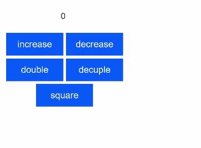
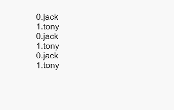

# HML语法参考

更新时间：2026-03-09 02:50:43

来源：https://developer.huawei.com/consumer/cn/doc/harmonyos-guides/js-framework-syntax-hml

HML是一套类HTML的标记语言，通过组件，事件构建出页面的内容。页面具备数据绑定、事件绑定、列表渲染、条件渲染和逻辑控制等高级能力。


##### 页面结构

```text
<!-- xxx.hml -->
<div class="item-container">
  <text class="item-title">Image Show</text>
  <div class="item-content">
    <image src="/common/xxx.png" class="image"></image>
  </div>
</div>
```


##### 数据绑定

```text
<!-- xxx.hml -->
<div class="container" onclick="changeText">
  <text> {{content[1]}} </text>
</div>
```

```text
/*xxx.css*/
.container{
    margin: 200px;
}
```

```text
// xxx.js
export default {
  data: {
    content: ['Hello World!', 'Welcome to my world!']
  },
  changeText: function() {
    this.content.splice(1, 1, this.content[0]);
  }
}
```

> [!NOTE]
> 针对数组内的数据修改，请使用splice方法生效数据绑定变更。 hml文件中的js表达式不支持ES6语法。





##### 普通事件绑定

事件通过'on'或者'@'绑定在组件上，当组件触发事件时会执行JS文件中对应的事件处理函数。

事件支持的写法有：

 - "funcName"：funcName为事件回调函数名（在JS文件中定义相应的函数实现）。
 - "funcName(a,b)"：函数参数例如a，b可以是常量，或者是在JS文件中的data中定义的变量（前面不用写this.）。
 - 示例

  
```text
<!-- xxx.hml -->
<div class="container">
    <text class="title">{{count}}</text>
    <div class="box">
        <input type="button" class="btn" value="increase" onclick="increase" />
        <input type="button" class="btn" value="decrease" @click="decrease" />
        <!-- 传递额外参数 -->
        <input type="button" class="btn" value="double" @click="multiply(2)" />
        <input type="button" class="btn" value="decuple" @click="multiply(10)" />
        <input type="button" class="btn" value="square" @click="multiply(count)" />
    </div>
</div>
```

```text
// xxx.js
export default {
  data: {
    count: 0
  },
  increase() {
    this.count++;
  },
  decrease() {
    this.count--;
  },
  multiply(multiplier) {
    this.count = multiplier * this.count;
  }
};
```

```text
/* xxx.css */
.container {
    display: flex;
    flex-direction: column;
    justify-content: center;
    align-items: center;
    left: 0px;
    top: 0px;
    width: 454px;
    height: 454px;
}
.title {
    font-size: 30px;
    text-align: center;
    width: 200px;
    height: 100px;
}
.box {
    width: 454px;
    height: 200px;
    justify-content: center;
    align-items: center;
    flex-wrap: wrap;
}
.btn {
    width: 200px;
    border-radius: 0;
    margin-top: 10px;
    margin-left: 10px;
}
```





##### 冒泡事件绑定5+

冒泡事件绑定包括：

 - 绑定冒泡事件：on:{event}.bubble。on:{event}等价于on:{event}.bubble。
 - 绑定并阻止冒泡事件向上冒泡：grab:{event}.bubble。grab:{event}等价于grab:{event}.bubble。

  
> [!TIP]
> 冒泡事件是指多个组件嵌套时，组件之间会有层次关系，当这些组件注册了相同的事件时，这个事件会首先运行在该元素上的处理程序，然后运行其父元素上的处理程序，一直向上到其他祖先上的处理程序。如果当一个组件触发了这个事件，它会首先触发该组件的回调函数，然后触发其父元素上的回调函数，然后触发其他祖先上的处理程序。 详细冒泡事件说明参见 通用事件 章节。

 - 示例

  
```text
<!-- xxx.hml -->
<div>
   <!-- 使用事件冒泡模式绑定事件回调函数。5+ -->;
    <div on:touchstart.bubble="touchstartfunc" style="background-color: red; width: 10%; height: 100%"></div>
    <div on:touchstart="touchstartfunc" style="background-color: orange; width: 10%; height: 100%"></div>
    <!-- 绑定事件回调函数，但阻止事件向上传递。5+ -->
    <div grab:touchstart.bubble="touchstartfunc" style="background-color: yellow; width: 10%; height: 100%"></div>
    <div grab:touchstart="touchstartfunc" style="background-color: greenyellow; width: 10%; height: 100%"></div>
    <!-- 使用事件冒泡模式绑定事件回调函数。6+ -->
    <div on:click.bubble="clickfunc" style="background-color: lightskyblue; width: 10%; height: 100%"></div>
    <div on:click="clickfunc" style="background-color: cornflowerblue; width: 10%; height: 100%"></div>
    <!-- 绑定事件回调函数，但阻止事件向上传递。6+ -->
    <div grab:click.bubble="clickfunc" style="background-color: mediumslateblue; width: 10%; height: 100%"></div>
    <div grab:click="clickfunc" style="background-color: purple; width: 10%; height: 100%"></div>
</div>
```

```text
// xxx.js
export default {
    clickfunc: function(e) {
        console.info(e);
    },
    touchstartfunc: function(e) {
        console.info(e);
    },
}
```


> [!NOTE]
> 采用旧写法(onclick)的事件绑定在最小API版本6以下时采用不冒泡处理，在最小API版本为6及6以上时采用冒泡处理。


##### 捕获事件绑定5+

Touch触摸类事件支持捕获，捕获阶段位于冒泡阶段之前，捕获事件先到达父组件然后到达子组件。

捕获事件绑定包括：

 - 绑定捕获事件：on:{event}.capture。
 - 绑定并阻止事件向下传递：grab:{event}.capture。
 - 示例

  
```text
<!-- xxx.hml -->
<div>
    <!-- 使用事件捕获模式绑定事件回调函数。5+ -->    
    <div on:touchstart.capture="touchstartfunc"></div>
    <!-- 绑定事件回调函数，但阻止事件向下传递。5+ -->
    <div grab:touchstart.capture="touchstartfunc"></div>
</div>
```

```text
// xxx.js
export default {
    touchstartfunc: function(e) {
        console.info(e);
    },
}
```


##### 列表渲染

```text
<!-- xxx.hml -->
<div class="array-container" style="flex-direction: column;margin: 200px;">
  <!-- div列表渲染 -->
  <!-- 默认$item代表数组中的元素, $idx代表数组中的元素索引 -->
  <div for="{{array}}" tid="id" onclick="changeText">
    <text>{{$idx}}.{{$item.name}}</text>
  </div>
  <!-- 自定义元素变量名称 -->
  <div for="{{value in array}}" tid="id" onclick="changeText">    
    <text>{{$idx}}.{{value.name}}</text>
  </div>
  <!-- 自定义元素变量、索引名称 -->
  <div for="{{(index, value) in array}}" tid="id" onclick="changeText">    
    <text>{{index}}.{{value.name}}</text>
  </div>
</div>
```

```text
// xxx.js
export default {
  data: {
    array: [
      {id: 1, name: 'jack', age: 18},
      {id: 2, name: 'tony', age: 18},
    ],
  },
  changeText: function() {
    if (this.array[1].name === "tony"){
      this.array.splice(1, 1, {id:2, name: 'Isabella', age: 18});
    } else {
      this.array.splice(2, 1, {id:3, name: 'Bary', age: 18});
    }
  },
}
```

tid属性主要用来加速for循环的重渲染，旨在列表中的数据有变更时，提高重新渲染的效率。tid属性是用来指定数组中每个元素的唯一标识，如果未指定，数组中每个元素的索引为该元素的唯一id。例如上述tid="id"表示数组中的每个元素的id属性为该元素的唯一标识。for循环支持的写法如下：

 - for="array"：其中array为数组对象，array的元素变量默认为$item。
 - for="v in array"：其中v为自定义的元素变量，元素索引默认为$idx。
 - for="(i, v) in array"：其中元素索引为i，元素变量为v，遍历数组对象array。


> [!NOTE]
> 数组中的每个元素必须存在tid指定的数据属性，否则运行时可能会导致异常。 数组中被tid指定的属性要保证唯一性，如果不是则会造成性能损耗。比如，示例中只有id和name可以作为tid字段，因为它们属于唯一字段。 tid不支持表达式。


##### 条件渲染

条件渲染分为2种：if/elif/else和show。两种写法的区别在于：第一种写法里if为false时，组件不会在vdom中构建，也不会渲染，而第二种写法里show为false时虽然也不渲染，但会在vdom中构建；另外，当使用if/elif/else写法时，节点必须是兄弟节点，否则编译无法通过。实例如下：

```text
<!-- xxx.hml -->
<div class="container">
  <button class="btn" type="capsule" value="toggleShow" onclick="toggleShow"></button>
  <button class="btn" type="capsule" value="toggleDisplay" onclick="toggleDisplay"></button>
  <text if="{{visible}}"> Hello-world1 </text>
  <text elif="{{display}}"> Hello-world2 </text>
  <text else> Hello-World </text>
</div>
```

```text
/* xxx.css */
.container{
  flex-direction: column;
  align-items: center;
}
.btn{
  width: 280px;
  font-size: 26px;
  margin: 10px 0;
}
```

```text
// xxx.js
export default {
  data: {
    visible: false,
    display: true,
  },
  toggleShow: function() {
    this.visible = !this.visible;
  },
  toggleDisplay: function() {
    this.display = !this.display;
  }
}
```


优化渲染：show方法。当show为true时，节点正常渲染；当为false时，仅仅设置display样式为none。

```text
<!-- xxx.hml -->
<div class="container">
  <button class="btn" type="capsule" value="toggle" onclick="toggle"></button>
  <text show="{{visible}}" > Hello World </text>
</div>
```

```text
/* xxx.css */
.container{
  flex-direction: column;
  align-items: center;
}
.btn{
  width: 280px;
  font-size: 26px;
  margin: 10px 0;
}
```

```text
// xxx.js
export default {
  data: {
    visible: false,
  },
  toggle: function() {
    this.visible = !this.visible;
  },
}
```

> [!NOTE]
> 禁止在同一个元素上同时设置for和if属性。


##### 逻辑控制块

&lt;block&gt;控制块使得循环渲染和条件渲染变得更加灵活；block在构建时不会被当作真实的节点编译。注意block标签只支持for和if属性。

```text
<!-- xxx.hml -->
<list>
  <block for="glasses">
    <list-item type="glasses">
      <text>{{$item.name}}</text>
    </list-item>
    <block for="$item.kinds">
      <list-item type="kind">
        <text>{{$item.color}}</text>
      </list-item>
    </block>
  </block>
</list>
```

```text
// xxx.js
export default {
  data: {
    glasses: [
      {name:'sunglasses', kinds:[{name:'XXX',color:'XXX'},{name:'XXX',color:'XXX'}]},
      {name:'nearsightedness mirror', kinds:[{name:'XXX',color:'XXX'}]},
    ],
  },
}
```


##### 模板引用

HML可以通过element引用模板文件，详细介绍可参考[自定义组件的基本用法](https://developer.huawei.com/consumer/cn/doc/harmonyos-references/js-components-custom-basic-usage)章节。

```text
<!-- template.hml -->
<div class="item"> 
  <text>Name: {{name}}</text>
  <text>Age: {{age}}</text>
</div>
```

```text
<!-- index.hml -->
<element name='comp' src='../../common/template.hml'></element>
<div>
  <comp name="Tony" age="18"></comp>
</div>
```
