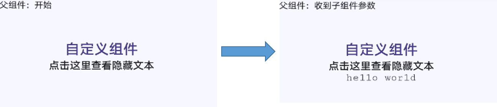

# 自定义组件

更新时间：2026-03-09 02:50:43

来源：https://developer.huawei.com/consumer/cn/doc/harmonyos-guides/ui-js-custom-components

使用兼容JS的类Web开发范式的方舟开发框架支持自定义组件，用户可根据业务需求将已有的组件进行扩展，增加自定义的私有属性和事件，封装成新的组件，方便在工程中多次调用，提高页面布局代码的可读性。具体的封装方法示例如下：

本示例中父组件通过添加自定义属性向子组件传递了名称为title的参数，子组件在props中接收。同时子组件也通过事件绑定向上传递了参数text，接收时通过e.detail获取。要绑定子组件事件，父组件事件命名必须遵循事件绑定规则，详见[自定义组件的基本用法](https://developer.huawei.com/consumer/cn/doc/harmonyos-references/js-components-custom-basic-usage)。自定义组件效果如下图所示：

**图1** 自定义组件的效果

