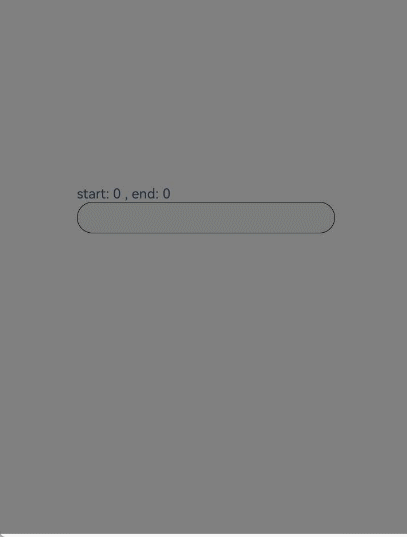

# 监听输入框事件

更新时间：2026-04-30 02:41:24

来源：https://developer.huawei.com/consumer/cn/doc/harmonyos-guides/ndk-textarea-event

输入框包含多种交互行为，开发者可注册事件监听并获取状态。

要实现实时搜索功能，可注册[NODE_TEXT_AREA_ON_CHANGE](https://developer.huawei.com/consumer/cn/doc/harmonyos-references/capi-native-node-h#arkui_nodeeventtype)事件，输入框文本发生变化时会收到通知，并能获取当前文本内容。

要实现文字过滤功能，可注册[NODE_TEXT_AREA_ON_WILL_INSERT](https://developer.huawei.com/consumer/cn/doc/harmonyos-references/capi-native-node-h#arkui_nodeeventtype)事件，在文字即将插入前会收到通知，通过返回值控制文字是否插入。

要实现用户编辑文字前后页面布局的不同，可注册[NODE_TEXT_AREA_ON_EDIT_CHANGE](https://developer.huawei.com/consumer/cn/doc/harmonyos-references/capi-native-node-h#arkui_nodeeventtype)事件，输入框编辑状态切换时会收到通知。

以下示例基于[接入ArkTS页面章节](https://developer.huawei.com/consumer/cn/doc/harmonyos-guides/ndk-access-the-arkts-page)，说明如何监听输入框的事件及数据解析。

