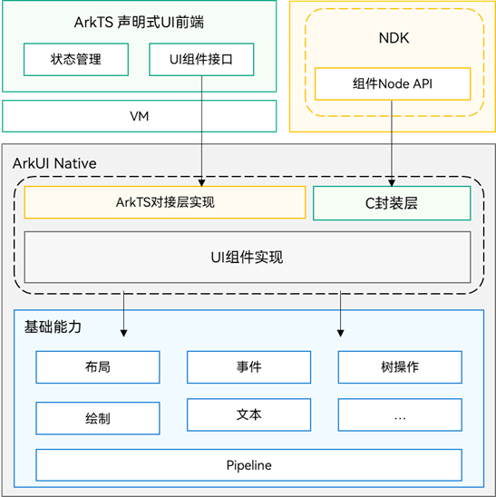

# 基于NDK构建UI概述

更新时间：2026-04-20 06:34:33

来源：https://developer.huawei.com/consumer/cn/doc/harmonyos-guides/ndk-build-ui-overview

ArkUI开发框架提供了一系列[NDK接口](https://developer.huawei.com/consumer/cn/doc/harmonyos-guides/ndk-development-overview)，能够在应用中使用C和C++代码构建UI界面，这些接口包括UI组件创建、UI树操作、属性设置和事件监听等。面向通用UI界面开发场景，建议使用ArkTS代码和ArkUI声明式开发框架。然而，如果需要实现以下一个或多个目标，那么ArkUI NDK接口就能派上用场：

ArkUI NDK接口能力主要包括：

## 整体架构

**图1** NDK接口和ArkTS声明式关系架构图

**图2** 通过NDK接口创建的组件挂载示意图

ArkTS声明式UI前端和NDK接口都是针对ArkUI底层实现的接口暴露，NDK接口相比于ArkTS声明式UI前端，除了剥离状态管理等声明式UI语法外，还精简了组件能力，将ArkUI组件核心功能通过C接口进行封装暴露。 NDK创建的UI组件需要通过ArkTS层的占位组件进行挂载显示，挂载后，NDK创建的组件和ArkTS创建的组件位于同一个UI树上，相关布局渲染和事件处理遵循相同规则。

## 开发流程

使用NDK接口开发UI界面时，主要涉及如下开发过程。
| 任务 | 简介 |
| --- | --- |
| [NDK开发导读](https://developer.huawei.com/consumer/cn/doc/harmonyos-guides/ndk-development-overview) | 介绍NDK的适用场景与必备基础知识。 |
| [接入ArkTS页面](https://developer.huawei.com/consumer/cn/doc/harmonyos-guides/ndk-access-the-arkts-page) | 介绍了如何将NDK接口开发的UI界面挂载到ArkTS主页面上进行渲染显示。 |
| [添加交互事件](https://developer.huawei.com/consumer/cn/doc/harmonyos-guides/ndk-listen-to-component-events) | 介绍了如何添加组件的交互事件。 |
| [使用动画](https://developer.huawei.com/consumer/cn/doc/harmonyos-guides/ndk-use-animation) | 介绍了如何在Native侧添加动画。 |
| [构建布局](https://developer.huawei.com/consumer/cn/doc/harmonyos-guides/ndk-loading-long-list) | 介绍了如何在Native侧使用容器组件构建布局。 |
| [构建弹窗](https://developer.huawei.com/consumer/cn/doc/harmonyos-guides/ndk-build-pop-up-window) | 介绍了如何使用弹窗接口构建UI界面进行弹窗显示。 |
| [构建自定义组件](https://developer.huawei.com/consumer/cn/doc/harmonyos-guides/ndk-build-custom-components) | 介绍了如何使用NDK接口能力构建自定义组件，实现差异化UI组件。 |
| [嵌入ArkTS组件](https://developer.huawei.com/consumer/cn/doc/harmonyos-guides/ndk-embed-arkts-components) | 介绍了如何在Native侧构建带有ArkTS组件的界面。 |
| [构建渲染节点](https://developer.huawei.com/consumer/cn/doc/harmonyos-guides/ndk-embed-render-components) | 介绍了如何在Native侧构建渲染节点。 |
| [通过自绘制接入无障碍](https://developer.huawei.com/consumer/cn/doc/harmonyos-guides/ndk-accessibility-xcomponent) | 介绍了自绘制机制接入的第三方UI框架平台，通过获取AccessibilityProvider如何对接系统无障碍。 |
| [自定义绘制](https://developer.huawei.com/consumer/cn/doc/harmonyos-guides/arkts-user-defined-draw) | 介绍了如何使用自定义绘制能力，实现自定义内容的绘制。 |
| [查询和操作自定义节点](https://developer.huawei.com/consumer/cn/doc/harmonyos-guides/ndk-node-query-operate) | 介绍了如何对自定义节点进行查询和操作。 |
| [通过EmbeddedComponent拉起EmbeddedUIExtensionAbility](https://developer.huawei.com/consumer/cn/doc/harmonyos-guides/ndk-embedded-component) | 介绍了如何在Native侧通过EmbeddedComponent拉起EmbeddedUIExtensionAbility。主要用于有进程隔离需求的模块化开发场景。 |
| [使用文本](https://developer.huawei.com/consumer/cn/doc/harmonyos-guides/ndk-styled-string) | 介绍了Text组件与字体引擎如何配套使用。 |
| [在NDK中保证多实例场景功能正常](https://developer.huawei.com/consumer/cn/doc/harmonyos-guides/ndk-scope-task) | 介绍了如何在NDK多线程场景中保证接口调用的功能正常。 |
| [使用多线程NDK接口并行化构建UI页面](https://developer.huawei.com/consumer/cn/doc/harmonyos-guides/ndk-build-on-multi-thread) | 介绍了如何使用NDK进行多线程UI组件创建。 |

## 注意事项

使用NDK接口开发UI界面时，需要保证相关UI接口调用在应用主线程上调用，避免多线程操作导致应用崩溃问题。
