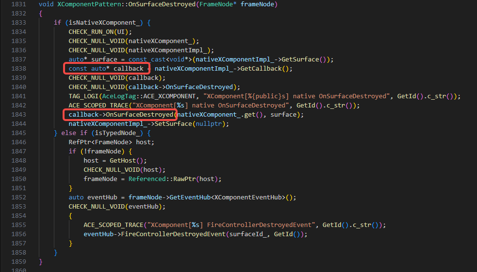
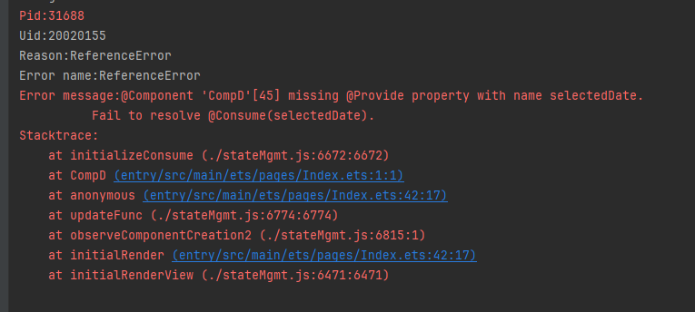
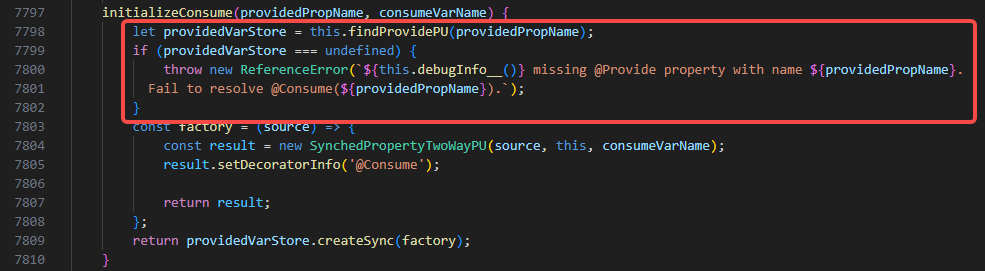
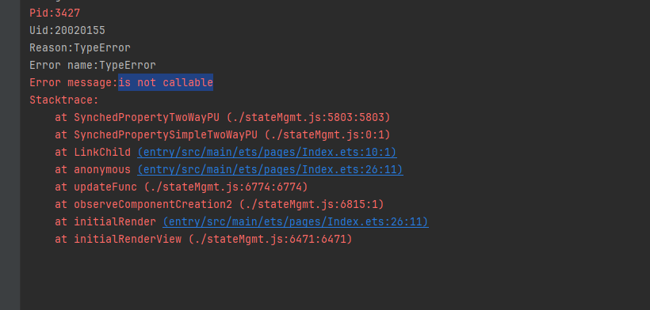
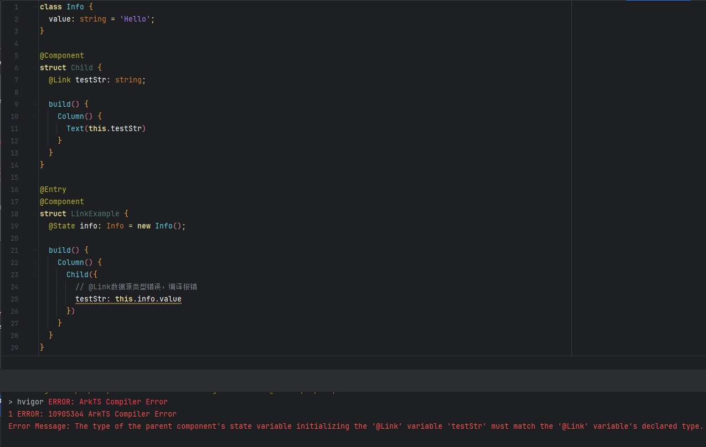
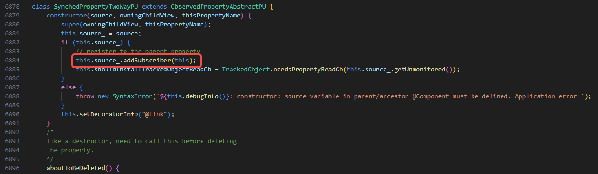
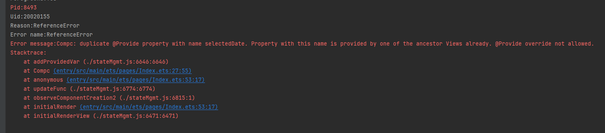
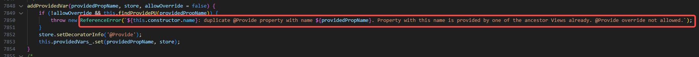

# UI相关应用崩溃常见问题

更新时间：2026-04-20 06:34:33

来源：https://developer.huawei.com/consumer/cn/doc/harmonyos-guides/arkts-stability-crash-issues

本文档收集整理了一些常见的会导致应用崩溃的ArkUI API错误用法，旨在帮助开发者了解这些会导致应用崩溃问题的错误用法，从而避免在实际应用开发过程中犯类似错误。


## OH_NativeXComponent注册的回调函数对象被提前释放

**问题现象** 应用闪退并生成如下cppcrash崩溃栈：
```text
Reason:Signal:SIGSEGV(SEGV_ACCERR)@0x0000005c5f09a280

#00 pc 0000000000ac9280 [anon:native_heap:jemalloc]
#01 pc 0000000002615120 /system/lib64/platformsdk/libace_compatible.z.so(OHOS::Ace::NG::XComponentPattern::OnSurfaceDestroyed()+468)
#02 pc 0000000002614b18 /system/lib64/platformsdk/libace_compatible.z.so(OHOS::Ace::NG::XComponentPattern::OnDetachFromFrameNode(OHOS::Ace::NG::FrameNode*)+88)
#03 pc 0000000000875294 /system/lib64/platformsdk/libace_compatible.z.so(OHOS::Ace::NG::FrameNode::~FrameNode()+264)
```

其中libace_compatible.z.so栈的最后一个调用帧为XComponentPattern类的OnSurfaceCreated、OnSurfaceChanged、OnSurfaceDestroyed、DispatchTouchEvent方法之一，且#00帧的pc是一个异常地址，通常其最后几位与Reason后面的地址内容一致，这表明某个函数指针存在问题，导致执行时跳转到异常地址。 **可能原因** 应用通过[OH_NativeXComponent_RegisterCallback](https://developer.huawei.com/consumer/cn/doc/harmonyos-references/capi-native-interface-xcomponent-h#oh_nativexcomponent_registercallback)接口注册的[OH_NativeXComponent_Callback](https://developer.huawei.com/consumer/cn/doc/harmonyos-references/ent-native-xcomponent-oh-nativexcomponent-callback)回调函数对象以裸指针形式保存在XComponentPattern对象中。这些回调的生命周期由应用控制。如果应用提前销毁了OH_NativeXComponent_Callback回调函数对象，将导致裸指针指向非法内存，引发Use-After-Free问题。

**解决措施** onSurfaceDestroy回调是XComponentPattern销毁时调用的最后一个回调，该回调执行完表示组件已经销毁。因此，应用必须确保在onSurfaceDestroy回调执行前，这些回调是有效的。 **参考链接** 相关接口详见[OH_NativeXComponent Native XComponent](https://developer.huawei.com/consumer/cn/doc/harmonyos-references/capi-oh-nativexcomponent-native-xcomponent)。

## OH_NativeXComponent对象被提前释放

**问题现象** 应用闪退并生成如下cppcrash崩溃栈：
```text
#00 pc 00000000000c8b3c /system/lib64/libc++.so(std::__h::basic_string, std::__h::allocator>::basic_string(std::__h::basic_string, std::__h::allocator> const&)+16)
#01 pc 0000000000034f64 /system/lib64/libace_ndk.z.so(OH_NativeXComponent::GetXComponentId(char*, unsigned long*)+76)
#02 pc 00000000000867c0 /data/storage/el1/bundle/libs/arm64/librenderer.so
```

其中栈顶附近内容为libace_ndk.z.so(OH_NativeXComponent::XXX...)，且下一帧是应用so。 **可能原因** OH_NativeXComponent使用裸指针管理。应用侧持有其裸指针。如果在其生命周期结束后仍然调用相关接口，会导致Use-After-Free问题。 **解决措施** 系统通过onSurfaceDestroy回调通知应用OH_NativeXComponent已销毁。应用必须确保在onSurfaceDestroy回调执行完毕后不再调用OH_NativeXComponent相关接口。 **参考链接** 相关接口详见[OH_NativeXComponent Native XComponent](https://developer.huawei.com/consumer/cn/doc/harmonyos-references/capi-oh-nativexcomponent-native-xcomponent)。

## @Consume缺少匹配的@Provide

**问题现象** 应用闪退并生成如下jscrash崩溃栈：

**可能原因** 报错发生在@Consume初始化阶段，原因是@Consume初始化时仅通过key匹配对应的@Provide变量。如果未找到对应的@Provide，就会出现报错（missing @Provide）。

**解决措施** 排查组件树时，确保@Provide装饰的变量在祖先组件中定义，这些变量被视为提供给后代的状态变量。@Consume装饰的变量在后代组件中使用，用于绑定祖先组件提供的变量。如果@Consume绑定的key在祖先组件中未定义，会导致报错。请从用法角度进行排查。 **参考链接** [跨组件层级双向同步](https://developer.huawei.com/consumer/cn/doc/harmonyos-guides/arkts-new-provider-and-consumer)。

## @Link数据源类型错误

**问题现象** 应用闪退并生成如下jscrash崩溃栈：

从API version 23开始，添加对@Link数据源错误的校验，运行时错误变为编译期报错：

**可能原因** 报错发生在@Link初始化阶段，原因是@Link初始化时会注册到父组件并调用父组件的addSubscriber方法。如果此时数据源的类型与@Link不完全一致，或者使用常量初始化@Link，会导致该方法无法调用，从而引发“is not callable”错误。

**解决措施** 排查@Link的数据源，确认其是否为状态变量，并确保数据源的类型与@Link的类型一致。 **参考链接** [父子双向同步](https://developer.huawei.com/consumer/cn/doc/harmonyos-guides/arkts-link)。

## @Provide缺少重写声明

**问题现象** 应用闪退并生成如下jscrash崩溃栈：

**可能原因** 报错发生在@Provide初始化阶段，原因是@Provide重写需要声明allowOverride。声明后，别名和属性名都可以被覆盖。如果未声明且存在重复的别名或属性名，将导致错误（duplicate @Provide property with name xxxxx）。

**解决措施** 需要检查@Provide是否使用了allowOverride声明。如果没有使用allowOverride，则这样使用是不合规的。只有在声明了allowOverride之后，才会允许重写，并且子组件的@Consume会根据别名或属性名找到并使用距离它最近的父节点上的@Provide值。 **参考链接** [跨组件层级双向同步](https://developer.huawei.com/consumer/cn/doc/harmonyos-guides/arkts-new-provider-and-consumer)。
