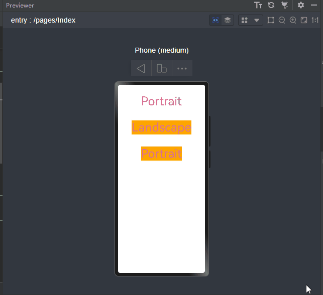
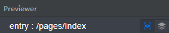
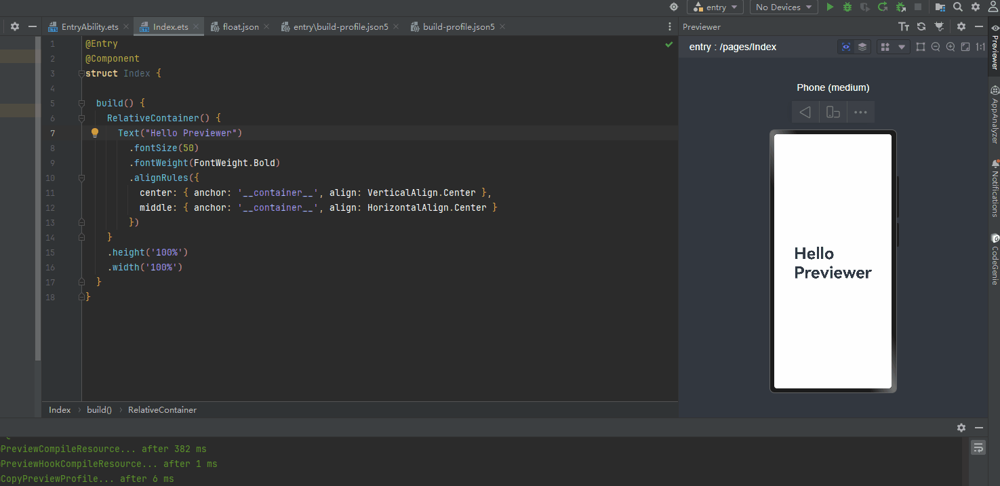
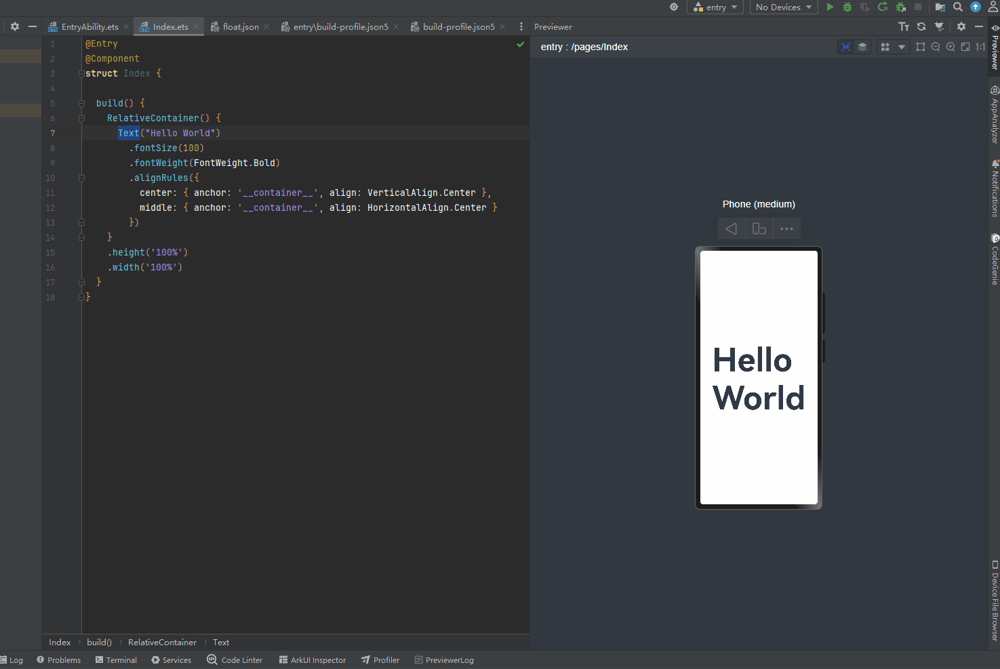
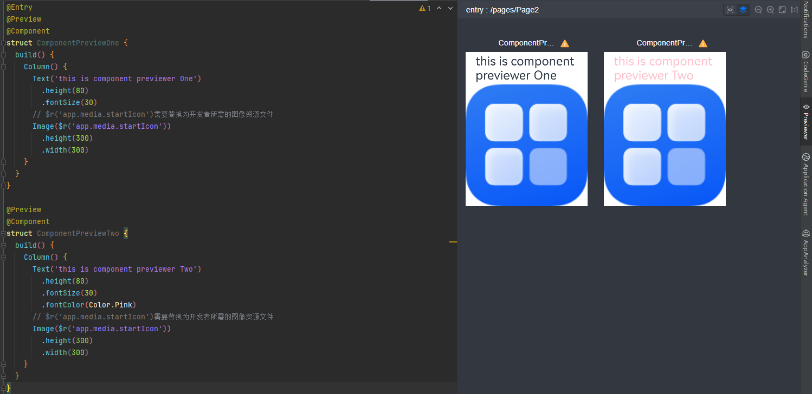

# UI预览

更新时间：2026-03-20 09:49:50

来源：https://developer.huawei.com/consumer/cn/doc/harmonyos-guides/ui-ide-previewer

DevEco Studio为开发者提供了UI预览功能，方便查看UI效果并随时调整页面布局。预览支持页面预览和组件预览。图1中左侧图标

表示页面预览，右侧图标

表示组件预览。

> [!NOTE]
> 操作系统和真机设备的差异可能导致预览效果与真机效果不同。预览效果仅作参考，实际效果以真机为准。


**图1** 预览图标





#### 页面预览

ArkTS应用/元服务均支持页面预览。页面预览通过在工程的ets文件中，给自定义组件添加[@Entry](https://developer.huawei.com/consumer/cn/doc/harmonyos-guides/arkts-create-custom-components#entry)装饰器，即可以查看当前UI页面效果。

 - 启动方式：选中需要预览的ets页面，点击右侧侧边栏的Previewer按钮，启动页面预览。
 - 热加载：在启动页面预览的前提下，添加、删除或修改UI组件后，通过Ctrl+S保存，预览器会同步刷新预览效果，无需重新启动预览。
 - 路由能力：支持通过路由能力进行页面切换查看其它页面预览效果。


在页面预览的基础上，提供了极速预览和Inspector双向预览两种特性。下面将详细说明这两种特性。


#### 极速预览

支持在修改组件的属性时，无需使用Ctrl+S进行保存，可以直接观察到修改后的预览效果。极速预览默认开启，若需关闭，点击预览器右上角按钮

即可。


部分应用场景不支持极速预览：

 - 不显示的组件。
 - 新增或删除组件。
 - 包含private变量或无类型的controller的组件。
 - 使用了[@Builder](https://developer.huawei.com/consumer/cn/doc/harmonyos-guides/arkts-builder)、[@Style](https://developer.huawei.com/consumer/cn/doc/harmonyos-guides/arkts-style)、[@Extend](https://developer.huawei.com/consumer/cn/doc/harmonyos-guides/arkts-extend)等装饰器的组件。
 - 修改使用import导入外部组件/模块的组件。
 - 修改状态变量。


效果如图2所示：

**图2** 极速预览演示图


#### inspector双向预览

支持ets文件与预览器的双向预览。使用时，点击预览器界面图标

开启双向预览功能。

开启双向预览功能后，支持代码编辑器、UI界面和组件树之间的联动：
1. 选中预览器界面中的组件，组件树上对应的组件将被选中，同时代码编辑器中的布局文件中对应的代码块高亮显示。
2. 选中布局文件中的代码块，预览器界面将高亮显示，组件树上的组件节点将呈现被选中的状态。
3. 选中组件树中的组件，对应的代码块和预览器界面将高亮显示。
4. 在预览界面，通过组件的属性面板修改可修改的属性或样式。预览界面的修改会自动同步到代码编辑器中，并实时刷新预览器界面。代码编辑器中的源码修改也会实时刷新预览器界面，并更新组件树信息及组件属性。

效果如图3所示：

**图3** inspector双向预览演示图


#### 组件预览

ArkTS应用/元服务支持组件预览功能。组件预览通过在自定义组件前添加[@Preview](https://developer.huawei.com/consumer/cn/doc/harmonyos-references/ts-universal-component-previewer#preview装饰器)装饰器实现。在单个源文件中，最多可以使用10个@Preview装饰自定义组件。启动方式：

 - 当组件被@Entry和@Preview装饰时，点击右侧侧边栏的Previewer按钮，启动页面预览，页面加载成功后，点击

，切换到组件预览。
 - 当组件仅被@Preview装饰时，点击右侧侧边栏的Previewer按钮，则默认为组件预览。


组件预览时，使用@Preview装饰器的默认属性（请参考[PreviewParams](https://developer.huawei.com/consumer/cn/doc/harmonyos-references/ts-universal-component-previewer#previewparams9)）进行效果显示。可以通过设置@Preview的参数，指定预览设备的相关属性，包括设备类型、屏幕形状等。

@Preview的使用参考如下示例：

```text
@Entry
@Preview
@Component
struct ComponentPreviewOne {
  build() {
    Column() {
      Text('this is component previewer One')
        .height(80)
        .fontSize(30)
      // $r('app.media.startIcon')需要替换为开发者所需的图像资源文件
      Image($r('app.media.startIcon'))
        .height(300)
        .width(300)
    }
  }
}

@Preview
@Component
struct ComponentPreviewTwo {
  build() {
    Column() {
      Text('this is component previewer Two')
        .height(80)
        .fontSize(30)
        .fontColor(Color.Pink)
      // $r('app.media.startIcon')需要替换为开发者所需的图像资源文件
      Image($r('app.media.startIcon'))
        .height(300)
        .width(300)
    }
  }
}
```

效果如图4所示：

**图4** 组件预览效果图


#### 动态修改分辨率

同一个应用/元服务可以运行在多个设备上，因不同设备的屏幕分辨率、形状、大小等不同，开发者需要在不同的设备上查看应用/元服务的UI布局和交互效果。预览支持动态修改分辨率，方便开发者随时查看不同设备上的页面显示效果。启动方式：启动页面预览后，点击右上角

，即可拖动页面选中框动态修改当前设备的屏幕大小。

效果如图5所示：

**图5** 动态修改分辨率效果图


