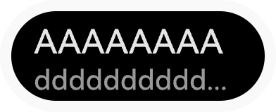
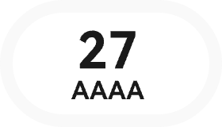
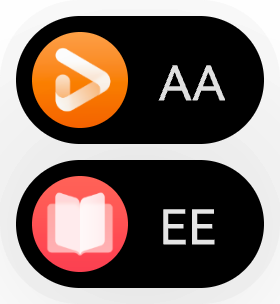

# 全局闪控球开发指导

更新时间：2026-04-29 07:35:50

来源：https://developer.huawei.com/consumer/cn/doc/harmonyos-guides/floatingball-guide

## 场景介绍

闪控球是一种在设备屏幕上悬浮的非全屏应用窗口，为应用提供临时的全局能力，完成跨应用交互。 应用可以将关键信息以小窗（闪控球）模式呈现。切换为小窗（闪控球）模式后，用户可以进行其他界面操作，提升使用体验。
> [!NOTE]
> 从API version 20开始，支持使用闪控球能力。  支持在DevEco Studio 6.0.1 Release及以上版本的模拟器中使用闪控球相关功能。


## 约束与限制

基于安全考虑，仅允许应用在前台时启动闪控球，并且需要具有[ohos.permission.USE_FLOAT_BALL](https://developer.huawei.com/consumer/cn/doc/harmonyos-guides/restricted-permissions#ohospermissionuse_float_ball)权限，具体可见[申请受限权限](https://developer.huawei.com/consumer/cn/doc/harmonyos-guides/declare-permissions-in-acl)。  当前仅对跨应用的题目搜索、账单记录、商品比价、抢单、翻译场景，以及金融类应用的实时盯盘场景开放此权限。接入后需在以上场景范围内使用，否则将会进行相关处罚与限制。  同一个应用只能启动一个闪控球，同一个设备最多同时存在两个闪控球，在超出闪控球最大个数限制时，打开新的闪控球会替换最早启动的闪控球。  仅支持手机和平板设备。

## 接口说明

以下是闪控球功能的常用接口，更多接口及使用参考[@ohos.window.floatingBall (闪控球窗口)](https://developer.huawei.com/consumer/cn/doc/harmonyos-references/js-apis-floatingball) 。
| 接口名 | 描述 |
| --- | --- |
| isFloatingBallEnabled(): boolean | 判断当前设备是否支持闪控球功能。 |
| create(config: FloatingBallConfiguration): Promise | 创建闪控球控制器。 |
| startFloatingBall(params: FloatingBallParams): Promise | 启动闪控球。 |
| updateFloatingBall(params: FloatingBallParams): Promise | 更新闪控球。 |
| stopFloatingBall(): Promise | 停止闪控球。 |
| on(type: 'stateChange', callback: Callback): void | 开启闪控球生命周期状态的监听。 |
| off(type: 'stateChange', callback?: Callback): void | 关闭闪控球生命周期状态的监听。 |
| on(type: 'click', callback: Callback): void | 开启闪控球点击事件的监听。 |
| off(type: 'click', callback?: Callback): void | 关闭闪控球点击事件的监听。 |
| getFloatingBallWindowInfo(): Promise | 获取闪控球窗口信息。 |
| restoreMainWindow(want: Want): Promise | 恢复应用主窗口，加载指定页面。 |


## 交互方式

闪控球提供以下交互方式： 单击闪控球：触发闪控球点击事件。  长按闪控球：长按闪控球震动变为待删除态，可以点击图标单个删除或全部删除。  拖动闪控球：可以手动拖拽闪控球改变位置，拖拽时自动避让状态栏、固定态软键盘（改变软键盘为固定态或者悬浮态的详细介绍请参见[输入法服务](https://developer.huawei.com/consumer/cn/doc/harmonyos-references/js-apis-inputmethodengine#changeflag10)）、导航条等其他组件，设备处于横屏场景时不会自动避让输入法。拖拽松手时闪控球自动吸附在最近的侧边，拖拽到垃圾桶区域（底部中部区域）松手即可删除。  闪控球位置记忆：关闭闪控球会记录当前位置，下一次打开功能时自动展示在上次关闭时的位置。旋转屏幕或重启设备会恢复到默认位置，默认位置位于屏幕右上侧。

## 闪控球规格与样式布局

目前支持四种闪控球模板布局，具体可见闪控球模板类型枚举[FloatingBallTemplate](https://developer.huawei.com/consumer/cn/doc/harmonyos-references/js-apis-floatingball#floatingballtemplate)。 静态布局：支持图标和标题。  普通文本布局：支持标题和内容。  强调文本布局：支持图标、标题和内容。  纯文本布局：仅支持标题，可双行展示。   目前闪控球的规格为：整体尺寸宽为70vp-98vp之间，高为40vp，标题和内容不支持自定义字体大小。 不同闪控球模板与样式布局示意如下，不同语言或内容以实际显示效果为准： **图1** 静态布局

**图2** 静态布局-超长文本标题

**图3** 普通文本布局

**图4** 普通文本布局-超长文本内容

**图5** 强调文本布局

**图6** 强调文本布局-超长文本内容

**图7** 强调文本布局-图标

**图8** 强调文本布局-图标和超长文本内容

**图9** 纯文本布局

**图10** 纯文本布局-超长文本标题

当有两个应用启动了闪控球后，闪控球将合并展示，如下图所示。整体高度为76vp。 **图11** 闪控球上下合并展示


## 开发步骤

导入模块并声明闪控球控制器。  使用[create()](https://developer.huawei.com/consumer/cn/doc/harmonyos-references/js-apis-floatingball#floatingballcreate)接口创建闪控球控制器实例后注册点击事件回调和状态变化事件回调，通过[startFloatingBall()](https://developer.huawei.com/consumer/cn/doc/harmonyos-references/js-apis-floatingball#startfloatingball)接口启动闪控球。  通过[updateFloatingBall()](https://developer.huawei.com/consumer/cn/doc/harmonyos-references/js-apis-floatingball#updatefloatingball)更新闪控球信息，以此控制闪控球展示的内容。  通过[stopFloatingBall()](https://developer.huawei.com/consumer/cn/doc/harmonyos-references/js-apis-floatingball#stopfloatingball)停止闪控球。当不再需要显示闪控球时，可根据业务需要关闭闪控球。
```text
// Utils.ts
// 该页面提供工具类，展示闪控球的创建、更新、关闭逻辑
import hilog from '@ohos.hilog';
import image from '@ohos.multimedia.image';
import { BusinessError } from '@kit.BasicServicesKit';
import { floatingBall } from '@kit.ArkUI';
import { Want } from '@kit.AbilityKit';
import { ContextUtil } from './ContextUtil';

const DOMAIN: number = 0xF811;
const TAG: string = '[Sample_FloatingBall]';
const BUNDLE_NAME: string = ContextUtil.context.abilityInfo.bundleName;

export class Utils {
    public static getRawfilePixelMapSync(path: string): image.PixelMap {
        try {
            const BUFFER = ContextUtil.context.resourceManager.getRawFileContentSync(path);
            const IMAGE_SOURCE: image.ImageSource = image.createImageSource(BUFFER.buffer as ArrayBuffer);
            hilog.debug(DOMAIN, TAG, `Get rawfile pixelMap path '${path}' successfully`);
            return IMAGE_SOURCE.createPixelMapSync();
        } catch (e) {
            hilog.error(DOMAIN, TAG, `Get rawfile pixelMap path '${path}' failed, error: ${e}`);
            throw e as Error;
        }
    }

    // 闪控球启动逻辑
    public static async onClickCreateFloatingBall(
        floatingBallController: floatingBall.FloatingBallController | undefined,
        template: floatingBall.FloatingBallTemplate,
        onActiveRowChange: (value: number) => void,  // 接收状态更新回调函数
        title: string = 'title',
        content: string = 'content',
        backgroundColor: string = '#0ff77c',
        icon?: image.PixelMap): Promise {
        // 注册 监听点击回调事件
        floatingBallController?.on('click', () => {
            hilog.debug(DOMAIN, TAG, `FloatingBall onClickEvent`);
            let want: Want = {
                bundleName: BUNDLE_NAME,
                abilityName: 'MainAbility'
            }
            // 使用promise异步回调
            floatingBallController?.restoreMainWindow(want)
            .then(() => {
                hilog.debug(DOMAIN, TAG, `Success in restoring FloatingBall main window`);
            }).catch((err: BusinessError) => {
                hilog.error(DOMAIN, TAG, `failed to restore FloatingBall main window. code: ${err.code}, message: ${err.message}`);
            })
        })
        // 注册 监听状态变化事件
        floatingBallController?.on('stateChange',
        (state: floatingBall.FloatingBallState) => {
            hilog.debug(DOMAIN, TAG, `FloatingBall stateCange: ${state}`);
            if(state === floatingBall.FloatingBallState.STOPPED) {
                floatingBallController?.off('click')
                floatingBallController?.off('stateChange')
                floatingBallController = undefined;
                // 执行状态更新回调
                onActiveRowChange?.(-1);
            }
        })
        // 最后启动闪控球
        let startParams: floatingBall.FloatingBallParams = icon? {
            template: template,
            title: title,
            content: content,
            backgroundColor: backgroundColor,
            icon: icon
        } : {
            template: template,
            title: title,
            content: content,
            backgroundColor: backgroundColor
        }
        try {
            floatingBallController?.startFloatingBall(startParams)
            .then(() => {
                hilog.debug(DOMAIN, TAG, `succeed in starting FloatingBall`);
            }).catch((err: BusinessError) => {
                hilog.error(DOMAIN, TAG, `failed to start FloatingBall. code: ${err.code}, message: ${err.message}`);
            })
        } catch (e) {
            console.error('startFloatingBall Error', e)
        }
    }

// 闪控球更新逻辑
public static onClickUpdateFloatingBall(
    floatingBallController: floatingBall.FloatingBallController | undefined,
    template: floatingBall.FloatingBallTemplate,
    title: string = 'newTitle',
    content: string = 'newContent',
    icon?: image.PixelMap): void {
        // 更新时给标题、内容 随机使用数字后缀
        let random_string: string = Math.floor(Math.random() * 100).toString();
        let updateParams: floatingBall.FloatingBallParams = icon ? {
            template: template,
            title: title + random_string,
            content: content + random_string,
            backgroundColor: '#f6ea0a',
            icon: icon
        } : {
            template: template,
            title: title + random_string,
            content: content + random_string,
            backgroundColor: '#f6ea0a',
        }
        try {
            floatingBallController?.updateFloatingBall(updateParams).then(() => {
                hilog.debug(DOMAIN, TAG, `Succeed in updating FloatingBall`);
            }).catch((err: BusinessError) => {
                hilog.error(DOMAIN, TAG, `failed to update FloatingBall. code: ${err.code}, message: ${err.message}`);
            })
        } catch (e) {
            console.error('updateFloatingBall Error:', e)
        }
    }

    // 闪控球停止逻辑
    public static onClickStopFloatingBall(floatingBallController: floatingBall.FloatingBallController | undefined): void {
        // stop 是异步流程，需要通过 stateChange 状态回调获取实际删除结果
        floatingBallController?.stopFloatingBall().then(() => {
            hilog.debug(DOMAIN, TAG, `Succeed in stopping FloatingBall`);
        }).catch((err: BusinessError) => {
            hilog.error(DOMAIN, TAG, `failed to stop FloatingBall. code: ${err.code}, message: ${err.message}`);
        })
    }
}
```


```text
// Index.ets
// 该页面利用按钮点击事件展示闪控球基本操作
import hilog from '@ohos.hilog';
import image from '@ohos.multimedia.image';
import { floatingBall } from '@kit.ArkUI';
import { Utils } from '../util/Utils';

const DOMAIN: number = 0xF811;
const TAG: string = '[Sample_FloatingBall]';

@Entry
@Component
struct Index {
  // 当前可用的行，-1 表示全部行可见
  @State private activeRow: number = -1;
  // 声明闪控球控制器
  private floatingBallController: floatingBall.FloatingBallController | undefined = undefined;
  // 缓存 icon 图标（静态布局）
  private cachedIcon1: image.PixelMap | undefined = undefined;
  // 缓存 icon 图标（强调文本布局）
  private cachedIcon2: image.PixelMap | undefined = undefined;

  // activeRow 的状态更新函数（确保闪控球销毁时，activeRow的值更新为-1）
  private activeRowChange = (value: number) => {this.activeRow = value};

  // 判断某个布局是否可用（是否置灰）
  private isEnabled(rowInex: number): boolean {
    return this.activeRow === -1 || this.activeRow === rowInex;
  }

  build() {
    Column({space: 12}) {
      // 静态布局，支持标题和图标，该布局在创建后无法修改
      Row({space: 6}) {
        Button('STATIC').onClick( async () => {
          // 请在组件内获取context，确保this.getUIContext().getHostContext()返回的结果是UIAbilityContext
          if (!this.floatingBallController) {
            this.floatingBallController = await floatingBall.create({
              context: this.getUIContext().getHostContext()
            })
          }
          if (this.floatingBallController) {
            // 仅当没有缓存 cachedIcon1 时才加载；有缓存时，直接使用；
            if (!this.cachedIcon1) {
              let pixelMap = Utils.getRawfilePixelMapSync('books.png');  // 图片尺寸有最大限制
              if (pixelMap) {
                this.cachedIcon1 = pixelMap;  // 把图标缓存起了
                hilog.debug(DOMAIN, TAG, `Success to load icon PixelMap`);
              } else {
                hilog.error(DOMAIN, TAG, `Failed to load icon PixelMap`);
              }
            }
            Utils.onClickCreateFloatingBall(this.floatingBallController,
              floatingBall.FloatingBallTemplate.STATIC, this.activeRowChange, 'title', 'content', '#0ff77c', this.cachedIcon1)
              this.activeRow = 0;
          }
        })
        .enabled(this.isEnabled(0))
        // 更新闪控球信息（该布局在创建后无法更新，按钮永久置灰）
        Button('Update1').enabled(false)
        // 关闭闪控球
        Button('Close1').onClick(() => {
          Utils.onClickStopFloatingBall(this.floatingBallController);
          this.activeRow = -1;  // 关闭后恢复所有行显示
        })
        .enabled(this.isEnabled(0))
      }
      .width('100%')
      .justifyContent(FlexAlign.Center)

    // 普通文本布局，支持标题和内容
    Row({space: 6}) {
      Button('NORMAL').onClick( async () => {
        // 请在组件内获取context，确保this.getUIContext().getHostContext()返回的结果是UIAbilityContext
        if (!this.floatingBallController) {
          this.floatingBallController = await floatingBall.create({
            context: this.getUIContext().getHostContext()
          })
        }
        if (this.floatingBallController) {
          Utils.onClickCreateFloatingBall(this.floatingBallController,
            floatingBall.FloatingBallTemplate.NORMAL, this.activeRowChange, 'title', 'content')
            this.activeRow = 1;
        }
      })
      .enabled(this.isEnabled(1))
      // 更新闪控球信息
      Button('Update2').onClick(() => Utils.onClickUpdateFloatingBall(this.floatingBallController,
        floatingBall.FloatingBallTemplate.NORMAL))
        .enabled(this.isEnabled(1))
      // 关闭闪控球
      Button('Close2').onClick(() => {
        Utils.onClickStopFloatingBall(this.floatingBallController);
        this.activeRow = -1;  // 关闭后恢复所有行显示
      })
      .enabled(this.isEnabled(1))
    }
    .width('100%')
    .justifyContent(FlexAlign.Center)

     // 强调文本布局，支持标题、图标和内容
     Row({space: 6}) {
      Button('EMPHATIC').onClick( async () => {
        // 请在组件内获取context，确保this.getUIContext().getHostContext()返回的结果是UIAbilityContext
        if (!this.floatingBallController) {
          this.floatingBallController = await floatingBall.create({
            context: this.getUIContext().getHostContext()
          })
        }
        if (this.floatingBallController) {
          // 仅当没有缓存 cachedIcon2 时才加载；有缓存时，直接使用；
          if(!this.cachedIcon2) {
            let pixelMap = Utils.getRawfilePixelMapSync('video.png');  // 图片尺寸有最大限制
            if (pixelMap) {
              this.cachedIcon2 = pixelMap;  // 把图标缓存起了
              hilog.debug(DOMAIN, TAG, `Success to load icon PixelMap`);
            } else {
              hilog.debug(DOMAIN, TAG, `Failed to load icon PixelMap`);
            }
          }
          Utils.onClickCreateFloatingBall(this.floatingBallController,
            floatingBall.FloatingBallTemplate.EMPHATIC, this.activeRowChange, '16', 'Min', '#0ff77c', this.cachedIcon2)
            this.activeRow = 2;
        }
      })
      .enabled(this.isEnabled(2))
      // 更新闪控球信息
      Button('Update3').onClick(() => Utils.onClickUpdateFloatingBall(this.floatingBallController,
        floatingBall.FloatingBallTemplate.EMPHATIC, '', 'Min', this.cachedIcon2))
        .enabled(this.isEnabled(2))
      // 关闭闪控球
      Button('Close3').onClick(() => {
        Utils.onClickStopFloatingBall(this.floatingBallController);
        this.activeRow = -1;  // 关闭后恢复所有行显示
      })
      .enabled(this.isEnabled(2))
    }
    .width('100%')
    .justifyContent(FlexAlign.Center)

    // 纯文本布局，只支持标题
    Row({space: 6}) {
      Button('SIMPLE').onClick( async () => {
        // 请在组件内获取context，确保this.getUIContext().getHostContext()返回的结果是UIAbilityContext
        if (!this.floatingBallController) {
          this.floatingBallController = await floatingBall.create({
            context: this.getUIContext().getHostContext()
          })
        }
        if (this.floatingBallController) {
          Utils.onClickCreateFloatingBall(this.floatingBallController,
            floatingBall.FloatingBallTemplate.SIMPLE, this.activeRowChange, 'title')
            this.activeRow = 3;
        }
      })
      .enabled(this.isEnabled(3))
      // 更新闪控球信息
      Button('Update4').onClick(() => Utils.onClickUpdateFloatingBall(this.floatingBallController,
        floatingBall.FloatingBallTemplate.SIMPLE))
        .enabled(this.isEnabled(3))
      // 关闭闪控球
      Button('Close4').onClick(() => {
        Utils.onClickStopFloatingBall(this.floatingBallController);
        this.activeRow = -1;  // 关闭后恢复所有行显示
      })
      .enabled(this.isEnabled(3))
    }
    .width('100%')
    .justifyContent(FlexAlign.Center)
    }
    .width('100%')
    .height('100%')
    .justifyContent(FlexAlign.Center)
  }
}
```


## 示例代码

[闪控球](https://gitcode.com/HarmonyOS_Samples/guide-snippets/tree/master/ArkUISample/FloatingBall)
