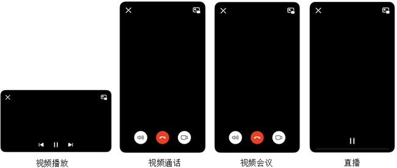
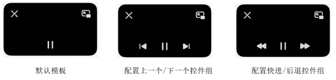
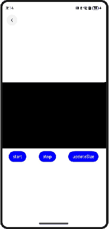
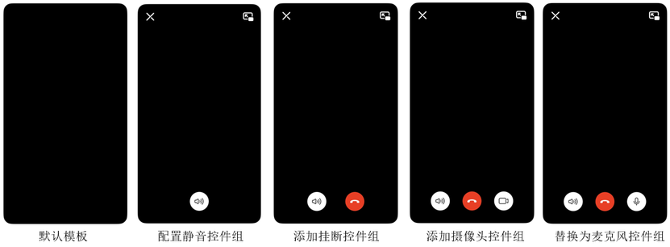
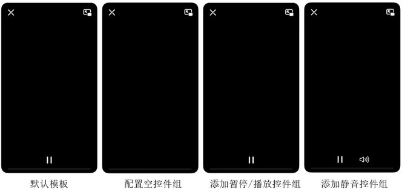
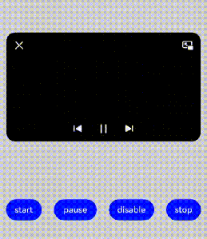

# 画中画开发概述

更新时间：2026-04-20 06:34:33

来源：https://developer.huawei.com/consumer/cn/doc/harmonyos-guides/pipwindow-overview

##### 场景介绍

应用在视频播放、视频会议、视频通话等场景下，可以使用画中画能力将视频内容以小窗（画中画）模式呈现。切换为小窗（画中画）模式后，用户可以进行其他界面操作，提升使用体验。
 
画中画的常见使用场景有以下几种：
 
- 视频播放。
- 视频通话。
- 视频会议。
- 直播。

 
系统提供以下三种画中画功能的开发方式：
 
- [使用XComponent实现画中画功能开发](https://developer.huawei.com/consumer/cn/doc/harmonyos-guides/pipwindow-xcomponent)：适用于应用通过[Navigation](https://developer.huawei.com/consumer/cn/doc/harmonyos-references/ts-basic-components-navigation)管理页面或Ability单页面情况下使用画中画的场景，这种实现方式无需应用管理页面。
- [使用typeNode实现画中画功能开发](https://developer.huawei.com/consumer/cn/doc/harmonyos-guides/pipwindow-typenode)：适用于所有场景，这种实现方式灵活性高，需要应用自行管理页面，推荐通过该方式使用画中画功能。
- [使用NDK接口实现画中画功能开发](https://developer.huawei.com/consumer/cn/doc/harmonyos-guides/pipwindow-native)：适用于依赖NDK接口开发的应用，需要应用自行管理页面。

 
  

##### 约束与限制

- 基于安全考虑，应用处于后台时不允许通过startPiP启动画中画。针对应用返回后台时需要启动画中画的场景，建议使用setAutoStartEnabled(true)实现自动启动。

 
  

##### 接口说明

以下是画中画功能的常用ArkTS接口，更多接口及使用参考[@ohos.PiPWindow (画中画窗口)](https://developer.huawei.com/consumer/cn/doc/harmonyos-references/js-apis-pipwindow)。
  
| 接口名 | 描述 |
| --- | --- |
| isPiPEnabled(): boolean | 判断当前系统是否开启画中画功能。 |
| create(config: PiPConfiguration): Promise&lt;PiPController&gt; | 创建画中画控制器。 |
| create(config: PiPConfiguration, contentNode: typeNode.XComponent): Promise&lt;PiPController&gt; | 使用typeNode创建画中画控制器。 |
| startPiP(): Promise&lt;void&gt; | 启动画中画。 |
| stopPiP(): Promise&lt;void&gt; | 停止画中画。 |
| setAutoStartEnabled(enable: boolean): void | 设置是否需要在应用退后台时自动启动画中画，true表示需要自动启动，false表示不需要自动启动。 |
| updateContentSize(width: number, height: number): void | 当媒体源切换时，向画中画控制器更新媒体源尺寸信息。 |
| on(type: 'stateChange', callback: (state: PiPState, reason: string) => void): void | 开启画中画生命周期状态的监听。 |
| off(type: 'stateChange'): void | 关闭画中画生命周期状态的监听。 |
| on(type: 'controlPanelActionEvent', callback: ControlPanelActionEventCallback): void | 开启画中画控制面板控件动作事件的监听。推荐使用on('controlEvent')来开启画中画控制面板控件动作事件的监听。 |
| off(type: 'controlPanelActionEvent'): void | 关闭画中画控制面板控件动作事件的监听。推荐使用off('controlEvent')来关闭画中画控制面板控件动作事件的监听。 |
| updatePiPControlStatus(controlType: PiPControlType, status: PiPControlStatus): void | 更新画中画控制面板控件状态。 |
| setPiPControlEnabled(controlType: PiPControlType, enabled: boolean): void | 设置控制面板控件使能状态。 |
| on(type: 'controlEvent', callback: CallBack&lt;ControlEventParam&gt;): void | 开启画中画控制面板控件动作事件的监听。 |
| off(type: 'controlEvent', callback?: CallBack&lt;ControlEventParam&gt;): void | 关闭画中画控制面板控件动作事件的监听。 |
 
 
以下是画中画功能的常用NDK接口，更多接口及使用参考[oh_window_pip.h](https://developer.huawei.com/consumer/cn/doc/harmonyos-references/capi-oh-window-pip-h)。
  
| 接口名 | 描述 |
| --- | --- |
| int32_t OH_PictureInPicture_CreatePipConfig(PictureInPicture_PipConfig* pipConfig) | 创建画中画参数配置器。 |
| int32_t OH_PictureInPicture_DestroyPipConfig(PictureInPicture_PipConfig* pipConfig) | 销毁画中画参数配置器。 |
| int32_t OH_PictureInPicture_CreatePip(PictureInPicture_PipConfig pipConfig, uint32_t* controllerId) | 创建画中画控制器。 |
| int32_t OH_PictureInPicture_DeletePip(uint32_t controllerId) | 删除画中画控制器。 |
| int32_t OH_PictureInPicture_StartPip(uint32_t controllerId) | 启动画中画。 |
| int32_t OH_PictureInPicture_StopPip(uint32_t controllerId) | 停止画中画。 |
| int32_t OH_PictureInPicture_UpdatePipContentSize(uint32_t controllerId, uint32_t width, uint32_t height) | 当媒体源切换时，向画中画控制器更新媒体源尺寸信息。 |
| int32_t OH_PictureInPicture_UpdatePipControlStatus(uint32_t controllerId, PictureInPicture_PipControlType controlType, PictureInPicture_PipControlStatus status) | 更新画中画控制面板控件状态。 |
| int32_t OH_PictureInPicture_SetPipControlEnabled(uint32_t controllerId, PictureInPicture_PipControlType controlType, bool enabled) | 设置画中画控制面板控件使能状态。 |
| int32_t OH_PictureInPicture_RegisterStartPipCallback(uint32_t controllerId, WebPipStartPipCallback callback) | 开启画中画surface创建完成的监听。 |
| int32_t OH_PictureInPicture_UnregisterStartPipCallback(uint32_t controllerId, WebPipStartPipCallback callback) | 关闭画中画surface创建完成的监听。 |
| int32_t OH_PictureInPicture_RegisterLifecycleListener(uint32_t controllerId, WebPipLifeCycleCallback callback) | 开启画中画生命周期状态的监听。 |
| int32_t OH_PictureInPicture_UnregisterLifecycleListener(uint32_t controllerId, WebPipLifeCycleCallback callback) | 关闭画中画生命周期状态的监听。 |
| int32_t OH_PictureInPicture_RegisterControlEventListener(uint32_t controllerId, WebPipControlEventCallback callback) | 开启画中画控制面板控件动作事件的监听。 |
| int32_t OH_PictureInPicture_UnregisterControlEventListener(uint32_t controllerId, WebPipControlEventCallback callback) | 关闭画中画控制面板控件动作事件的监听。 |
| int32_t OH_PictureInPicture_RegisterResizeListener(uint32_t controllerId, WebPipResizeCallback callback) | 开启画中画窗口尺寸变化事件的监听。 |
| int32_t OH_PictureInPicture_UnregisterResizeListener(uint32_t controllerId, WebPipResizeCallback callback) | 关闭画中画窗口尺寸变化事件的监听。 |
 
 
  

##### 交互方式

画中画窗口提供以下交互方式：
 
- 单击画中画窗口：如果画中画控制层未显示，则显示画中画控制层，3秒后自动隐藏控制层；如果当前控制层已显示，则隐藏画中画控制层。
- 双击画中画窗口：放大或缩小画中画窗口。
- 拖动画中画窗口：可以将画中画窗口拖动到屏幕任意位置。如果将画中画窗口拖动到屏幕左右边缘，画中画窗口会自动隐藏；隐藏后在屏幕边缘显示画中画隐藏图标，点击该图标后画中画窗口恢复显示。
- 拖拽缩放画中画窗口：可以拖拽画中画窗口四边以及四个对角缩放画中画窗口大小，窗口尺寸不能超过默认最大档与最小档，当拖拽过程中画中画窗口超过窗口尺寸限制以及超出屏幕尺寸，会触发回弹效果。
- 拖动删除画中画窗口：可以将画中画窗口拖动到底部垃圾桶热区，删除画中画窗口。对于申请长时任务的应用，需要主动监听画中画生命周期STOPPED事件，关闭任务或进程。

 
画中画控制层提供以下功能：
 
- 窗口控制：包括“关闭”和“恢复全屏窗口”功能。点按“关闭”按钮后，画中画窗口关闭；点按“恢复全屏窗口”按钮后，将从画中画窗口恢复到应用原始界面。
- 内容控制：内容控制区根据不同场景呈现不同，应用可根据实际场景需要进行设置，各场景控制层示意图如下所示。

 
**图1** 不同场景下画中画控制层的不同呈现
 

 
  

##### 配置画中画控制层可选控件

在使用[create](https://developer.huawei.com/consumer/cn/doc/harmonyos-references/js-apis-pipwindow#pipwindowcreate)接口创建画中画时，可通过在[PiPConfiguration](https://developer.huawei.com/consumer/cn/doc/harmonyos-references/js-apis-pipwindow#pipconfiguration)中新增[PiPControlGroup](https://developer.huawei.com/consumer/cn/doc/harmonyos-references/js-apis-pipwindow#pipcontrolgroup12)类型的数组配置当前画中画控制层控件。
 
- 视频播放场景可通过配置[VideoPlayControlGroup](https://developer.huawei.com/consumer/cn/doc/harmonyos-references/js-apis-pipwindow#videoplaycontrolgroup12)来显示可选的控制层控件。

  **图2** 视频播放场景配置控制层可选控件

  

- 视频通话场景可通过配置[VideoCallControlGroup](https://developer.huawei.com/consumer/cn/doc/harmonyos-references/js-apis-pipwindow#videocallcontrolgroup12)来显示可选的控制层控件。示意图如下所示。

  **图3** 视频通话场景配置控制层可选控件

  

  若不配置，视频通话模版默认不存在任何按钮，点击画中画窗口即可启动还原（见下图左，未配置任何控件的操作示意图）。下图右为配置控件的操作示意图。

  

 

- 视频会议场景可通过配置[VideoMeetingControlGroup](https://developer.huawei.com/consumer/cn/doc/harmonyos-references/js-apis-pipwindow#videomeetingcontrolgroup12)来显示可选的控制层控件。示意图如下所示。若不配置，视频会议模版默认不存在任何按钮，点击画中画窗口即可启动还原（与视频通话模版操作示意图一致）。

  **图4** 视频会议场景配置控制层可选控件

  

- 直播场景可通过配置[VideoLiveControlGroup](https://developer.huawei.com/consumer/cn/doc/harmonyos-references/js-apis-pipwindow#videolivecontrolgroup12)来显示可选的控制层控件。示意图如下所示。

  **图5** 直播场景配置控制层可选控件

  

 
  

##### 在画中画内容上方展示自定义UI

在使用[create](https://developer.huawei.com/consumer/cn/doc/harmonyos-references/js-apis-pipwindow#pipwindowcreate)接口创建画中画时，可通过在[PiPConfiguration](https://developer.huawei.com/consumer/cn/doc/harmonyos-references/js-apis-pipwindow#pipconfiguration)中传入customUIController来显示自定义UI。
 
> [!NOTE]
> 自定义显示的UI无法响应交互事件。

 
**图6** 在画中画内容上方显示自定义UI
 

 
  

##### 更新画中画控制面板控件状态

应用可以使用updatePiPControlStatus接口更新控制面板控件的功能状态，如将视频播放模板下VIDEO_PLAY_PAUSE控件的播放状态更改为暂停状态，见下图。
 
应用也可以使用setPiPControlEnabled接口设置控制面板控件的使能状态，如将视频播放模板下VIDEO_PREVIOUS控件从可点击状态变为不可点击状态，见下图。
 
**图7** 更新控件功能状态
 

 
**图8** 设置控件使能状态
 

