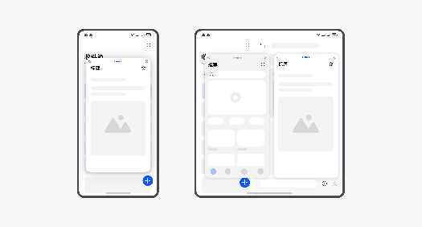

# 顶部窗口控制条避让适配智慧多窗

更新时间：2026-04-20 06:34:33

来源：https://developer.huawei.com/consumer/cn/doc/harmonyos-guides/multi-window-controlbar-adapt

顶部窗口控制条是应用窗口处于智慧多窗模式下，应用顶部的操作横条

。

 顶部窗口控制条示意图如下所示：

 

 顶部横条的避让可通过以下两种方式适配：
