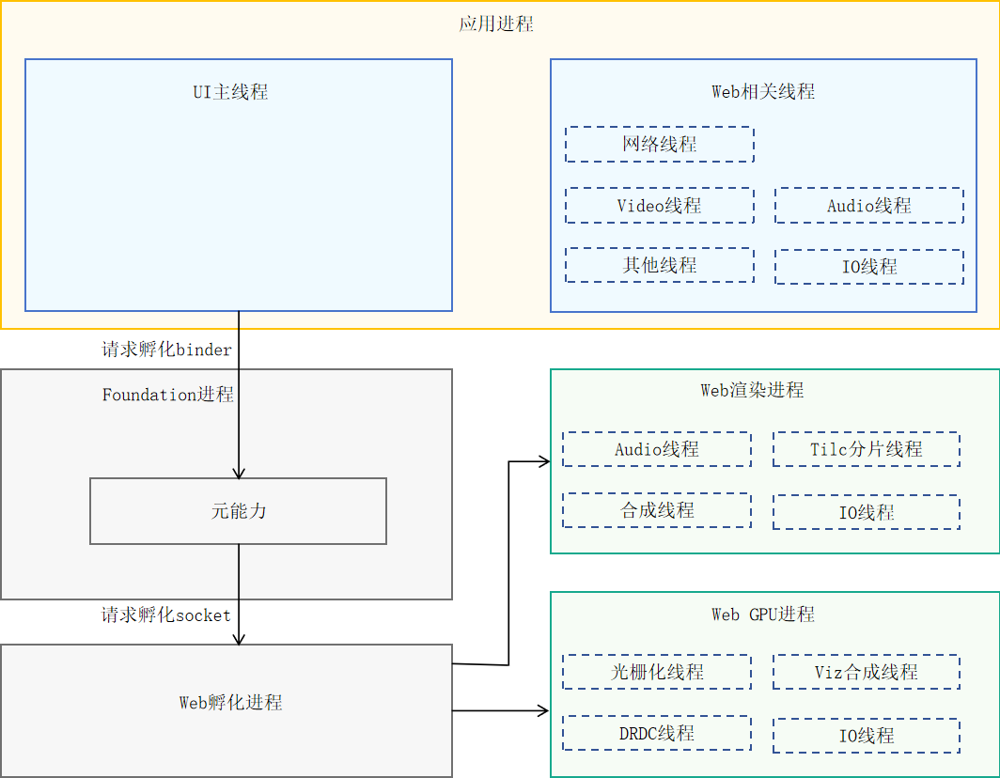

# ArkWeb进程

更新时间：2026-04-30 02:41:24

来源：https://developer.huawei.com/consumer/cn/doc/harmonyos-guides/web_component_process

ArkWeb是多进程模型，分为应用进程、Web渲染进程、Web GPU进程、Web孵化进程和Foundation进程。

> [!NOTE]
> Web内核对内存大小的申请无限制约束。

**图1** ArkWeb进程模型图

Foundation进程（系统唯一）

负责接收应用进程进行孵化进程的请求，管理应用进程和Web渲染进程的绑定关系。

Web孵化进程（系统唯一）

Web渲染进程（应用可指定多Web实例间共享或独立进程）

Web GPU进程（应用唯一）

负责光栅化、合成送显等与GPU、RenderService交互功能。提升应用进程稳定性、安全性。
