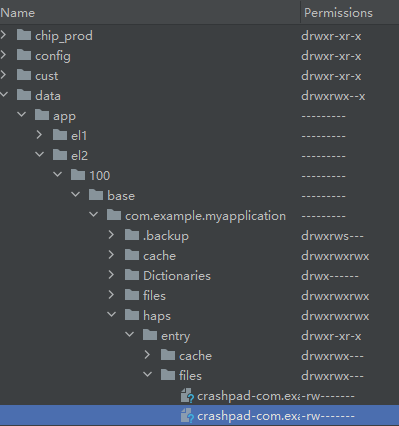

# 使用Crashpad收集Web组件崩溃信息

更新时间：2026-04-10 09:55:20

来源：https://developer.huawei.com/consumer/cn/doc/harmonyos-guides/web-crashpad

Web组件支持使用Crashpad记录进程崩溃信息。Crashpad是Chromium内核提供的进程崩溃信息处理工具，在应用使用Web组件导致的进程（Web渲染进程）崩溃出现后，Crashpad会在应用主进程沙箱目录写入dmp文件。该文件为二进制格式，后缀为dmp，其记录了进程崩溃的原因、线程信息、寄存器信息等，应用可以使用该文件分析Web组件相关进程崩溃问题。Web组件分别从API version 9和API version 12开始支持接口onRenderExited和onRenderProcessNotResponding，开发者可以分别通过Web接口[onRenderExited](https://developer.huawei.com/consumer/cn/doc/harmonyos-references/arkts-basic-components-web-events#onrenderexited9)和[onRenderProcessNotResponding](https://developer.huawei.com/consumer/cn/doc/harmonyos-references/arkts-basic-components-web-events#onrenderprocessnotresponding12)来检测渲染进程退出和渲染进程不响应，也可以在这些接口中增加应用处理的逻辑。

使用步骤如下：


1. 在应用使用Web组件导致的进程崩溃出现后，Crashpad收到信号，对应Hilog日志（节选部分）如下


```text
pid-30069             I     [crashpad_ohos.cc:254] crashpad SandboxedHandler::HandleCrash, received signo = 6
pid-30069             I     [crashpad_ohos.cc:182] crashpad SandboxedHandler::HandleCrashNonFatal, connect to handler successfully, need to request dump
...
arkweb_cr..._handler  I     [crash_report_database.cc:91] crash dmp path : /data/storage/el2/log/crashpad/new/xxx.dmp
```

这时Crashpad开始请求dump，成功之后，会在应用主进程沙箱目录下产生对应的dmp文件，对应的沙箱路径如下：


```text
/data/storage/el2/log/crashpad
```


1. 参考[Native访问应用沙箱](https://developer.huawei.com/consumer/cn/doc/best-practices/bpta-file-native-side)实现访问应用沙箱dmp文件；也可将存放dmp文件的沙箱路径的文件复制到可以查看的路径。示例如下


```text
import { fileIo as fs } from '@kit.CoreFileKit'
import { BusinessError } from '@kit.BasicServicesKit'
import { webview } from '@kit.ArkWeb'

@Entry
@Component
struct Index {
  controller: webview.WebviewController = new webview.WebviewController();
  uiContext: UIContext = this.getUIContext();
  build() {
    RelativeContainer() {
      Web({src:'chrome://memory-exhaust/', controller:this.controller})
      Button('file')
        .onClick(() => {
          let pathDir = this.uiContext.getHostContext()?.filesDir;
          console.info("pathdir=" + pathDir);
          fs.copyDir("/data/storage/el2/log/crashpad/pending/", pathDir, 0)
            .then(()=>{
              console.info("copy files success");
            })
            .catch((err: BusinessError)=>{
              console.error("copy failed with error message: " + err.message + ", error code: " + err.code);
            })
        })
    }
    .height('100%')
    .width('100%')
  }
}
```

以上示例将所有的dmp文件都复制到可查看的沙箱路径中，也可以搜索Hilog日志“.dmp”得到dmp文件名，这样就可以将某个dmp文件复制到另一个沙箱路径下了，具体的路径为


```text
/data/app/el2/100/base/com.example.myapplication/haps/entry/files/
```

这个路径可以利用DevEco Studio查看。


