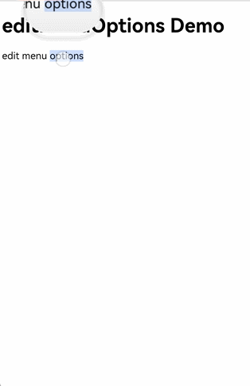
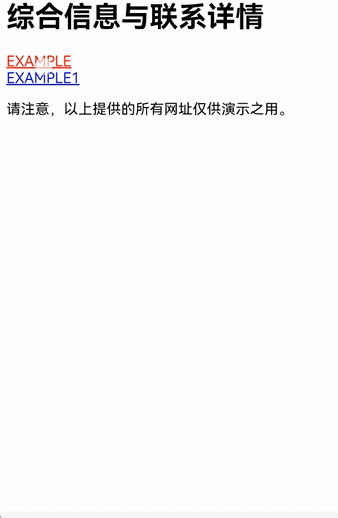
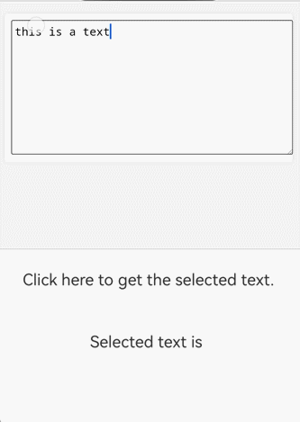
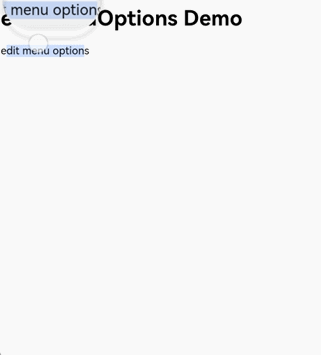
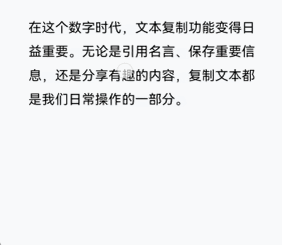

# 使用Web组件菜单处理网页内容

更新时间：2026-05-12 09:31:20

来源：https://developer.huawei.com/consumer/cn/doc/harmonyos-guides/web-menu

菜单作为用户交互的关键组件，其作用是构建清晰的导航体系，通过结构化布局展示功能入口，使用户能够迅速找到目标内容或执行操作。作为人机交互的重要枢纽，它显著提升了Web组件的可访问性和用户体验，是应用设计中必不可少的部分。Web组件菜单类型包括[文本选中菜单](https://developer.huawei.com/consumer/cn/doc/harmonyos-guides/web-menu#文本选中菜单)、[上下文菜单](https://developer.huawei.com/consumer/cn/doc/harmonyos-guides/web-menu#上下文菜单)和[自定义菜单](https://developer.huawei.com/consumer/cn/doc/harmonyos-guides/web-menu#自定义菜单)，应用可根据具体需求灵活选择。


| 菜单类型 | 目标元素 | 响应类型 | 是否支持自定义 |
| --- | --- | --- | --- |
| [文本选中菜单](https://developer.huawei.com/consumer/cn/doc/harmonyos-guides/web-menu#文本选中菜单) | 文本 | 手势长按 | 可增减菜单项，菜单样式不可自定义 |
| [上下文菜单](https://developer.huawei.com/consumer/cn/doc/harmonyos-guides/web-menu#上下文菜单) | 超链接、图片、文字 | 手势长按、鼠标右键 | 支持通过菜单组件自定义 |
| [自定义菜单](https://developer.huawei.com/consumer/cn/doc/harmonyos-guides/web-menu#自定义菜单) | 图片 | 手势长按 | 支持通过菜单组件自定义 |


## 文本选中菜单

Web组件的文本选中菜单是一种通过自定义元素实现的上下文交互组件，当用户选中文本时会动态显示，提供复制、分享、标注等语义化操作，具备标准化功能与良好可扩展性，是移动端文本操作的核心功能之一。文本选中菜单在用户长按选中文本或编辑状态下长按出现单手柄时弹出，菜单项横向排列。系统提供默认的菜单实现。应用可通过[editMenuOptions](https://developer.huawei.com/consumer/cn/doc/harmonyos-references/arkts-basic-components-web-attributes#editmenuoptions12)接口对文本选中菜单进行自定义操作。 通过onCreateMenu方法自定义菜单项，通过操作Array数组可对显示菜单项进行增减操作，在[TextMenuItem](https://developer.huawei.com/consumer/cn/doc/harmonyos-references/ts-text-common#textmenuitem12对象说明)中定义菜单项名称、图标、ID等内容。 通过onMenuItemClick方法处理菜单项点击事件，当返回false时会执行系统默认逻辑。 创建一个[EditMenuOptions](https://developer.huawei.com/consumer/cn/doc/harmonyos-references/ts-text-common#editmenuoptions)对象，包含onCreateMenu和onMenuItemClick两个方法，通过Web组件的[editMenuOptions](https://developer.huawei.com/consumer/cn/doc/harmonyos-references/arkts-basic-components-web-attributes#editmenuoptions12)接口与Web组件绑定。
```text
import { webview } from '@kit.ArkWeb';

@Entry
@Component
struct WebComponent {
  controller: webview.WebviewController = new webview.WebviewController();

  onCreateMenu(menuItems: Array): Array {
    let items = menuItems.filter((menuItem) => {
      // 过滤用户需要的系统菜单项
      return (
        menuItem.id.equals(TextMenuItemId.CUT) ||
          menuItem.id.equals(TextMenuItemId.COPY) ||
          menuItem.id.equals(TextMenuItemId.PASTE)
      );
    });
    let customItem1: TextMenuItem = {
      content: 'customItem1',
      id: TextMenuItemId.of('customItem1'),
      // 请将$r('app.media.startIcon')替换为实际资源文件
      icon: $r('app.media.startIcon')
    };
    let customItem2: TextMenuItem = {
      // 请将$r('app.string.EntryAbility_label')替换为实际资源文件，在本示例中该资源文件的value值为"label"
      content: $r('app.string.EntryAbility_label'),
      id: TextMenuItemId.of('customItem2'),
      // 请将$r('app.media.startIcon')替换为实际资源文件
      icon: $r('app.media.startIcon')
    };
    items.push(customItem1); // 在选项列表后添加新选项
    items.unshift(customItem2); // 在选项列表前添加选项
    for (let i = 0; i


      测试网页


    editMenuOptions Demo
    edit menu options


```



## 上下文菜单

上下文菜单是用户通过特定操作（如右键点击或长按富文本）触发的快捷菜单，用于提供与当前操作对象或界面元素相关的功能选项。菜单项纵向排列。系统未提供默认实现，若应用未实现，则不显示上下文菜单。应用需要创建一个[Menu](https://developer.huawei.com/consumer/cn/doc/harmonyos-references/ts-basic-components-menu)组件并与Web组件绑定，在菜单弹出时可通过Web组件的[onContextMenuShow](https://developer.huawei.com/consumer/cn/doc/harmonyos-references/arkts-basic-components-web-events#oncontextmenushow9)回调接口获取上下文菜单的详细信息，包括点击位置的HTML元素信息及点击位置信息。 [Menu](https://developer.huawei.com/consumer/cn/doc/harmonyos-references/ts-basic-components-menu)组件作为弹出的菜单，包含所有菜单项行为与样式。 使用bindPopup方法将Menu组件与Web组件绑定。当上下文菜单弹出时，将显示创建的Menu组件。 在onContextMenuShow回调中获取上下文菜单事件信息[onContextMenuShowEvent](https://developer.huawei.com/consumer/cn/doc/harmonyos-references/arkts-basic-components-web-i#oncontextmenushowevent12)。其中param为[WebContextMenuParam](https://developer.huawei.com/consumer/cn/doc/harmonyos-references/arkts-basic-components-web-webcontextmenuparam)类型，包含点击位置对应HTML元素信息和位置信息，result为[WebContextMenuResult](https://developer.huawei.com/consumer/cn/doc/harmonyos-references/arkts-basic-components-web-webcontextmenuresult)类型，提供常见的菜单能力。
```text
// xxx.ets
import { webview } from '@kit.ArkWeb';
import { pasteboard } from '@kit.BasicServicesKit';

const TAG = 'ContextMenu';

@Entry
@Component
struct WebComponent {
  controller: webview.WebviewController = new webview.WebviewController();
  private result: WebContextMenuResult | undefined = undefined;
  @State linkUrl: string = '';
  @State offsetX: number = 0;
  @State offsetY: number = 0;
  @State showMenu: boolean = false;
  uiContext: UIContext = this.getUIContext();

  @Builder
  // 构建自定义菜单及触发功能接口
  MenuBuilder() {
    // 以垂直列表形式显示的菜单。
    Menu() {
      // 展示菜单Menu中具体的菜单项。
      MenuItem({
        content: 'Copy Image',
      })
        .width(100)
        .height(50)
        .onClick(() => {
          this.result?.copyImage();
          this.showMenu = false;
        })
      MenuItem({
        content: 'Cut',
      })
        .width(100)
        .height(50)
        .onClick(() => {
          this.result?.cut();
          this.showMenu = false;
        })
      MenuItem({
        content: 'Copy',
      })
        .width(100)
        .height(50)
        .onClick(() => {
          this.result?.copy();
          this.showMenu = false;
        })
      MenuItem({
        content: 'Paste',
      })
        .width(100)
        .height(50)
        .onClick(() => {
          this.result?.paste();
          this.showMenu = false;
        })
      MenuItem({
        content: 'Copy link',
      })
        .width(100)
        .height(50)
        .onClick(() => {
          let pasteData = pasteboard.createData(pasteboard.MIMETYPE_TEXT_PLAIN, this.linkUrl);
          pasteboard.getSystemPasteboard().setData(pasteData, (error) => {
            if (error) {
              return;
            }
          })
          this.showMenu = false;
        })
      MenuItem({
        content: 'Select All',
      })
        .width(100)
        .height(50)
        .onClick(() => {
          this.result?.selectAll();
          this.showMenu = false;
        })
    }
    .width(150)
    .height(300)
  }

  build() {
    Column() {
      Web({ src: $rawfile('index1.html'), controller: this.controller })
      // 触发自定义弹窗
        .onContextMenuShow((event) => {
          if (event) {
            this.result = event.result
            console.info('x coord = ' + event.param.x());
            console.info('link url = ' + event.param.getLinkUrl());
            this.linkUrl = event.param.getLinkUrl();
          }
          console.info(TAG, `x: ${this.offsetX}, y: ${this.offsetY}`);
          this.showMenu = true;
          this.offsetX = 0;
          this.offsetY = Math.max(this.uiContext!.px2vp(event?.param.y() ?? 0) - 0, 0);
          return true;
        })
        .bindPopup(this.showMenu,
          {
            builder: this.MenuBuilder(),
            enableArrow: false,
            placement: Placement.LeftTop,
            offset: { x: this.offsetX, y: this.offsetY },
            mask: false,
            onStateChange: (e) => {
              if (!e.isVisible) {
                this.showMenu = false;
                this.result!.closeContextMenu();
              }
            }
          })
    }
  }
}
```


```text


  onContextMenuShow
  [超链接www.example.com](http://www.example.com)

  
  选中文字鼠标右键弹出菜单


```


## 自定义菜单

自定义菜单赋予开发者灵活控制菜单触发时机与视觉呈现的能力，使应用能够根据用户操作场景动态匹配功能入口，显著简化开发过程中的界面适配工作，同时让交互体验更贴近用户直觉。 开发者可通过[bindSelectionMenu](https://developer.huawei.com/consumer/cn/doc/harmonyos-references/arkts-basic-components-web-attributes#bindselectionmenu13)接口实现自定义菜单功能。目前，已额外支持通过长按图片、链接和文本，触发自定义菜单及自定义文本菜单。 创建[Menu](https://developer.huawei.com/consumer/cn/doc/harmonyos-references/ts-basic-components-menu)组件作为菜单弹窗。 通过Web组件的[bindSelectionMenu](https://developer.huawei.com/consumer/cn/doc/harmonyos-references/arkts-basic-components-web-attributes#bindselectionmenu13)方法绑定MenuBuilder菜单弹窗。将[WebElementType](https://developer.huawei.com/consumer/cn/doc/harmonyos-references/arkts-basic-components-web-e#webelementtype13)设置为WebElementType.IMAGE，[responseType](https://developer.huawei.com/consumer/cn/doc/harmonyos-references/arkts-basic-components-web-e#webresponsetype13)设置为WebResponseType.LONG_PRESS，表示长按图片时弹出菜单。在[options](https://developer.huawei.com/consumer/cn/doc/harmonyos-references/arkts-basic-components-web-i#selectionmenuoptionsext13)中定义菜单显示回调onAppear、菜单消失回调onDisappear、预览窗口preview和菜单类型menuType。
```text
import { webview } from '@kit.ArkWeb';

interface PreviewBuilderParam {
  previewImage: Resource | string | undefined;
  width: number;
  height: number;
}

@Builder function previewBuilderGlobal($$: PreviewBuilderParam) {
  Column() {
    Image($$.previewImage)
      .objectFit(ImageFit.Fill)
      .autoResize(true)
  }.width($$.width).height($$.height)
}

@Entry
@Component
struct WebComponent {
  controller: webview.WebviewController = new webview.WebviewController();

  private result: WebContextMenuResult | undefined = undefined;
  @State previewImage: Resource | string | undefined = undefined;
  @State previewWidth: number = 0;
  @State previewHeight: number = 0;
  uiContext: UIContext = this.getUIContext();

  @Builder
  MenuBuilder() {
    Menu() {
      MenuItem({ content: 'Copy', })
        .onClick(() => {
          this.result?.copy();
          this.result?.closeContextMenu();
        })
      MenuItem({ content: 'Select All', })
        .onClick(() => {
          this.result?.selectAll();
          this.result?.closeContextMenu();
        })
    }
  }
  build() {
    Column() {
      Web({ src: $rawfile('index2.html'), controller: this.controller })
        .bindSelectionMenu(WebElementType.IMAGE, this.MenuBuilder, WebResponseType.LONG_PRESS,
          {
            onAppear: () => {},
            onDisappear: () => {
              this.result?.closeContextMenu();
            },
            preview: previewBuilderGlobal({
              previewImage: this.previewImage,
              width: this.previewWidth,
              height: this.previewHeight
            }),
            menuType: MenuType.PREVIEW_MENU
          })
        .onContextMenuShow((event) => {
          if (event) {
            this.result = event.result;
            if (event.param.getLinkUrl()) {
              return false;
            }
            this.previewWidth = this.uiContext!.px2vp(event.param.getPreviewWidth());
            this.previewHeight = this.uiContext!.px2vp(event.param.getPreviewHeight());
            if (event.param.getSourceUrl().indexOf('resource://rawfile/') == 0) {
              this.previewImage = $rawfile(event.param.getSourceUrl().substr(19));
            } else {
              this.previewImage = event.param.getSourceUrl();
            }
            return true;
          }
          return false;
        })
    }
  }
}
```


```text


      测试网页


    bindSelectionMenu Demo

    


```


自API version 20起，支持绑定长按超链接菜单。可以为图片和链接绑定不同的自定义菜单。 以下示例中，PreviewBuilder定义了超链接对应菜单的弹出内容，用Web组件加载了超链接内容（需要注意PreviewBuilder中的Web组件不会接收事件），使用[Progress组件](https://developer.huawei.com/consumer/cn/doc/harmonyos-guides/arkts-common-components-progress-indicator)展示了加载进度。
```text
import { webview } from '@kit.ArkWeb';
import { pasteboard } from '@kit.BasicServicesKit';

interface PreviewBuilderParam {
  width: number;
  height: number;
  url:Resource | string | undefined;
}

interface PreviewBuilderParamForImage {
  previewImage: Resource | string | undefined;
  width: number;
  height: number;
}


@Builder function previewBuilderGlobalForImage($$: PreviewBuilderParamForImage) {
  Column() {
    Image($$.previewImage)
      .objectFit(ImageFit.Fill)
      .autoResize(true)
  }.width($$.width).height($$.height)
}

@Entry
@Component
struct SelectionMenuLongPress {
  controller: webview.WebviewController = new webview.WebviewController();
  previewController: webview.WebviewController = new webview.WebviewController();
  @Builder PreviewBuilder($$: PreviewBuilderParam){
    Column() {
      Stack(){
        Text('') // 可选择是否展示url
          .padding(5)
          .width('100%')
          .textAlign(TextAlign.Start)
          .backgroundColor(Color.White)
          .copyOption(CopyOptions.LocalDevice)
          .maxLines(1)
          .textOverflow({overflow:TextOverflow.Ellipsis})
        Progress({ value: this.progressValue, total: 100, type: ProgressType.Linear }) // 展示进度条
          .style({ strokeWidth: 3, enableSmoothEffect: true })
          .backgroundColor(Color.White)
          .opacity(this.progressVisible?1:0)
          .backgroundColor(Color.White)
      }.alignContent(Alignment.Bottom)
      Web({src:$$.url,controller: new webview.WebviewController()})
        .javaScriptAccess(true)
        .fileAccess(true)
        .onlineImageAccess(true)
        .imageAccess(true)
        .domStorageAccess(true)
        .onPageBegin(()=>{
          this.progressValue = 0;
          this.progressVisible = true;
        })
        .onProgressChange((event)=>{
          this.progressValue = event.newProgress;
        })
        .onPageEnd(()=>{
          this.progressVisible = false;
        })
        .hitTestBehavior(HitTestMode.None) // 使预览Web不响应手势
    }.width($$.width).height($$.height) // 设置预览宽高
  }

  private result: WebContextMenuResult | undefined = undefined;
  @State previewImage: Resource | string | undefined = undefined;
  @State previewWidth: number = 1;
  @State previewHeight: number = 1;
  @State previewWidthImage: number = 1;
  @State previewHeightImage: number = 1;
  @State linkURL:string = '';
  @State progressValue:number = 0;
  @State progressVisible:boolean = true;
  uiContext: UIContext = this.getUIContext();

  @Builder
  LinkMenuBuilder() {
    Menu() {
      MenuItem({ content: 'Copy link', })
        .onClick(() => {
          const pasteboardData = pasteboard.createData(pasteboard.MIMETYPE_TEXT_PLAIN, this.linkURL);
          const systemPasteboard = pasteboard.getSystemPasteboard();
          systemPasteboard.setData(pasteboardData);
        })
      MenuItem({content:'Open the link'})
        .onClick(()=>{
          this.controller.loadUrl(this.linkURL);
        })
    }
  }
  @Builder
  ImageMenuBuilder() {
    Menu() {
      MenuItem({ content: 'Copy Image', })
        .onClick(() => {
          this.result?.copyImage();
          this.result?.closeContextMenu();
        })
    }
  }
  build() {
    Column() {
      Web({ src: $rawfile('index3.html'), controller: this.controller })
        .javaScriptAccess(true)
        .fileAccess(true)
        .onlineImageAccess(true)
        .imageAccess(true)
        .domStorageAccess(true)
        .bindSelectionMenu(WebElementType.LINK, this.LinkMenuBuilder, WebResponseType.LONG_PRESS,
          {
            onAppear: () => {},
            onDisappear: () => {
              this.result?.closeContextMenu();
            },
            preview: this.PreviewBuilder({
              width: 500,
              height: 400,
              url:this.linkURL
            }),
            menuType: MenuType.PREVIEW_MENU,
          })
        .bindSelectionMenu(WebElementType.IMAGE, this.ImageMenuBuilder, WebResponseType.LONG_PRESS,
          {
            onAppear: () => {},
            onDisappear: () => {
              this.result?.closeContextMenu();
            },
            preview: previewBuilderGlobalForImage({
              previewImage: this.previewImage,
              width: this.previewWidthImage,
              height: this.previewHeightImage,
            }),
            menuType: MenuType.PREVIEW_MENU,
          })
        .zoomAccess(true)
        .onContextMenuShow((event) => {
          if (event) {
            this.result = event.result;
            this.previewWidthImage = this.uiContext!.px2vp(event.param.getPreviewWidth());
            this.previewHeightImage = this.uiContext!.px2vp(event.param.getPreviewHeight());
            if (event.param.getSourceUrl().indexOf('resource://rawfile/') == 0) {
              this.previewImage = $rawfile(event.param.getSourceUrl().substring(19));
            } else {
              this.previewImage = event.param.getSourceUrl();
            }
            this.linkURL = event.param.getLinkUrl()
            return true;
          }
          return false;
        })
    }

  }
  // 侧滑返回
  onBackPress(): boolean | void {
    try {
      if (this.controller.accessStep(-1)) {
        this.controller.backward();
        return true;
      }
    } catch (err) {
      console.error(`onBackPress failed with error: ${err.code}, ${err.message}`);
    }
    return false;
  }
}
```

html示例
```text


    综合信息页面


    综合信息与联系详情

        [EXAMPLE](https://www.example.com)

        [EXAMPLE1](https://www.example1.com/)


    请注意，以上提供的所有网址仅供演示之用。


```



## Web菜单保存图片

创建MenuBuilder组件作为菜单弹窗，使用[SaveButton](https://developer.huawei.com/consumer/cn/doc/harmonyos-references/ts-security-components-savebutton)组件实现图片保存，通过bindContextMenu将MenuBuilder与Web绑定。 在onContextMenuShow中获取图片url，通过copyLocalPicToDir或copyUrlPicToDir将图片保存至应用沙箱。 通过photoAccessHelper将应用沙箱中的图片保存至图库。
```text
import { webview } from '@kit.ArkWeb';
import { common } from '@kit.AbilityKit';
import { fileIo } from '@kit.CoreFileKit';
import { systemDateTime } from '@kit.BasicServicesKit';
import { http } from '@kit.NetworkKit';
import { photoAccessHelper } from '@kit.MediaLibraryKit';

@Entry
@Component
struct WebComponent {
  saveButtonOptions: SaveButtonOptions = {
    icon: SaveIconStyle.FULL_FILLED,
    text: SaveDescription.SAVE_IMAGE,
    buttonType: ButtonType.Capsule
  }
  controller: webview.WebviewController = new webview.WebviewController();
  @State showMenu: boolean = false;
  @State imgUrl: string = '';
  context = this.getUIContext().getHostContext() as common.UIAbilityContext;

  copyLocalPicToDir(rawfilePath: string, newFileName: string): string {
    try {
      let srcFileDes = this.context.resourceManager.getRawFdSync(rawfilePath);
      let dstPath = this.context.filesDir + '/' + newFileName;
      let dest: fileIo.File = fileIo.openSync(dstPath, fileIo.OpenMode.CREATE | fileIo.OpenMode.READ_WRITE);
      let bufsize = 4096;
      let buf = new ArrayBuffer(bufsize);
      let off = 0;
      let len = 0;
      let readedLen = 0;
      while ((len = fileIo.readSync(srcFileDes.fd, buf, { offset: srcFileDes.offset + off, length: bufsize })) != 0) {
        readedLen += len;
        fileIo.writeSync(dest.fd, buf, { offset: off, length: len });
        off = off + len;
        if ((srcFileDes.length - readedLen)  {
    let uri = '';
    let httpRequest = http.createHttp();
    try {
      let data: http.HttpResponse = await (httpRequest.request(picUrl) as Promise);
      if (data?.responseCode == http.ResponseCode.OK) {
        let dstPath = this.context.filesDir + '/' + newFileName;
        let dest: fileIo.File = fileIo.openSync(dstPath, fileIo.OpenMode.CREATE | fileIo.OpenMode.READ_WRITE);
        let writeLen: number = fileIo.writeSync(dest.fd, data.result as ArrayBuffer);
        uri = dest.path;
      }
    } catch (err) {
      console.error(`copyUrlPicToDir failed with error: ${err.code}, ${err.message}`);
    } finally {
      httpRequest.destroy();
    }
    return uri;
  }

  @Builder
  MenuBuilder() {
    Column() {
      Row() {
        SaveButton(this.saveButtonOptions)
          .onClick(async (event, result: SaveButtonOnClickResult) => {
            if (result == SaveButtonOnClickResult.SUCCESS) {
              try {
                let context = this.context;
                let phAccessHelper = photoAccessHelper.getPhotoAccessHelper(context);
                let uri = '';
                if (this.imgUrl?.includes('rawfile')) {
                  let rawFileName: string = this.imgUrl.substring(this.imgUrl.lastIndexOf('/') + 1);
                  uri = this.copyLocalPicToDir(rawFileName, 'copyFile.png');
                } else if (this.imgUrl?.includes('http') || this.imgUrl?.includes('https')) {
                  uri = await this.copyUrlPicToDir(this.imgUrl, `onlinePic${systemDateTime.getTime()}.png`);
                }
                let assetChangeRequest: photoAccessHelper.MediaAssetChangeRequest =
                  photoAccessHelper.MediaAssetChangeRequest.createImageAssetRequest(context,  uri);
                await phAccessHelper.applyChanges(assetChangeRequest);
              } catch (err) {
                console.error(`create asset failed with error: ${err.code}, ${err.message}`);
              }
            } else {
              console.error(`SaveButtonOnClickResult create asset failed`);
            }
            this.showMenu = false;
          })
      }
      .margin({ top: 20, bottom: 20 })
      .justifyContent(FlexAlign.Center)
    }
    .width('80')
    .backgroundColor(Color.White)
    .borderRadius(10)
  }

  build() {
    Column() {
      Web({src: $rawfile('index4.html'), controller: this.controller})
        .onContextMenuShow((event) => {
          if (event) {
            let hitValue = this.controller.getLastHitTest();
            this.imgUrl = hitValue.extra;
          }
          this.showMenu = true;
          return true;
        })
        .bindContextMenu(this.MenuBuilder, ResponseType.LongPress)
        .fileAccess(true)
        .javaScriptAccess(true)
        .domStorageAccess(true)
    }
  }
}
```


```text


    SavePicture


SavePicture


```


## Web菜单获取选中文本

Web组件的[editMenuOptions](https://developer.huawei.com/consumer/cn/doc/harmonyos-references/arkts-basic-components-web-attributes#editmenuoptions12)接口中没有提供获取选中文本的方式。开发者可通过[javaScriptProxy](https://developer.huawei.com/consumer/cn/doc/harmonyos-references/arkts-basic-components-web-attributes#javascriptproxy)获取到JavaScript的选中文本，实现自定义菜单的逻辑。 创建SelectClass类，通过[javaScriptProxy](https://developer.huawei.com/consumer/cn/doc/harmonyos-references/arkts-basic-components-web-attributes#javascriptproxy)将SelectClass对象注册到Web组件中。 在HTML侧注册选区变更监听器，在选区变更时通过SelectClass对象将选区设置到ArkTS侧。
```text
import { webview } from '@kit.ArkWeb';
let selectText = '';

class SelectClass {
  constructor() {
  }

  setSelectText(param: string) {
    selectText = param.toString();
  }
}

@Entry
@Component
struct WebComponent {
  webController: webview.WebviewController = new webview.WebviewController();
  @State selectObj: SelectClass = new SelectClass();
  @State textStr: string = '';

  build() {
    Column() {
      Web({ src: $rawfile('index5.html'), controller: this.webController})
        .javaScriptProxy({
          object: this.selectObj,
          name: 'selectObjName',
          methodList: ['setSelectText'],
          controller: this.webController
        })
        .height('40%')
      Text('Click here to get the selected text.')
        .fontSize(20)
        .onClick(() => {
          this.textStr = selectText;
        })
        .height('10%')
      Text('Selected text is ' + this.textStr)
        .fontSize(20)
        .height('10%')
    }
  }
}
```


```text


    Test Get Select

        body {
          margin: 40px;
          background-color: #f4f4f4;
        }
        .edit-container {
          padding: 20px;
          background-color: #fff;
          border-radius: 8px;
          box-shadow: 0 0 10px rgba(0,0,0,0.1);
          margin: auto;
        }
        textarea {
          width: 100%;
          height: 400px;
          font-size: 16px;
          padding: 10px;
          border: 1px solid #ccc;
          border-radius: 4px;
        }


    document.addEventListener('selectionchange', () => {
      var selection = window.getSelection();
      if(selection.rangeCount > 0) {
        var selectedText = selection.toString();
        selectObjName.setSelectText(selectedText);
      }
    })


```



## 常见问题


## 如何禁用长按选择时弹出菜单

可通过[editMenuOptions](https://developer.huawei.com/consumer/cn/doc/harmonyos-references/arkts-basic-components-web-attributes#editmenuoptions12)接口将系统默认菜单全部过滤，此时无菜单项，则不会显示菜单。
```text
import { webview } from '@kit.ArkWeb';

@Entry
@Component
struct WebComponent {
  controller: webview.WebviewController = new webview.WebviewController();

  onCreateMenu(menuItems: Array): Array {
    let items = menuItems.filter((menuItem) => {
      // 过滤用户需要的系统菜单项
      return false;
    });
    return items;
  }

  onMenuItemClick(menuItem: TextMenuItem, textRange: TextRange): boolean {
    return false; // 返回默认值false
  }

  @State editMenuOptions: EditMenuOptions = { onCreateMenu: this.onCreateMenu, onMenuItemClick: this.onMenuItemClick }

  build() {
    Column() {
      Web({ src: $rawfile('index7.html'), controller: this.controller })
        .editMenuOptions(this.editMenuOptions)
    }
  }
}
```


```text


      测试网页


    editMenuOptions Demo
    edit menu options


```



## 出现选区时手柄菜单不显示

可排查是否通过JavaScript的[selection-api](https://www.w3.org/TR/selection-api/)对选区进行了操作，目前通过这种方式改变选区会导致文本选中菜单不显示。

## 如何修改文本选中菜单的样式

从API version 21开始，应用可通过[bindSelectionMenu](https://developer.huawei.com/consumer/cn/doc/harmonyos-references/arkts-basic-components-web-attributes#bindselectionmenu13)接口，实现自定义文本选中菜单。 **示例代码**
```text
import { webview } from '@kit.ArkWeb';
import { BusinessError } from '@kit.BasicServicesKit';

@Entry
@Component
struct WebComponent {
  controller: webview.WebviewController = new webview.WebviewController();

  clearSelection() {
    try {
      this.controller.runJavaScript(
        'clearSelection()',
        (error, result) => {
          if (error) {
            console.error(`run clearSelection JavaScript error, ErrorCode: ${(error as BusinessError).code}, Message: ${(error as BusinessError).message}`);
            return;
          }
          if (result) {
            console.info(`The clearSelection() return value is: ${result}`);
          }
        });
    } catch (error) {
      console.error(`ErrorCode: ${(error as BusinessError).code}, Message: ${(error as BusinessError).message}`);
    }
  }

  @Builder
  TextMenuBuilder() {
    Menu() {
      MenuItem({ content: 'Copy', })
        .onClick(() => {
          try {
            this.controller.runJavaScript(
              'copySelectedText()',
              (error, result) => {
                if (error) {
                  console.error(`run copySelectedText JavaScript error, ErrorCode: ${(error as BusinessError).code}, Message: ${(error as BusinessError).message}`);
                  return;
                }
                if (result) {
                  console.info(`The copySelectedText() return value is: ${result}`);
                }
              });
          } catch (error) {
            console.error(`ErrorCode: ${(error as BusinessError).code}, Message: ${(error as BusinessError).message}`);
          }
          this.clearSelection()
        }).backgroundColor(Color.Pink)
    }
  }
  build() {
    Column() {
      Web({ src: $rawfile('bindSelectionMenuText.html'), controller: this.controller })
        .javaScriptAccess(true)
        .fileAccess(true)
        .onlineImageAccess(true)
        .imageAccess(true)
        .domStorageAccess(true)
        .zoomAccess(true)
        .bindSelectionMenu(WebElementType.TEXT, this.TextMenuBuilder, WebResponseType.LONG_PRESS,
          {
            onAppear: () => {},
            onDisappear: () => {},
            menuType: MenuType.SELECTION_MENU,
          })
    }
  }
  onBackPress(): boolean | void {
    if (this.controller.accessStep(-1)) {
      this.controller.backward();
      return true;
    } else {
      return false;
    }
  }
}
```


```text


    自定义文本菜单

        .container {
            background-color: white;
            padding: 30px;
            margin: 20px 0;
        }

        .context {
            line-height: 1.8;
            font-size: 18px;
        }

        .context span {
            border-radius: 8px;
            background-color: #f8f9fa;
        }


        在这个数字时代，文本复制功能变得日益重要。无论是引用名言、保存重要信息，还是分享有趣的内容，复制文本都是我们日常操作的  一部分。


  function copySelectedText() {
      const selectedText = window.getSelection().toString();
      if (selectedText.length > 0) {
          // 使用Clipboard API复制文本
          navigator.clipboard.writeText(selectedText)
              .then(() => {
                  showNotification();
              })
              .catch(err => {
                  console.error('copy failed:', err);
              });
      }
  }
  function clearSelection() {
    if (window.getSelection) {
      window.getSelection().removeAllRanges();
    }
  }


```


