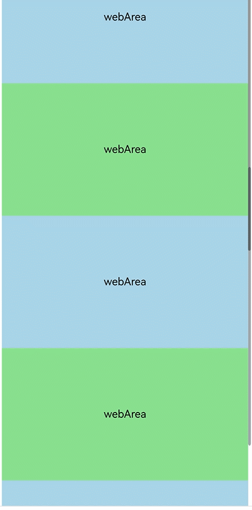

# Web组件嵌套滚动

更新时间：2026-05-26 06:48:54

来源：https://developer.huawei.com/consumer/cn/doc/harmonyos-guides/web-nested-scrolling

Web组件嵌套滚动的典型应用场景为，在页面中，多个独立区域需进行滚动，当用户滚动Web区域内容时，可联动其他滚动区域，实现上下左右全方位滑动页面的嵌套滚动体验。内嵌于可滚动容器（[Grid](https://developer.huawei.com/consumer/cn/doc/harmonyos-references/ts-container-grid)、[List](https://developer.huawei.com/consumer/cn/doc/harmonyos-references/ts-container-list)、[Scroll](https://developer.huawei.com/consumer/cn/doc/harmonyos-references/ts-container-scroll)、[Swiper](https://developer.huawei.com/consumer/cn/doc/harmonyos-references/ts-container-swiper)、[Tabs](https://developer.huawei.com/consumer/cn/doc/harmonyos-references/ts-container-tabs)、[WaterFlow](https://developer.huawei.com/consumer/cn/doc/harmonyos-references/ts-container-waterflow)、[Refresh](https://developer.huawei.com/consumer/cn/doc/harmonyos-references/ts-container-refresh)、[bindSheet](https://developer.huawei.com/consumer/cn/doc/harmonyos-references/ts-universal-attributes-sheet-transition#bindsheet)）中的Web组件，接收到滑动手势事件后，需要设置ArkUI的[NestedScrollMode](https://developer.huawei.com/consumer/cn/doc/harmonyos-references/ts-appendix-enums#nestedscrollmode10)枚举属性，实现Web组件与ArkUI可滚动容器的嵌套滚动。

Web组件嵌套滚动可通过[方案1：使用nestedScroll属性实现嵌套滚动](#使用nestedscroll属性实现嵌套滚动)或[方案2：滚动偏移量由滚动父组件统一派发](#滚动偏移量由滚动父组件统一派发)两个方案实现，方案的选择应取决于应用嵌套滚动的具体业务场景。如果只是简单的Web组件与其他父组件联动滚动建议通过方案1实现；如果应用需要自定义控制Web组件和其他滚动组件滚动，以及一些复杂场景建议使用方案2。

> [!NOTE]
> 如果Web组件用到了全量展开的场景（layoutMode为WebLayoutMode.FIT_CONTENT），需要显式指明渲染模式(RenderMode.SYNC_RENDER)，详见 layoutMode 。


##### 使用nestedScroll属性实现嵌套滚动

使用Web组件[nestedScroll](https://developer.huawei.com/consumer/cn/doc/harmonyos-references/arkts-basic-components-web-attributes#nestedscroll11)属性来设置上下左右四个方向，或者设置向前、向后两个方向的嵌套滚动模式，实现与父组件的滚动联动，同时也允许在过程中动态改变嵌套滚动的模式。

**完整代码**

```ArkTS
import { webview } from '@kit.ArkWeb';

@Entry
@ComponentV2
struct NestedScroll {
  private scrollerForScroll: Scroller = new Scroller();
  controller: webview.WebviewController = new webview.WebviewController();
  @Local arr: Array<number> = [];

  aboutToAppear(): void {
    for (let i = 0; i < 10; i++) {
    this.arr.push(i);
  }
}

build() {
  Scroll(this.scrollerForScroll) {
    Column() {
      Web({ src: $rawfile('scroll.html'), controller: this.controller })
        .nestedScroll({
          scrollUp: NestedScrollMode.PARENT_FIRST, // 向上滚动父组件优先
          scrollDown: NestedScrollMode.SELF_FIRST, // 向下滚动子组件优先
        }).height('100%')
      Repeat<number>(this.arr)
        .each((item: RepeatItem<number>) => {
          Text('Scroll Area')
            .width('100%')
            .height('40%')
            .backgroundColor(0x330000FF)
            .fontSize(16)
            .textAlign(TextAlign.Center)
        })
    }
  }
}
}
```

加载的html文件。

```text
<!-- scroll.html -->
<!DOCTYPE html>
<html>

<head>
    <meta name="viewport" id="viewport" content="width=device-width, initial-scale=1.0">
    <style>
        .blue {
            background-color: lightblue;
        }

        .green {
            background-color: lightgreen;
        }

        .blue,
        .green {
            font-size: 16px;
            height: 200px;
            text-align: center;
            /* 水平居中 */
            line-height: 200px;
            /* 垂直居中（值等于容器高度） */
        }
    </style>
</head>

<body>
    <div class="blue">webArea</div>
    <div class="green">webArea</div>
    <div class="blue">webArea</div>
    <div class="green">webArea</div>
    <div class="blue">webArea</div>
    <div class="green">webArea</div>
    <div class="blue">webArea</div>
</body>

</html>
```





##### 滚动偏移量由滚动父组件统一派发

**实现思路**
1. 手指向上滑动：

  (1) 如果Web页面没有滚动到底部，Scroll组件将滚动偏移量派发给Web，Scroll组件自身不滚动。

  (2) 如果Web页面滚动至底部，而Scroll组件尚未滚动至底部，则仅Scroll组件自身滚动，不向Web组件和List组件派发滚动偏移量。

  (3) 如果Scroll组件滚动到底部，则滚动偏移量派发给List组件，Scroll组件自身不滚动。
2. 手指向下滑动：

  (1) 如果List组件没有滚动到顶部，则Scroll组件将滚动偏移量派发给List组件，Scroll组件自身不滚动。

  (2) 当List组件滚动至顶部，而Scroll组件未到达顶部时，Scroll组件将自行滚动，滚动偏移量不会派发给List组件和Web组件。

  (3) 如果Scroll组件滚动到顶部，则滚动偏移量派发给Web，Scroll组件自身不滚动。

**关键实现**
1. 如何禁用Web组件滚动手势。

  (1) 首先调用Web组件滚动控制器方法，设置Web禁用触摸（[setScrollable](https://developer.huawei.com/consumer/cn/doc/harmonyos-references/arkts-apis-webview-webviewcontroller#setscrollable12)）的滚动。

  
```text
this.webController.setScrollable(false, webview.ScrollType.EVENT);
```
(2) 再使用[onGestureRecognizerJudgeBegin](https://developer.huawei.com/consumer/cn/doc/harmonyos-references/ts-gesture-blocking-enhancement#ongesturerecognizerjudgebegin13)方法，禁止Web组件自带的滚动手势触发。

  
```text
.onGestureRecognizerJudgeBegin((event: BaseGestureEvent, current: GestureRecognizer, otherArray<GestureRecognizer>) => {
  if (current.isBuiltIn() && current.getType() == GestureControl.GestureType.PAN_GESTURE) {
    return GestureJudgeResult.REJECT;
  }
  return GestureJudgeResult.CONTINUE;
})
```

2. 如何禁用[List](https://developer.huawei.com/consumer/cn/doc/harmonyos-references/ts-container-list)组件的手势。

  
```text
.enableScrollInteraction(false)
```

3. 如何检测List组件、Scroll组件是否滚动到边界。

  (1) 滚动到上边界：scroller.currentOffset().yOffset <= 0;

  (2) 滚动到下边界：scroller.isAtEnd() == true;
4. 如何检测Web组件是否滚动到边界。

  (1) 获取Web组件自身高度、内容高度和当前滚动偏移量来判定。

  (2) 判断Web组件是否滚动到顶部：webController.getPageOffset().y == 0;

  (3) 判断Web组件是否滚动到底部：webController.getPageOffset().y + this.webHeight >= webController.getPageHeight();

  (4) 获取Web组件自身高度：webController.[getPageHeight()](https://developer.huawei.com/consumer/cn/doc/harmonyos-references/arkts-apis-webview-webviewcontroller#getpageheight);

  (5) 获取Web组件窗口高度：webController?.[runJavaScriptExt](https://developer.huawei.com/consumer/cn/doc/harmonyos-references/arkts-apis-webview-webviewcontroller#runjavascriptext10)('window.innerHeight');

  (6) 获取Web组件的滚动偏移量：webController.[getPageOffset()](https://developer.huawei.com/consumer/cn/doc/harmonyos-references/arkts-apis-webview-webviewcontroller#getpageoffset20);
5. 如何让Scroll组件不滚动。

  Scroll组件绑定[onScrollFrameBegin](https://developer.huawei.com/consumer/cn/doc/harmonyos-references/ts-container-scroll#onscrollframebegin9)事件，将剩余滚动偏移量返回0，Scroll组件就不滚动，也不会停止惯性滚动动画。
6. 滚动偏移量如何派发给List组件。

  
```text
this.listScroller.scrollBy(0, offset)
```

7. 滚动偏移量如何派发给Web组件。

  
```text
this.webController.scrollBy(0, offset)
```

8. 设置Web组件[bypassVsyncCondition](https://developer.huawei.com/consumer/cn/doc/harmonyos-references/arkts-basic-components-web-attributes#bypassvsynccondition20)为WebBypassVsyncCondition.SCROLLBY_FROM_ZERO_OFFSET，加快Web组件首帧滚动绘制。

  
```text
.bypassVsyncCondition(WebBypassVsyncCondition.SCROLLBY_FROM_ZERO_OFFSET)
```


**完整代码**

```ArkTS
import { webview } from '@kit.ArkWeb';

@Entry
@ComponentV2
struct Index {
  private scroller: Scroller = new Scroller()
  private listScroller: Scroller = new Scroller()
  private webController: webview.WebviewController = new webview.WebviewController()
  private isWebAtEnd: boolean = false
  private webHeight: number = 0
  @Local arr: Array<number> = []

  aboutToAppear(): void {
    for (let i = 0; i < 10; i++) {
      this.arr.push(i)
    }
  }

  getWebHeight() {
    try {
      this.webController?.runJavaScriptExt('window.innerHeight',
        (error, result) => {
          if (error || !result) {
            return;
          }
          if (result.getType() === webview.JsMessageType.NUMBER) {
            this.webHeight = result.getNumber()
          }
        })
    } catch (error) {
    }
  }

  checkScrollBottom() {
    this.isWebAtEnd = false;
    if (this.webController.getPageOffset().y + this.webHeight >= this.webController.getPageHeight()) {
      this.isWebAtEnd = true;
    }
  }

  build() {
    Scroll(this.scroller) {
      Column() {
        Web({
          src: $rawfile('scroll.html'),
          controller: this.webController,
        }).height('100%')
          .bypassVsyncCondition(WebBypassVsyncCondition.SCROLLBY_FROM_ZERO_OFFSET)
          .onPageEnd(() => {
            this.webController.setScrollable(false, webview.ScrollType.EVENT);
            this.getWebHeight();
          })
          // 在识别器即将要成功时，根据当前组件状态，设置识别器使能状态
          .onGestureRecognizerJudgeBegin((event: BaseGestureEvent, current: GestureRecognizer,
            others: Array<GestureRecognizer>) => {
            if (current.isBuiltIn() && current.getType() == GestureControl.GestureType.PAN_GESTURE) {
              return GestureJudgeResult.REJECT;
            }
            return GestureJudgeResult.CONTINUE;
          })
        List({ scroller: this.listScroller }) {
          Repeat<number>(this.arr)
            .each((item: RepeatItem<number>) => {
              ListItem() {
                Text('Scroll Area')
                  .width('100%')
                  .height('40%')
                  .backgroundColor(0x330000FF)
                  .fontSize(16)
                  .textAlign(TextAlign.Center)
              }
            })
        }.height('100%')
        .maintainVisibleContentPosition(true)
        .enableScrollInteraction(false)
      }
    }
    .onScrollFrameBegin((offset: number, state: ScrollState) => {
      this.checkScrollBottom();
      if (offset > 0) {
        if (!this.isWebAtEnd) {
          this.webController.scrollBy(0, offset)
          return { offsetRemain: 0 }
        } else if (this.scroller.isAtEnd()) {
          this.listScroller.scrollBy(0, offset)
          return { offsetRemain: 0 }
        }
      } else if (offset < 0) {
        if (this.listScroller.currentOffset().yOffset > 0) {
          this.listScroller.scrollBy(0, offset)
          return { offsetRemain: 0 }
        } else if (this.scroller.currentOffset().yOffset <= 0) {
          this.webController.scrollBy(0, offset)
          return { offsetRemain: 0 }
        }
      }
      return { offsetRemain: offset }
    })
  }
}
```

加载的html文件。

```text
<!-- scroll.html -->
<!DOCTYPE html>
<html>
<head>
    <meta name="viewport" id="viewport" content="width=device-width, initial-scale=1.0">
    <style>
        .blue {
          background-color: lightblue;
        }
        .green {
          background-color: lightgreen;
        }
        .blue, .green {
         font-size:16px;
         height:200px;
         text-align: center;       /* 水平居中 */
         line-height: 200px;       /* 垂直居中（值等于容器高度） */
        }
    </style>
</head>
<body>
<div class="blue" >webArea</div>
<div class="green">webArea</div>
<div class="blue">webArea</div>
<div class="green">webArea</div>
<div class="blue">webArea</div>
<div class="green">webArea</div>
<div class="blue">webArea</div>
</body>
</html>
```


##### 示例代码

 - [Web组件嵌套滑动](https://gitcode.com/harmonyos_samples/web-scroller)
