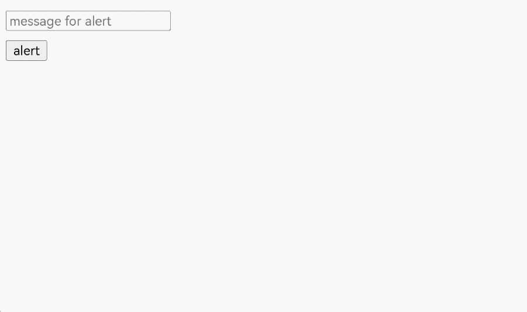
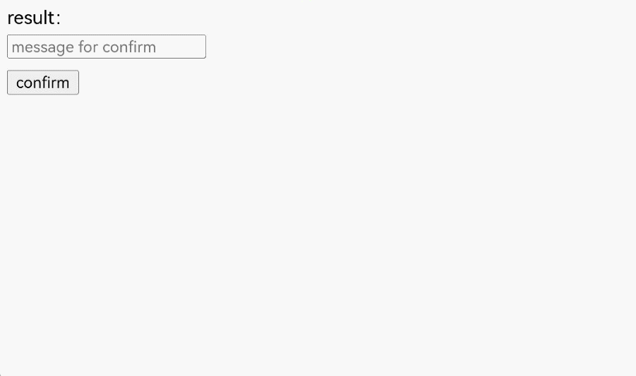
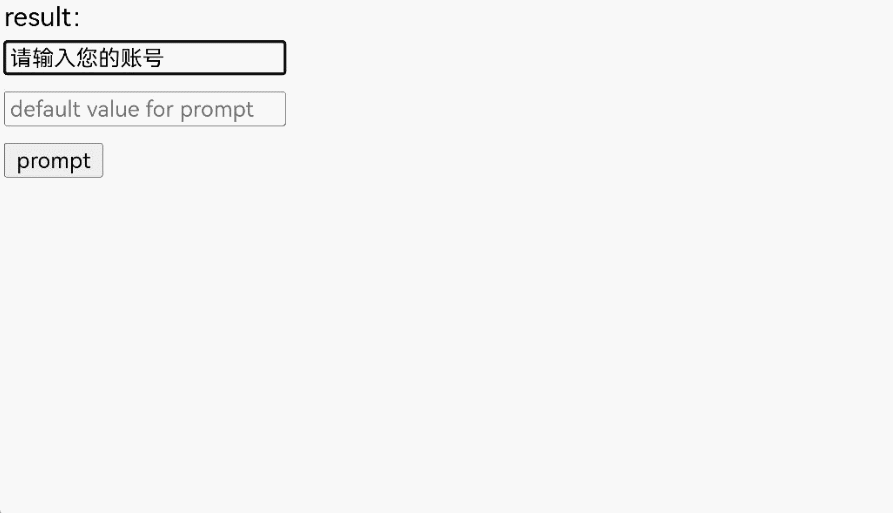

# 使用Web组件显示网页弹框

更新时间：2026-05-26 06:48:54

来源：https://developer.huawei.com/consumer/cn/doc/harmonyos-guides/web-dialog

在HTML中，可以使用JavaScript创建三种类型的弹框：警告框window.alert(message)、确认框window.confirm(message)和提示框window.prompt(message, defaultValue)。这些弹框可以用于向用户传递信息、确认操作或请求输入。

当前，ArkWeb暂未提供默认的应用弹框。如果需要网页的弹框能够正常使用，应用需要通过[onAlert](https://developer.huawei.com/consumer/cn/doc/harmonyos-references/arkts-basic-components-web-events#onalert)、[onConfirm](https://developer.huawei.com/consumer/cn/doc/harmonyos-references/arkts-basic-components-web-events#onconfirm)和[onPrompt](https://developer.huawei.com/consumer/cn/doc/harmonyos-references/arkts-basic-components-web-events#onprompt9)接口自定义弹框功能。


##### 实现Alert弹框

window.alert()用于显示一个包含可选信息的对话框。警告框用于确保用户可以得到某些信息。当警告框出现后，用户需要点击确定按钮才能继续进行操作。

 - 可选参数message是要显示在警告对话框中的字符串，如果传入其他类型的值，会转换成字符串。
 - 该方法不存在返回值。


应用可以通过[onAlert](https://developer.huawei.com/consumer/cn/doc/harmonyos-references/arkts-basic-components-web-events#onalert)事件监听网页alert方法，并创建合适的弹框。

 - 用[AlertDialog](https://developer.huawei.com/consumer/cn/doc/harmonyos-references/ts-methods-alert-dialog-box)创建弹框。

  
```ArkTS
import { webview } from '@kit.ArkWeb';

@Entry
@Component
struct Index {
  @State message: string = 'Hello World';
  webviewController: webview.WebviewController = new webview.WebviewController();
  uiContext: UIContext = this.getUIContext();

  build() {
    Row() {
      Web({ src: $rawfile('test.html'), controller: this.webviewController })
        .onAlert((event) => {
          if (event) {
            console.info('event.url:' + event.url);
            console.info('event.message:' + event.message);
            this.uiContext.showAlertDialog({
              title: 'Warning',
              message: event.message,
              confirm:{
                value: 'confirm',
                action: () => {
                  console.info('Alert confirmed.');
                  event.result.handleConfirm();
                }
              },
              cancel: () => {
                event.result.handleCancel();
              }
            })
          }
          return true;
        })
    }
  }
}
```
加载的HTML。

  
```text
<!-- test.html -->
<!DOCTYPE html>
<html lang="en">
<head>
    <meta charset="UTF-8">
    <meta name="viewport"
          content="width=device-width, user-scalable=no, initial-scale=1.0, maximum-scale=1.0, minimum-scale=1.0">
    <meta http-equiv="X-UA-Compatible" content="ie=edge">
    <title>Document</title>
    <style>
        button,label,input {
        margin: 5px 0;
        }
    </style>
</head>
<body>
<input type="text" id="alert-message" placeholder="message for alert"><br/>
<button onclick="handleAlert()">alert</button><br/>
<script>
    function handleAlert() {
        let message = document.getElementById("alert-message").value;
        let result = window.alert(message ? message : 'alert');
    }
</script>
</body>
</html>
```

 - 用[CustomDialog-AlertDialog](https://developer.huawei.com/consumer/cn/doc/harmonyos-references/ohos-arkui-advanced-dialog#alertdialog)创建弹框。

  
```ArkTS
import { AlertDialog } from '@kit.ArkUI';
import { webview } from '@kit.ArkWeb';

@Entry
@Component
struct AlertDialogPage {
  @State message: string = 'Hello World';
  @State title: string = 'Hello World';
  @State subtitle: string = '';
  @State result: JsResult | null = null;
  webviewController: webview.WebviewController = new webview.WebviewController();
  dialogControllerAlert: CustomDialogController = new CustomDialogController({
    builder: AlertDialog({
      primaryTitle: this.title,
      secondaryTitle: this.subtitle,
      content: this.message,
      primaryButton: {
        value: 'confirm',
        role: ButtonRole.ERROR,
        action: () => {
          console.info('Callback when the second button is clicked');
          this.result?.handleConfirm();
        }
      },
    }),
    onWillDismiss: () => {
      this.result?.handleCancel();
      this.dialogControllerAlert.close();
    }
  })
  build() {
    Column() {
      Web({ src: $rawfile('alert.html'), controller: this.webviewController })
        .onAlert((event) => {
          if (event) {
            console.info('event.url:' + event.url);
            console.info('event.message:' + event.message);
            this.title = 'Warning';
            this.message = event.message;
            this.result = event.result;
            this.dialogControllerAlert.open();
          }
          return true;
        })
    }
  }
}
```
加载的html。

  
```text
<!-- alert.html -->
<!DOCTYPE html>
<html lang="en">
<head>
    <meta charset="UTF-8">
    <meta name="viewport"
          content="width=device-width, user-scalable=no, initial-scale=1.0, maximum-scale=1.0, minimum-scale=1.0">
    <meta http-equiv="X-UA-Compatible" content="ie=edge">
    <title>Document</title>
    <style>
        button,label,input {
        margin: 5px 0;
        }
    </style>
</head>
<body>
<input type="text" id="alert-message" placeholder="message for alert"><br/>
<button onclick="handleAlert()">alert</button><br/>
<script>
    function handleAlert() {
        let message = document.getElementById("alert-message").value;
        let result = window.alert(message ? message : 'alert');
    }
</script>
</body>
</html>
```




##### 实现Confirm弹框

window.confirm()用于显示一个包含可选消息的对话框，并等待用户确认或取消该对话框。

 - 可选参数message是要显示在对话框中的字符串，如果传入其他类型的值，会转换成字符串。
 - 该方法返回一个布尔值，表示是否选择了确定（true）或取消（false）。如果应用忽略了页面内的对话框，那么返回值总是false。


确认框用于验证用户是否接受某个操作，常用于询问用户是否离开网页，以防页面表单等数据丢失。

应用可以通过[onConfirm](https://developer.huawei.com/consumer/cn/doc/harmonyos-references/arkts-basic-components-web-events#onconfirm)事件监听网页confirm方法，并创建合适的弹框。

 - 用[AlertDialog](https://developer.huawei.com/consumer/cn/doc/harmonyos-references/ts-methods-alert-dialog-box)创建弹框。

  
```ArkTS
import { webview } from '@kit.ArkWeb';

@Entry
@Component
struct Index {
  @State message: string = 'Hello World';
  webviewController: webview.WebviewController = new webview.WebviewController();
  uiContext: UIContext = this.getUIContext();

  build() {
    Column() {
      Web({ src: $rawfile('test.html'), controller: this.webviewController })
        .onConfirm((event) => {
          if (event) {
            console.info('event.url:' + event.url);
            console.info('event.message:' + event.message);
            this.uiContext.showAlertDialog({
              title: 'Confirm',
              message: event.message,
              primaryButton: {
                value: 'cancel',
                action: () => {
                  event.result.handleCancel();
                }
              },
              secondaryButton: {
                value: 'ok',
                action: () => {
                  event.result.handleConfirm();
                }
              },
              cancel: () => {
                event.result.handleCancel();
              }
            })
          }
          return true;
        })
    }
  }
}
```
加载的html。

  
```text
<!-- test.html -->
<!DOCTYPE html>
<html lang="en">
<head>
    <meta charset="UTF-8">
    <meta name="viewport"
          content="width=device-width, user-scalable=no, initial-scale=1.0, maximum-scale=1.0, minimum-scale=1.0">
    <meta http-equiv="X-UA-Compatible" content="ie=edge">
    <title>Document</title>
    <style>
        button,label,input {
        margin: 5px 0;
        }
    </style>
</head>
<body>
result：<label id="confirmLabel" for="confirm"></label><br/>
<input type="text" id="confirm-message" placeholder="message for confirm"><br/>
<button id="confirm" onclick="handleConfirm()">confirm</button><br/>
<script>
    function handleConfirm() {
        let message = document.getElementById("confirm-message").value;
        let result = window.confirm(message ? message : 'confirm');
        console.info(result);
        document.getElementById("confirmLabel").innerHTML=String(result);
    }
</script>
</body>
</html>
```

 - 用[CustomDialog-ConfirmDialog](https://developer.huawei.com/consumer/cn/doc/harmonyos-references/ohos-arkui-advanced-dialog#confirmdialog)创建弹框。

  
```ArkTS
import { webview } from '@kit.ArkWeb';
import { ConfirmDialog } from '@kit.ArkUI';

@Entry
@Component
struct DialogConfirmDialog {
  @State message: string = 'Hello World';
  @State title: string = 'Hello World';
  @State result: JsResult | null = null;
  webviewController: webview.WebviewController = new webview.WebviewController();
  isChecked = false;
  dialogControllerCheckBox: CustomDialogController = new CustomDialogController({
    builder: ConfirmDialog({
      title: this.title,
      content: this.message,
      // 勾选框选中状态
      isChecked: this.isChecked,
      // 勾选框说明文本
      checkTips: 'No further prompts after prohibition',
      primaryButton: {
        value: 'prohibited',
        action: () => {
          this.result?.handleCancel();
        },
      },
      secondaryButton: {
        value: 'allow',
        action: () => {
          this.isChecked = false;
          console.info('Callback when the second button is clicked');
          this.result?.handleConfirm();
        }
      },
      onCheckedChange: (checked) => {
        this.isChecked = checked;
        console.info('Callback when the checkbox is clicked');
      },
    }),
    onWillDismiss: () => {
      this.result?.handleCancel();
      this.dialogControllerCheckBox.close();
    },
    autoCancel: true
  })

  build() {
    Column() {
      Web({ src: $rawfile('confirm.html'), controller: this.webviewController })
        .onConfirm((event) => {
          if (event) {
            if (this.isChecked) {
              event.result.handleCancel();
            } else {
              console.info('event.url:' + event.url);
              console.info('event.message:' + event.message);
              this.title = 'Confirm';
              this.message = event.message;
              this.result = event.result;
              this.dialogControllerCheckBox.open();
            }
          }
          return true;
        })
    }
  }
}
```
加载的html。

  
```text
<!-- confirm.html -->
<!DOCTYPE html>
<html lang="en">
<head>
    <meta charset="UTF-8">
    <meta name="viewport"
          content="width=device-width, user-scalable=no, initial-scale=1.0, maximum-scale=1.0, minimum-scale=1.0">
    <meta http-equiv="X-UA-Compatible" content="ie=edge">
    <title>Document</title>
    <style>
        button,label,input {
        margin: 5px 0;
        }
    </style>
</head>
<body>
result：<label id="confirmLabel" for="confirm"></label><br/>
<input type="text" id="confirm-message" placeholder="message for confirm"><br/>
<button id="confirm" onclick="handleConfirm()">confirm</button><br/>
<script>
    function handleConfirm() {
        let message = document.getElementById("confirm-message").value;
        let result = window.confirm(message ? message : 'confirm');
        console.info(result);
        document.getElementById("confirmLabel").innerHTML=String(result);
    }
</script>
</body>
</html>
```




##### 实现Prompt弹框

window.prompt()用于显示一个对话框，并等待用户提交文本或取消对话框。用户需要输入某个值，然后点击确认或取消按钮。点击确认返回输入的值，点击取消返回null。

 - 可选参数message向用户显示的一串文本。如果在提示窗口中没有什么可显示的，可以省略。
 - 可选参数defaultValue是一个字符串，包含文本输入字段中显示的默认值。
 - 返回值为用户输入文本的字符串，或null。


提示框用于提示用户输入某个值，常用于需要用户输入临时的口令或验证码等场景。

应用可以通过[onPrompt](https://developer.huawei.com/consumer/cn/doc/harmonyos-references/arkts-basic-components-web-events#onprompt9)事件监听网页prompt方法，并创建合适的弹框。

 - 用[CustomDialog-CustomContentDialog](https://developer.huawei.com/consumer/cn/doc/harmonyos-references/ohos-arkui-advanced-dialog#customcontentdialog12)创建弹框。        
```ArkTS
import { CustomContentDialog } from '@kit.ArkUI';
import { webview } from '@kit.ArkWeb';

@Entry
@Component
struct PromptDialog {
  @State message: string = 'Hello World';
  @State title: string = 'Hello World';
  @State result: JsResult | null = null;
  promptResult: string = '';
  webviewController: webview.WebviewController = new webview.WebviewController();
  dialogController: CustomDialogController = new CustomDialogController({
    builder: CustomContentDialog({
      primaryTitle: this.title,
      contentBuilder: () => {
        this.buildContent();
      },
      buttons: [
        {
          value: 'cancel',
          buttonStyle: ButtonStyleMode.TEXTUAL,
          action: () => {
            console.info('Callback when the button is clicked');
            this.result?.handleCancel();
          }
        },
        {
          value: 'confirm',
          buttonStyle: ButtonStyleMode.TEXTUAL,
          action: () => {
            this.result?.handlePromptConfirm(this.promptResult);
          }
        }
      ],
    }),
    onWillDismiss: () => {
      this.result?.handleCancel();
      this.dialogController.close();
    }
  });

  // 自定义弹出框的内容区
  @Builder
  buildContent(): void {
    Column() {
      Text(this.message)
      TextInput()
        .onChange((value) => {
          this.promptResult = value;
        })
        .defaultFocus(true)
    }
    .width('100%')
  }

  build() {
    Column() {
      Web({ src: $rawfile('prompt.html'), controller: this.webviewController })
        .onPrompt((event) => {
          if (event) {
            console.info('event.url:' + event.url);
            console.info('event.message:' + event.message);
            console.info('event.value:' + event.value);
            this.title = 'Prompt';
            this.message = event.message;
            this.promptResult = event.value;
            this.result = event.result;
            this.dialogController.open();
          }
          return true;
        })
    }
  }
}
```
 加载的html。       
```text
<!-- prompt.html -->
<!DOCTYPE html>
<html lang="en">
<head>
    <meta charset="UTF-8">
    <meta name="viewport"
          content="width=device-width, user-scalable=no, initial-scale=1.0, maximum-scale=1.0, minimum-scale=1.0">
    <meta http-equiv="X-UA-Compatible" content="ie=edge">
    <title>Document</title>
    <style>
        button,label,input {
        margin: 5px 0;
        }
    </style>
</head>
<body>
result：<label id="promptLabel" for="prompt"></label><br/>
<input type="text" id="prompt-message" placeholder="message for prompt"><br/>
<input type="text" id="prompt-value" placeholder="default value for prompt"><br/>
<button id="prompt" onclick="handlePrompt()">prompt</button><br/>
<script>
    function handlePrompt() {
        let message = document.getElementById("prompt-message").value;
        let defaultValue = document.getElementById("prompt-value").value;
        let result = window.prompt(message ? message : 'prompt', defaultValue);
        console.info(result);
        document.getElementById("promptLabel").innerHTML=result;
    }
</script>
</body>
</html>
```


需要的资源文件string.json

```json
{
  "string": [
    {
      "name": "from",
      "value": "来自"
    },
    {
      "name": "warn",
      "value": "的警告"
    },
    {
      "name": "notarize",
      "value": "确认"
    },
    {
      "name": "cancel",
      "value": "取消"
    },
    {
      "name": "info",
      "value": "的消息"
    }
  ]
}
```



