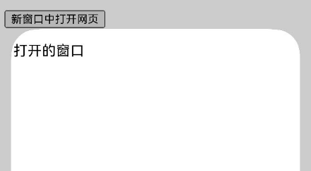

# 在新窗口中打开页面

更新时间：2026-04-30 02:41:24

来源：https://developer.huawei.com/consumer/cn/doc/harmonyos-guides/web-open-in-new-window

Web组件提供了在新窗口打开页面的能力，开发者可以通过[multiWindowAccess()](https://developer.huawei.com/consumer/cn/doc/harmonyos-references/arkts-basic-components-web-attributes#multiwindowaccess9)接口来设置是否允许网页在新窗口打开。当有新窗口打开时，应用侧会在[onWindowNew()](https://developer.huawei.com/consumer/cn/doc/harmonyos-references/arkts-basic-components-web-events#onwindownew9)接口或[onWindowNewExt()](https://developer.huawei.com/consumer/cn/doc/harmonyos-references/arkts-basic-components-web-events#onwindownewext23)接口中收到Web组件新窗口事件。开发者需要在此接口事件中新建窗口来处理Web组件的窗口请求。


> [!NOTE]
> onWindowNewExt()接口为onWindowNew()接口的功能增强接口，OnWindowNewExtEvent比OnWindowNewEvent新增了NavigationPolicy和WindowFeatures，用于通知应用新窗口的打开方式和位置大小信息。当在同一个Web组件上同时使用这两个接口时，只有onWindowNewExt()接口会被触发。 allowWindowOpenMethod()接口设置为true时，前端页面通过JavaScript函数调用的方式打开新窗口。 当在Web页面调用window.open(url, name)打开新窗口时，ArkWeb内核会根据name查找是否存在已绑定的Web组件。若存在，该Web组件将收到onActivateContent()接口通知，以便应用可将其展示至前台；若不存在，ArkWeb内核将通过onWindowNew()接口通知应用创建新窗口。 如果在onWindowNew()接口通知中创建了新窗口，并将ControllerHandler.setWebController()接口的参数设置为新Web组件的WebviewController，则ArkWeb内核会完成name与该新Web组件的绑定。 如果在onWindowNew()接口通知中没有创建新窗口，需要将ControllerHandler.setWebController()接口的参数设置为null。

在下面的本地示例中，当用户点击“新窗口中打开网页”按钮时，应用会在onWindowNew()接口收到Web组件的新窗口事件。


> [!NOTE]
> 网页要求用户创建新的窗口时触发回调OnWindowNewEvent()，该回调函数中isUserTrigger参数，true代表用户触发，false代表非用户触发。


- 应用侧代码。


```text
// xxx.ets
import { webview } from '@kit.ArkWeb';

// 在同一界面有两个Web组件。在WebComponent新开窗口时，会跳转到NewWebViewComp。
@CustomDialog
struct NewWebViewComp {
  controller?: CustomDialogController;
  webviewController1: webview.WebviewController = new webview.WebviewController();

  build() {
    Column() {
      Web({ src: '', controller: this.webviewController1 })
        .javaScriptAccess(true)
        .multiWindowAccess(false)
        .onWindowExit(() => {
          console.info('NewWebViewComp onWindowExit');
          if (this.controller) {
            this.controller.close();
          }
        })
        .onActivateContent(() => {
          // 该Web需要展示到前台，建议应用在这里进行tab或window切换的动作
          console.info('NewWebViewComp onActivateContent')
        })
    }
  }
}

@Entry
@Component
struct WebComponent {
  controller: webview.WebviewController = new webview.WebviewController();
  dialogController: CustomDialogController | null = null;

  build() {
    Column() {
      Web({ src: $rawfile('window.html'), controller: this.controller })
        .javaScriptAccess(true)
          // 需要使能multiWindowAccess
        .multiWindowAccess(true)
        .allowWindowOpenMethod(true)
        .onWindowNew((event) => {
          if (this.dialogController) {
            this.dialogController.close()
          }
          let popController: webview.WebviewController = new webview.WebviewController();
          this.dialogController = new CustomDialogController({
            builder: NewWebViewComp({ webviewController1: popController }),
            // isModal设置为false，防止新窗口被销毁而无法触发onActivateContent回调
            isModal: false
          })
          this.dialogController.open();
          // 将新窗口对应WebviewController返回给Web内核。
          // 若不调用event.handler.setWebController接口，会造成render进程阻塞。
          // 如果没有创建新窗口，调用event.handler.setWebController接口时设置成null，通知Web没有创建新窗口。
          event.handler.setWebController(popController);
        })
    }
  }
}
```


**图1** 新窗口中打开页面效果图


