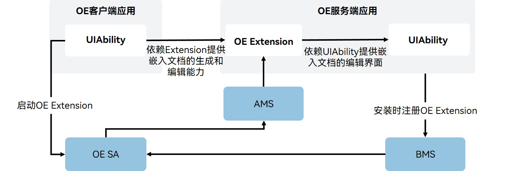
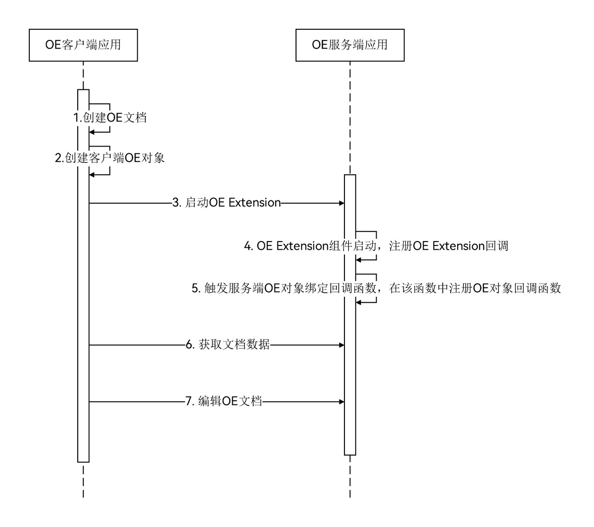

# 客户端和服务端交互流程

更新时间：2026-04-30 02:41:24

来源：https://developer.huawei.com/consumer/cn/doc/harmonyos-guides/client-server-interaction-process

[OE](https://developer.huawei.com/consumer/cn/doc/harmonyos-guides/content-embed-kit-terminology#oe)框架采用ExtensionAbility机制进行扩展，主要架构元素包括：[OE Extension](https://developer.huawei.com/consumer/cn/doc/harmonyos-guides/content-embed-kit-terminology#oe-extension)和[OE SA](https://developer.huawei.com/consumer/cn/doc/harmonyos-guides/content-embed-kit-terminology#oe-sa)。外部依赖元素包括：[AMS](https://developer.huawei.com/consumer/cn/doc/harmonyos-guides/content-embed-kit-terminology#ams)和[BMS](https://developer.huawei.com/consumer/cn/doc/harmonyos-guides/content-embed-kit-terminology#bms)。

以下是OE客户端和服务端交互流程：客户端依赖服务端的OE Extension执行文档的嵌入与编辑操作；服务端则负责OE Extension的统一注册与管理。在运行时，服务端依据客户端请求，**动态启动**相应的OE Extension实例，以响应文档处理需求。

下图为应用间内容嵌入与协同编辑开发时序图。

客户端和服务端开发步骤详见：[客户端应用开发](https://developer.huawei.com/consumer/cn/doc/harmonyos-guides/content-embed-client-guidelines)和[服务端应用开发](https://developer.huawei.com/consumer/cn/doc/harmonyos-guides/content-embed-server-guidelines)。

1. 创建[OE文档](https://developer.huawei.com/consumer/cn/doc/harmonyos-guides/content-embed-kit-terminology#oe文档)：客户端创建OE文档有三种方式：基于[OEID](https://developer.huawei.com/consumer/cn/doc/harmonyos-guides/content-embed-kit-terminology#oeid)创建OE文档，基于文件创建OE文档，基于[OE格式文件](https://developer.huawei.com/consumer/cn/doc/harmonyos-guides/content-embed-kit-terminology#oe格式文件)加载OE文档。
2. 创建[客户端OE对象](https://developer.huawei.com/consumer/cn/doc/harmonyos-guides/content-embed-kit-terminology#客户端oe对象)：客户端基于OE文档创建客户端OE对象，实现OE文档与客户端OE对象的关联，并用于与服务端通信。创建客户端OE对象完成后需注册该对象回调以响应OE服务端通知。
3. 启动OE Extension：在嵌入或者编辑OE文档时，OE客户端应用需通过调用[OE框架层接口](https://developer.huawei.com/consumer/cn/doc/harmonyos-references/capi-content-embed-proxy-h)，通知OE服务端启动OE Extension组件。
4. 注册OE Extension回调：当OE服务端应用的OE Extension组件启动后，需在OE Extension组件的入口函数中注册OE Extension回调，以响应客户端请求。
5. 注册[服务端OE对象](https://developer.huawei.com/consumer/cn/doc/harmonyos-guides/content-embed-kit-terminology#服务端oe对象)回调：当OE服务端应用的OE Extension组件启动后，客户端OE对象将会与服务端OE对象绑定，此时需注册服务端OE对象回调函数，以响应OE客户端的请求。
6. 获取OE文档快照：当OE客户端嵌入OE文档时，该文档在OE客户端界面中可能呈现为文档快照（Snapshot），当OE Extension被启动后，OE客户端会向服务端获取文档快照。
7. 编辑OE文档：当OE Extension被启动后，OE客户端会通知OE服务端编辑OE文档，此时OE服务端应用需启动对应的UIAbility编辑文档。
