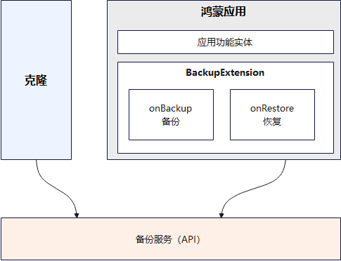

# 应用克隆适配指导

更新时间：2026-07-28 11:23:46

来源：https://developer.huawei.com/consumer/cn/doc/harmonyos-guides/app-file-clone

#### 简介

用户在日常换机过程中，需要将一台设备的数据备份并发送到另一台设备上进行恢复，以完成跨设备的数据迁移，此时需要使用克隆工具（"数据克隆"应用）。接入克隆工具时，应用需实现备份恢复接口[BackupExtensionAbility](https://developer.huawei.com/consumer/cn/doc/harmonyos-references/js-apis-application-backupextensionability#backupextensionability)，在onBackup中实现数据备份，在onRestore中实现数据恢复。若应用未实现BackupExtensionAbility，克隆过程将仅迁移旧设备上的应用，而不迁移应用数据。
 

 
  

#### 约束与限制

克隆调试应用时，新旧设备均需安装该应用。否则，系统将判定为恶意应用，导致克隆失败。
 
  

#### 适配指导

API version 12开始，三方应用接入克隆只需要接入备份恢复能力即可，接入指导： **[应用接入数据备份恢复](https://developer.huawei.com/consumer/cn/doc/harmonyos-guides/app-file-backup-extension)**。
