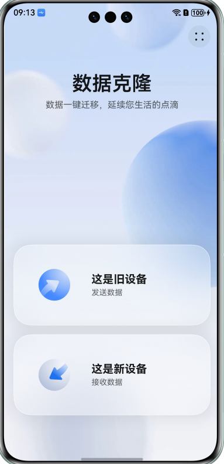
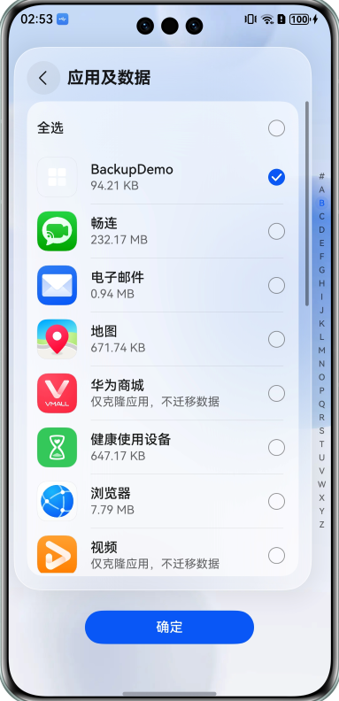
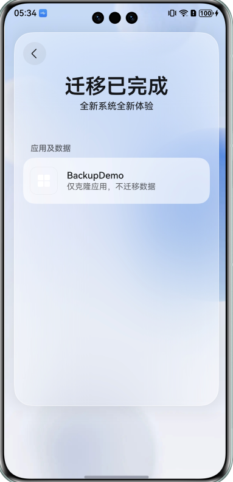
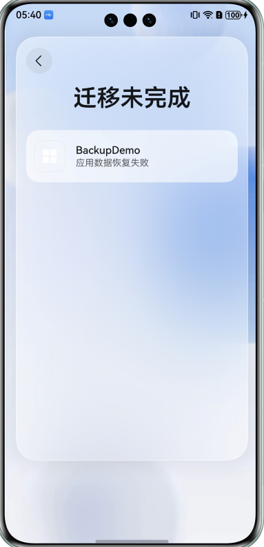

# 应用数据备份恢复验证指导

更新时间：2026-04-20 06:34:33

来源：https://developer.huawei.com/consumer/cn/doc/harmonyos-guides/app-file-backup-dataclone

为方便开发者验证[应用接入数据备份恢复](https://developer.huawei.com/consumer/cn/doc/harmonyos-guides/app-file-backup-extension)结果，此篇指南介绍了在鸿蒙设备上通过数据克隆应用触发数据备份恢复，以及常见问题说明。
  

##### 环境准备

- 调试设备：两部鸿蒙设备，系统版本在HarmonyOS 6.0.0.115及以上，数据克隆版本在6.0.0.516及以上。
- 安装应用：两部设备都要安装待测试应用。

 
  

##### 触发数据备份恢复
1. 打开数据克隆应用，一部设备选择“这是新设备”，作为数据恢复侧，另一部设备选择“这是旧设备”，作为数据备份侧，按照提示连接两部设备。

  

2. 在选择数据页面，点击应用及数据，勾选待测试应用。

  

3. 等待备份恢复完成，根据备份恢复结果，并结合日志分析备份和恢复流程是否正常。
 
  

##### 常见问题说明

  

##### 在“应用及数据”页面没有找到待测试应用

**问题现象**
 
在“应用及数据”页面勾选应用时，找不到待测试应用。
 
**可能原因**
 
备份侧设备没有安装待测试应用。
 
**解决措施**
 
在备份侧设备安装待测试应用。
 
  

##### 迁移结果显示“仅克隆应用，不迁移数据”

**问题现象**
 
克隆结束后，迁移结果显示“仅克隆应用，不迁移数据”。
 

 
**可能原因**
 
onBackup/onBackupEx未按照规范实现。
 
**解决措施**
 
请排查是否符合[应用接入数据备份恢复](https://developer.huawei.com/consumer/cn/doc/harmonyos-guides/app-file-backup-extension)规范，并结合日志分析onBackup/onBackupEx执行流程。
 
  

##### 迁移结果显示“应用数据恢复失败”

**问题现象**
 
克隆结束后，迁移结果显示“应用数据恢复失败”。
 

 
**可能原因**
 1. 恢复侧设备未安装待测试应用。
2. onRestore/onRestoreEx未按照规范实现。
 
**解决措施**
 1. 在恢复侧设备安装待测试应用。
2. 请排查是否符合[应用接入数据备份恢复](https://developer.huawei.com/consumer/cn/doc/harmonyos-guides/app-file-backup-extension)规范，并结合日志分析onRestore/onRestoreEx执行流程。
