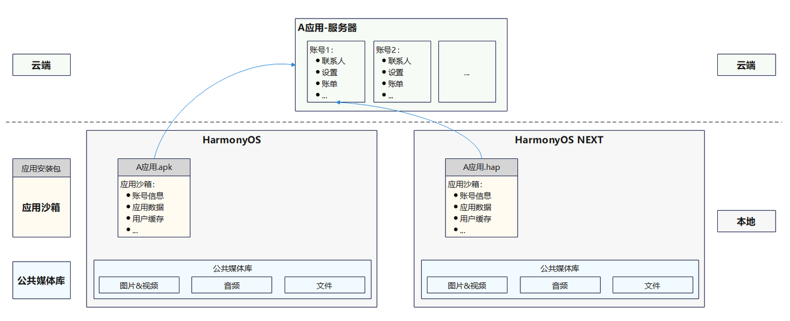
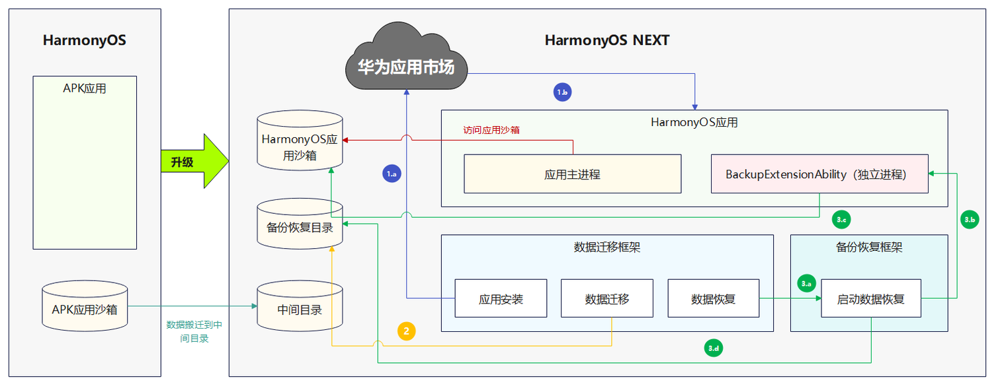
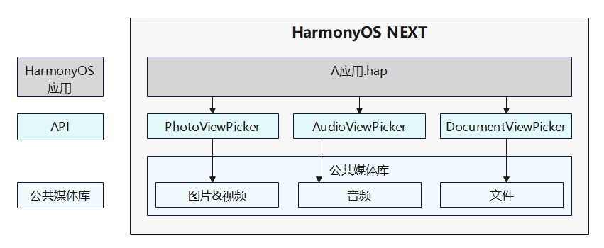

# 应用数据迁移功能介绍

更新时间：2026-04-20 06:34:33

来源：https://developer.huawei.com/consumer/cn/doc/harmonyos-guides/app-data-migration-overview

#### 使用场景

终端设备从HarmonyOS 3.1 Release API 9及之前版本（简称HarmonyOS）升级到HarmonyOS NEXT Developer Preview1及之后版本（简称HarmonyOS NEXT）时，原HarmonyOS中运行的APK应用，升级后需要切换为HarmonyOS NEXT中的HarmonyOS应用。APK应用的部分数据需要转换并迁移到指定位置后，才能被HarmonyOS应用访问。HarmonyOS NEXT提供了“数据迁移框架”和“备份恢复框架”，为开发者提供应用数据的迁移和转换能力。开发者完成适配，APK应用切换为HarmonyOS应用后，可继承原APK应用中适配HarmonyOS应用的数据。
 
如下图所示，应用需要的数据，包含云端服务器中的数据，本地应用沙箱中的数据和本地公共媒体库中的数据。为了应用的数据可以继承，开发者需要保证云端数据定义兼容APK应用和HarmonyOS应用，确保系统升级后同一账号下的数据可识别。
 

 
  

#### 数据迁移机制

  

#### 应用沙箱数据迁移机制

终端设备从HarmonyOS升级到HarmonyOS NEXT后，APK应用沙箱数据被搬迁到中间目录。针对应用沙箱数据，HarmonyOS NEXT提供“数据迁移框架”统一调度应用数据迁移任务。
 
应用数据迁移任务需要执行的步骤包括：应用安装，数据迁移和数据恢复。
 1. **应用安装步骤：**

  
- “数据迁移框架”向华为应用市场发送HarmonyOS应用下载和安装请求。

2. 华为应用市场下载并安装HarmonyOS应用。
- **数据迁移步骤：**

  在HarmonyOS应用安装完成之后，“数据迁移框架”将应用沙箱数据从中间目录搬迁到备份恢复目录。
- **数据恢复步骤：**

1. 在应用数据搬迁到备份恢复目录后，“数据迁移框架”向“备份恢复框架”发送应用数据恢复请求。

2. “备份恢复框架”拉起应用的“BackupExtensionAbility”独立进程，启动应用数据恢复。

3. 应用通过“BackupExtensionAbility”从备份恢复目录加载APK应用的数据，处理后保存到HarmonyOS应用沙箱中，完成应用数据恢复。

4. “备份恢复框架”在应用数据恢复完成后，清空备份恢复目录。

 
后续HarmonyOS应用通过访问HarmonyOS应用沙箱获取应用的数据。
 

 
  

#### 公共媒体库中数据迁移机制

公共媒体库中的数据，在终端设备从HarmonyOS升级到HarmonyOS NEXT后，会整体搬迁直接继承。应用可以使用HarmonyOS NEXT提供的API，访问公共媒体库中的数据。媒体库的使用指导可以参考：[媒体文件管理服务](https://developer.huawei.com/consumer/cn/doc/harmonyos-guides/photoaccesshelper-overview)。
 

