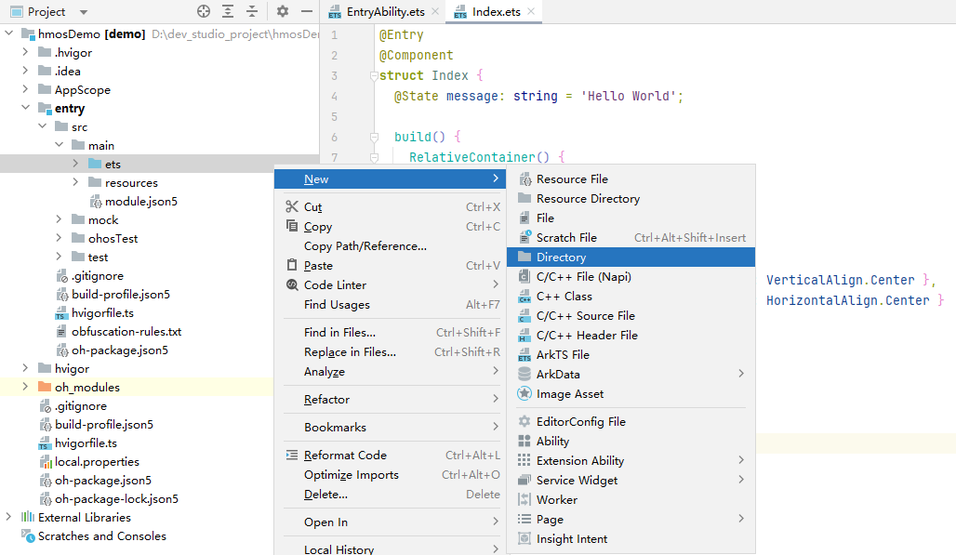
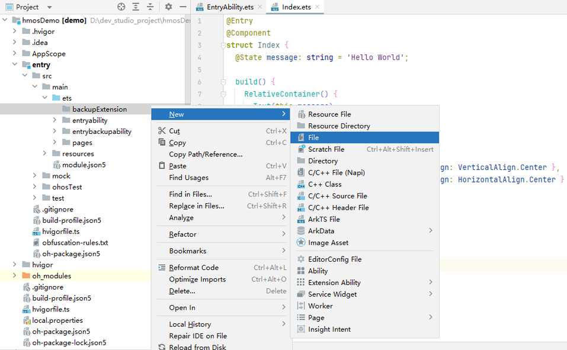

# 应用数据迁移适配指导

更新时间：2026-04-20 06:34:33

来源：https://developer.huawei.com/consumer/cn/doc/harmonyos-guides/app-data-migration-adaptation

#### 环境准备

开发者需要通过OTA升级的形式，将终端设备升级到HarmonyOS NEXT Developer Beta1及之后版本。
  
| 工具 | 版本 | 说明 |
| --- | --- | --- |
| “迁移调试”工具 | 205.0.0.115及之后版本 | 模拟验证数据迁移 |
| DevEco Studio | DevEco Studio NEXT Developer Beta3及之后版本 | 请参考：DevEco Studio使用指南。 |
| Compatible SDK | 5.0.0(12) | 请参考：版本说明。 |
 
 
  

#### 应用数据迁移适配流程

  

#### 创建新工程

本章节从[创建新工程](https://developer.huawei.com/consumer/cn/doc/harmonyos-guides/ide-create-new-project)开始，指导开发者接入“备份恢复框架”，已经创建工程的开发者可以跳过本节。
 
  

#### BackupExtensionAbility的实现

开发者可以在BackupExtension.ts文件中自定义类继承BackupExtensionAbility，通过重写其中的onBackup和onRestore方法，自定义应用数据的转换和迁移。终端设备从HarmonyOS升级到HarmonyOS NEXT数据迁移场景中，onRestore回调接口中的参数**bundleVersion.name**的**前缀**为“**0.0.0.0**”。
 


 
 
**onRestore 接口是同步接口，其内部所有的异步操作请进行同步等待。**
  

 
以下步骤以空工程为例，介绍如何实现BackupExtensionAbility：
 1. 在**entry/src/main/ets/目录下，点击 New > Directory** 创建backupExtension目录。

  


2. 点击**entry/src/main/ets/backupExtension/目录，点击 New > File** 创建BackupExtension.ets文件。

  


3. 参考示例代码实现BackupExtensionAbility，应用的数据转换和迁移逻辑，请在指定位置填充实现。

  终端设备从HarmonyOS升级到HarmonyOS NEXT中，会将原有APK应用沙箱目录中文件放置到HarmonyOS备份恢复目录。对应关系详见[APK应用沙箱目录与备份恢复目录映射关系](#apk应用沙箱目录与备份恢复目录映射关系)。

  
```json
import { BackupExtensionAbility, BundleVersion } from '@kit.CoreFileKit';

const TAG = `EntryBackupAbility`;

/**
 * serviceExt进程入口
 */
export default class EntryBackupAbility extends  BackupExtensionAbility {
  async onBackup () {
    console.info(TAG,`onBackup ok`);
    await Promise.resolve();
  }

  /**
   * 数据恢复处理接口。接口是同步接口，其内部所有的异步操作请进行同步等待。
   *
   * @param bundleVersion 版本信息
   */
  async onRestore (bundleVersion : BundleVersion): Promise<void> {
    console.info(TAG, `onRestore ok ${JSON.stringify(bundleVersion)}`);
    //bundleVersion.name的前缀为“0.0.0.0”时，表示终端设备从HarmonyOS升级到HarmonyOS NEXT数据迁移场景
    if (bundleVersion.name.startsWith("0.0.0.0")){
      // 在此处实现终端设备从HarmonyOS 4.x升级到HarmonyOS NEXT后，应用数据的转换和迁移
      // 涉及异步操作请进行同步等待
      console.info(TAG, `HarmonyOS to HarmonyOS NEXT scenario`);
    } else {
      // 在此处实现从HarmonyOS NEXT设备迁移到HarmonyOS NEXT设备后，应用数据的处理。无特殊要求，可以空实现
      // 涉及异步操作请进行同步等待
      console.info(TAG, `Other scenario`);
    }
  }
}
```


  

 

  
- 单个应用设定的最长数据迁移时间为十五分钟，超过十五分钟还未完成应用数据迁移的应用，应用数据迁移会失败。

4. 应用的“BackupExtensionAbility”执行完后，“备份恢复框架”会清空备份恢复目录，开发者请在应用的“BackupExtensionAbility”执行结束前，完成所有所需数据的转换和迁移。

 
  

#### 元数据资源配置文件适配

开发者通过元数据资源配置文件backup_config.json，启用备份恢复，并定义备份恢复框架需要传输的文件。
 
以下步骤以空工程为例，介绍如何配置元数据资源文件：
 1. 在**entry/src/main/resources/base/profile/目录下，点击 New > File** 创建backup_config.json文件。
2. 参考示例代码实现元数据资源文件配置。

  
```text
{
  "allowToBackupRestore": true,
  "extraInfo": {
    "supportScene": [
      "hmos2next"
    ]
  }
}
```

 
  

#### module.json5适配

开发者需要在应用配置文件module.json5中进行注册，其中注册类型type需要设置为backup，元数据信息metadata需要新增一个name为ohos.extension.backup的条目。
 


 
 
**extensionAbilities需要配置在entry内的module.json5才能正常访问。**
  

 
以下步骤以空工程为例，介绍如何配置[module.json5](https://developer.huawei.com/consumer/cn/doc/harmonyos-guides/module-configuration-file#extensionabilities标签)文件：
 1. 开发者需要在entry内的module.json5里面进行注册,参考示例代码实现元数据资源文件配置。

  
```ArkTS
"extensionAbilities": [
  {
    "description": "DemoBackupExtension",
    "icon": "$media:app_icon",
    "name": "BackupExtensionAbility",
    "srcEntry": "./ets/backupExtension/BackupExtension.ets",  // 对应BackupExtension.ets在代码仓中的位置
    "type": "backup",                                         // 类型需要选择backup
    "exported": false,
    "metadata": [                                             // 对应注册的元数据资源
      {
        "name": "ohos.extension.backup",
        "resource": "$profile:backup_config"
      }
    ]
  }
]
```

 
  

#### APK应用沙箱目录与备份恢复目录映射关系

APK应用沙箱目录与备份恢复目录映射关系见下表中所示：
  
| APK应用沙箱目录 | 备份恢复目录示例 | 备份恢复目录获取方式 |
| --- | --- | --- |
| /data/user_de/{userId}/{APK包名}/ | /data/storage/el1/base/.backup/restore/{APK包名}/de/ | this.context.area = contextConstant.AreaMode.EL1; let deSourcePath = this.context.backupDir + "restore/{APK包名}/de/" |
| /data/user/{userId}/{APK包名}/ | /data/storage/el2/base/.backup/restore/{APK包名}/ce/ | this.context.area = contextConstant.AreaMode.EL2; let ceSourcePath = this.context.backupDir + "restore/{APK包名}/ce/" |
| /data/media/{userId}/Android/data/{APK包名}/ | /data/storage/el2/base/.backup/restore/{APK包名}/A/data/ | this.context.area = contextConstant.AreaMode.EL2; let dataSourcePath = this.context.backupDir + "restore/{APK包名}/A/data/" |
| /data/media/{userId}/Android/obb/{APK包名}/ | /data/storage/el2/base/.backup/restore/{APK包名}/A/obb/ | this.context.area = contextConstant.AreaMode.EL2; let obbSourcePath = this.context.backupDir + "restore/{APK包名}/A/obb/" |
