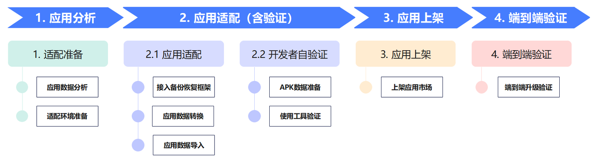
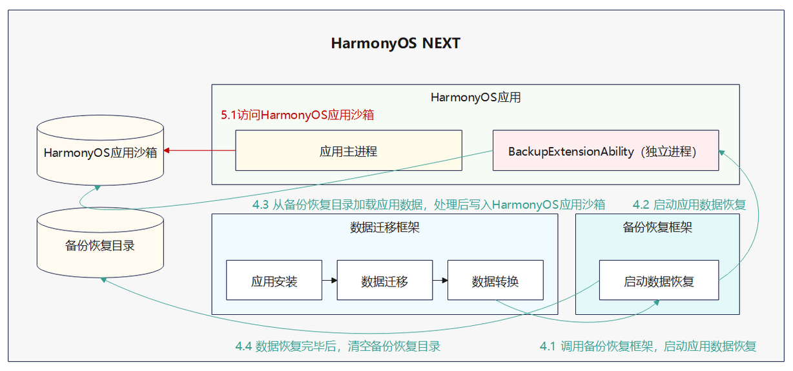

# 适配流程

更新时间：2026-04-20 06:34:33

来源：https://developer.huawei.com/consumer/cn/doc/harmonyos-guides/adaptation-process

适配流程包括：适配准备、应用适配、开发者自验证、应用上架和端到端验证。
 
**图1** 适配流程图
 

  

#### 适配准备阶段

在适配准备阶段，开发者需要分析清楚HarmonyOS中APK应用和HarmonyOS NEXT中HarmonyOS应用的数据范围和差异。
 
在开发之前，需要通过OTA升级的形式，将终端设备升级到HarmonyOS NEXT Developer Preview1及之后版本。
 
  

#### 应用适配

在适配准备工作完成后，进入应用适配阶段。开发者需要在HarmonyOS应用的代码中，实现“BackupExtensionAbility”，使应用接入到“备份恢复框架”中，完成应用数据的转换和迁移。更多适配指导可参考：[应用数据迁移适配指导](https://developer.huawei.com/consumer/cn/doc/harmonyos-guides/app-data-migration-adaptation)。
 

 
 
应用的“BackupExtensionAbility”执行完后，“备份恢复框架”会清空备份恢复目录，开发者请在应用的“BackupExtensionAbility”执行结束前，完成所有所需数据的转换和迁移。
  

 
后续HarmonyOS应用通过访问HarmonyOS应用沙箱获取应用的数据。
 

 
备份恢复目录如下表中所示：
  
| 备份恢复目录 |
| --- |
| /data/storage/el1/base/.backup/restore/{APK包名}/de/ |
| /data/storage/el2/base/.backup/restore/{APK包名}/ce/ |
| /data/storage/el2/base/.backup/restore/{APK包名}/A/data/ |
| /data/storage/el2/base/.backup/restore/{APK包名}/A/obb/ |
 
 
HarmonyOS应用沙箱目录请参考[应用沙箱目录](https://developer.huawei.com/consumer/cn/doc/harmonyos-guides/app-sandbox-directory)。
 
  

#### 开发者自验证

开发者完成应用适配后，需要完成自验证HarmonyOS应用数据迁移适配结果。更多自验证指导可参考：[开发者自验证](https://developer.huawei.com/consumer/cn/doc/harmonyos-guides/self-verification)。
 
其中自验证所需“迁移调试”工具获取方式如下：
 
- HarmonyOS NEXT Developer Beta1及之后版本，厂商合作伙伴可通过[IssueReporter平台](https://issuereporter.developer.huawei.com/my-created)提交工单，向华为方技术支持人员申请“迁移调试”工具，模拟进行数据迁移验证。公共开发者请通过华为开发者联盟官网->支持，[在线提单](https://developer.huawei.com/consumer/cn/support/)方式获取。
- HarmonyOS NEXT Developer Beta1之前版本，开发者可以通过系统内置“迁移调试”工具，模拟进行数据迁移验证。

 
  

#### 应用上架

HarmonyOS应用适配成功后，在进行端到端验证之前，需要将HarmonyOS应用上架到华为应用市场。HarmonyOS应用上架指导请参考：[发布HarmonyOS应用指导](https://developer.huawei.com/consumer/cn/doc/app/agc-help-releaseharmony-0000001933963166)。
 

 
 
HarmonyOS应用上架应用市场的时候，需要配置HarmonyOS应用和APK应用映射关系。HarmonyOS应用关联APK应用指导请参考：[关联APK应用](https://developer.huawei.com/consumer/cn/doc/app/agc-help-associate-android-app-overview-0000002351878886)。
  

 
  

#### 端到端验证

在HarmonyOS应用上架到华为应用市场之后，华为方技术支持人员会为开发者推送回退版本。如果终端设备为HarmonyOS NEXT，开发者需要将终端设备回退到HarmonyOS，在HarmonyOS中使用APK应用生成数据。应用数据准备完成后，请通过OTA升级形式，将终端设备升级到华为方提供的HarmonyOS NEXT。验证HarmonyOS NEXT中的HarmonyOS应用是否成功继承原APK应用的数据。
