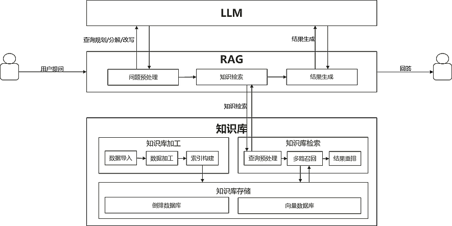

# RAG概述

更新时间：2026-04-20 06:34:33

来源：https://developer.huawei.com/consumer/cn/doc/harmonyos-guides/data-augmentation-rag-overview

RAG（Retrieval-Augmented Generation，检索增强生成）融合了智能检索与知识库技术，通过知识库驱动内容生成，具备强大的可解释性和深度定制能力。应用可通过接入Data Augmentation Kit提供的[RAG](https://developer.huawei.com/consumer/cn/doc/harmonyos-references/dataaugmentation-rag-api)能力，快速实现知识问答、智慧助手等业务场景。本模块还支持通过模板灵活配置RAG运行的核心参数，实现全流程的深度定制。

其工作原理为：请求大语言模型解析用户问题，智能检索知识库内容，最终由大模型融合检索结果并生成自然流畅的回复。下文将以流式的知识问答场景为例，详细说明RAG的使用。

