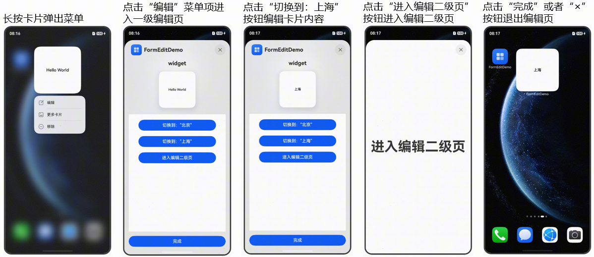
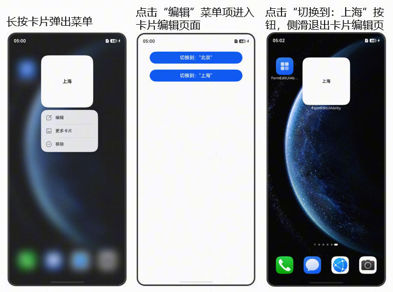
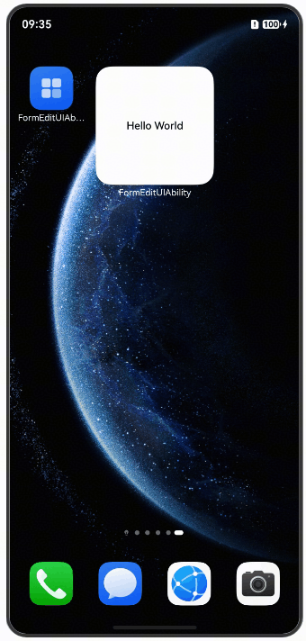

# ArkTS卡片编辑概述

更新时间：2026-05-26 06:48:54

来源：https://developer.huawei.com/consumer/cn/doc/harmonyos-guides/-ui-widget-event-formeditextensionability-overview

ArkTS卡片提供卡片页面编辑能力，支持实现用户自定义卡片内容的功能，例如：编辑联系人卡片、修改卡片中展示的联系人、编辑天气卡片等。

卡片页面编辑分为半模态卡片编辑和全屏卡片编辑两种方式，从API version 18开始，支持半模态卡片编辑。


##### 半模态卡片编辑

下面给出一个示例，介绍半模态卡片编辑的使用步骤。


##### 实现原理




1. 长按卡片弹出菜单，此时桌面通过[formConfigAbility](https://developer.huawei.com/consumer/cn/doc/harmonyos-guides/arkts-ui-widget-configuration#配置文件字段说明)字段判断卡片是否支持卡片编辑能力来决定是否显示编辑按钮。
2. 点击“编辑”菜单项，桌面通过formConfigAbility中的字段拉起对应的页面，进入一级编辑页。一级编辑页的编辑区域有限，用于比较简单的编辑布局。       
预览区：灰色区域为预览区，用于呈现卡片编辑后的效果。预览区的布局是由桌面决定的。
3. 编辑区：白色区域为编辑区，为应用自定义布局区域，用来实现卡片编辑的布局。卡片编辑区的布局由应用继承[FormEditExtensionAbility](https://developer.huawei.com/consumer/cn/doc/harmonyos-references/js-apis-app-form-formeditextensionability)后绘制而成，可用于简单的编辑布局。
4. FormEditDemo：该字段为卡片宿主应用的应用名称，通过[app.json5](https://developer.huawei.com/consumer/cn/doc/harmonyos-guides/app-configuration-file#配置文件标签)配置文件中的label字段配置。
5. widget：该字段为卡片名称，通过卡片form_config.json配置文件中的[name](https://developer.huawei.com/consumer/cn/doc/harmonyos-guides/arkts-ui-widget-configuration#配置文件字段说明)字段配置。
6. “完成”按钮：编辑完成之后，点击按钮可退出半模态卡片编辑页面。
7. 在卡片编辑区，点击“切换到：上海”按钮后，卡片提供方可以通过[updateForm](https://developer.huawei.com/consumer/cn/doc/harmonyos-references/js-apis-app-form-formprovider#formproviderupdateform)接口更新卡片信息，并在预览区显示。
8. 在卡片编辑区，点击“进入二级编辑页”按钮，此时卡片通过FormEditExtensionContext提供的[startSecondPage](https://developer.huawei.com/consumer/cn/doc/harmonyos-references/js-apis-inner-application-formeditextensioncontext#startsecondpage)方法，将卡片提供方的二级编辑页信息传递给桌面，桌面拉起对应页面，即进入二级编辑页。二级编辑页主要有用于实现复杂的编辑布局，是否需要二级编辑页请开发者根据实际需求添加。
9. 编辑完成之后退出编辑页。


##### 开发步骤
1. [创建卡片](https://developer.huawei.com/consumer/cn/doc/harmonyos-guides/arkts-ui-widget-creation)。
2. 新增EntryFormEditAbility文件，用于实现[FormEditExtensionAbility](https://developer.huawei.com/consumer/cn/doc/harmonyos-references/js-apis-app-form-formeditextensionability)的半模态编辑组件，并在form_config.json文件中配置[formConfigAbility](https://developer.huawei.com/consumer/cn/doc/harmonyos-guides/arkts-ui-widget-configuration#配置文件字段说明)字段。

  
半模态一级编辑页Ability的实现。
3. 半模态二级编辑页Ability的实现。
4. 新增EntryFormEditAbility需要在module.json5配置，配置如下。
5. 卡片form_config.json文件实现。
6. 实现一级编辑页布局，通过[updateForm](https://developer.huawei.com/consumer/cn/doc/harmonyos-references/js-apis-app-form-formprovider#formproviderupdateform)接口去刷新被编辑卡片的信息和预览卡片信息，通过[startSecondPage](https://developer.huawei.com/consumer/cn/doc/harmonyos-references/js-apis-inner-application-formeditextensioncontext#startsecondpage)方法去拉起二级编辑页。

  
一级编辑页布局实现如下。
7. 新增FormEditSecPage.ets文件用来实现二级编辑页布局。
8. 加载布局文件。

  
```json
// entry/src/main/resources/base/profile/main_pages.json
{
    "src": [
        "pages/Index",
        "pages/FormEditExtension",
        "pages/FormEditSecPage"
    ]
}
```

9. 新增ExtensionEvent文件，封装[startSecondPage](https://developer.huawei.com/consumer/cn/doc/harmonyos-references/js-apis-inner-application-formeditextensioncontext#startsecondpage)方法到startFormEditSecondPage中，供业务使用。
10. 卡片信息持久化。每次进入卡片编辑页，预览卡片都需要与被编辑卡片保持一致，所以需要持久化卡片信息。

  
新增PreferencesUtil文件，主要是来封装[Preferences](https://developer.huawei.com/consumer/cn/doc/harmonyos-guides/data-persistence-by-preferences)首选项，供业务做持久化数据使用。
11. 为确保预览卡片和被编辑卡片信息同步，新建卡片时，在onAddForm回调函数中需要判断'ohos.extra.param.key.edit_form_id'字段是否携带了卡片ID。如果携带了卡片ID，则就是预览卡片则需要从数据库获取被编辑卡片的信息。
12. 卡片布局文件如下。
13. 新增CommonData.ets文件，用来定义卡片数据结构。
14. 资源文件如下。

  
```json
// entry/src/main/resources/base/element/string.json
{
   "string": [
      // ...
      {
         "name": "button_one",
         "value": "切换到：北京"
      },
      {
         "name": "button_two",
         "value": "切换到：上海"
      },
      {
         "name": "button_three",
         "value": "进入编辑二级页"
      }
   ]
 }
```

15. 运行效果如下：

  


##### 全屏卡片编辑


##### 实现原理




1. 长按卡片弹出菜单。桌面通过[formConfigAbility](https://developer.huawei.com/consumer/cn/doc/harmonyos-guides/arkts-ui-widget-configuration#配置文件字段说明)字段判断卡片是否支持卡片编辑能力来决定是否显示编辑按钮。
2. 点击“编辑”菜单项进入全屏编辑页。桌面通过formConfigAbility字段的信息拉起卡片编辑页。
3. 点击“切换到：上海”按钮编辑卡片内容。提供方通过[updateForm](https://developer.huawei.com/consumer/cn/doc/harmonyos-references/js-apis-app-form-formprovider#formproviderupdateform)接口去更新编辑卡片的信息。


##### 开发步骤

下面给出示例，实现如下功能：长按卡片弹出编辑菜单，点击“编辑”菜单项进入全屏编辑页，修改卡片内容。
1. [创建卡片](https://developer.huawei.com/consumer/cn/doc/harmonyos-guides/arkts-ui-widget-creation)。
2. 开发者需要新增EntryEditAbility.ets文件，继承[UIAbility](https://developer.huawei.com/consumer/cn/doc/harmonyos-references/js-apis-app-ability-uiability)组件，实现[onCreate](https://developer.huawei.com/consumer/cn/doc/harmonyos-references/js-apis-app-ability-uiability#oncreate)和[onNewWant](https://developer.huawei.com/consumer/cn/doc/harmonyos-references/js-apis-app-ability-uiability#onnewwant)回调函数。卡片使用方会通过[Want](https://developer.huawei.com/consumer/cn/doc/harmonyos-references/js-apis-app-ability-want)的parameters字段把被编辑的卡片ID带进来。并且需要在form_config.json文件中配置[formConfigAbility](https://developer.huawei.com/consumer/cn/doc/harmonyos-guides/arkts-ui-widget-configuration#配置文件字段说明)字段。

  
实现编辑页面的Ability。
3. 新增EntryEditAbility需要在module.json5配置，配置如下。
4. 卡片form_config.json文件实现。
5. 新增FormEditIndex.ets文件实现全屏编辑页布局，通过[updateForm](https://developer.huawei.com/consumer/cn/doc/harmonyos-references/js-apis-app-form-formprovider#formproviderupdateform)接口去刷新被编辑卡片的信息。

  
```ArkTS
// entry/src/main/ets/pages/FormEditIndex.ets
import { formBindingData, formProvider } from '@kit.FormKit';
import { BusinessError } from '@kit.BasicServicesKit';
import { PreferencesUtil } from '../common/PreferencesUtil';
import { preferences } from '@kit.ArkData';

const TAG: string = 'FormEdit -->';

@Entry
@Component
struct FormEditIndex {
  @State message: string = 'Hello World';
  @State message1: string = '北京';
  @State message2: string = '上海';

  updateForm(message: string) {
    // 通过数据库获取当前需要编辑的卡片ID
    let util = PreferencesUtil.getInstance();
    let preferences = util.getPreferences(this.getUIContext().getHostContext() as Context) as preferences.Preferences;
    let formId: string = util.getValue(preferences) as string;
    if (!formId) {
      return;
    }
    console.info(TAG, `doy: formId: ${formId}, message: ${message}`)
    let param: Record<string, string> = {
      'message': message
    }
    let obj: formBindingData.FormBindingData = formBindingData.createFormBindingData(param);
    try {
      formProvider.updateForm(formId, obj, (error: BusinessError) => {
        if (error) {
          console.error(TAG, `callback error, code: ${error.code}, message: ${error.message})`);
          return;
        }
        console.info(TAG, `formProvider updateForm success`);
      });
    } catch (error) {
      console.error(TAG, `catch error, Code:${error.code}, message:${error.message}`);
    }
  }

  build() {
    Row() {
      Column() {
        Button($r('app.string.button_one'))
          .width('80%')
          .type(ButtonType.Capsule)
          .margin({
            top: 20
          })
          .onClick(() => {
            this.updateForm(this.message1);
          })
        Button($r('app.string.button_two'))
          .width('80%')
          .type(ButtonType.Capsule)
          .margin({
            top: 20
          })
          .onClick(() => {
            this.updateForm(this.message2);
          })
      }
    }
    .justifyContent(FlexAlign.Center)
    .width('100%')
  }
}
```

加载全屏编辑页布局文件。
6. 卡片布局文件如下。
7. 新增PreferencesUtil文件，主要是来封装[Preferences](https://developer.huawei.com/consumer/cn/doc/harmonyos-guides/data-persistence-by-preferences)首选项，供业务做持久化数据使用。

  
```ArkTS
// entry/src/main/ets/common/PreferencesUtil.ets
import { preferences } from '@kit.ArkData';
import { BusinessError } from '@kit.BasicServicesKit';

const TAG: string = 'PreferencesUtil';
const MY_STORE: string = 'myStore';
const key: string = 'formID';

export class PreferencesUtil {
  private static preferencesUtil: PreferencesUtil;

  public static getInstance(): PreferencesUtil {
    if (!PreferencesUtil.preferencesUtil) {
      PreferencesUtil.preferencesUtil = new PreferencesUtil();
    }
    return PreferencesUtil.preferencesUtil;
  }

  getPreferences(context: Context): preferences.Preferences | undefined {
    try {
      preferences.removePreferencesFromCacheSync(context, MY_STORE);
      return preferences.getPreferencesSync(context, { name: MY_STORE });
    } catch (error) {
      let err = error as BusinessError;
      console.error(TAG, `getPreferences failed, error code=${err.code}, message=${err.message}`);
      return undefined;
    }
  }

  preferencesFlush(preferences: preferences.Preferences) {
    preferences.flushSync();
  }

  preferencesPut(preferences: preferences.Preferences, formID: string): void {
    try {
      preferences.putSync(key, formID);
      preferences.flushSync();
    } catch (error) {
      let err = error as BusinessError;
      console.error(TAG, `preferencesPut failed, error code=${err.code}, message=${err.message}`);
    }
  }

  removePreferencesFromCache(context: Context): void {
    preferences.removePreferencesFromCache(context, MY_STORE).catch((err: BusinessError) => {
      console.error(TAG, `removePreferencesFromCache failed, error code=${err.code}, message=${err.message}`);
    });
  }

  getValue(preferences: preferences.Preferences): string | undefined {
    if (preferences === null) {
      console.error(TAG, `preferences is null`);
      return undefined;
    }
    try {
      return preferences.getSync(key, '') as string
    } catch (error) {
      let err = error as BusinessError;
      console.error(TAG, `getSync failed, error code=${err.code}, message=${err.message}`);
      return undefined;
    }
  }

  removeFormId(context: Context) {
    try {
      let preferences = this.getPreferences(context);
      if (!preferences) {
        console.error(TAG, `preferences is null`);
        return;
      }
      if (preferences.hasSync(key)) {
        preferences.deleteSync(key);
        preferences.flushSync();
        console.info(TAG, `deleteSync done.`)
      }
    } catch (error) {
      console.error(TAG, `Failed to get preferences. Code:${error.code}, message:${error.message}`);
    }
  }
}
```

8. 资源文件如下。

  
```json
// entry/src/main/resources/base/element/string.json
{
  "string": [
    // ...
    {
      "name": "button_one",
      "value": "切换到：北京"
    },
    {
      "name": "button_two",
      "value": "切换到：上海"
    }
  ]
}
```

9. 运行效果如下：

  

