# ArkTS待机屏保卡片开发指导

更新时间：2026-04-30 09:02:20

来源：https://developer.huawei.com/consumer/cn/doc/harmonyos-guides/arkui-ui-standby-form-development

从API version 23开始，Form Kit提供在设备待机屏保界面（即横屏充电锁屏状态下显示的界面）上显示卡片的能力，用以展示重要信息，旨在待机下也可陪伴用户。待机屏保卡片用于展示天气、日历等信息，并支持用户个性化定制。

 本文介绍了待机屏保卡片的使用步骤、约束限制，并给出开发指导。


> [!NOTE]
> 在待机屏保界面下默认为深色模式不会跟随系统。


## 亮点/特征

丰富待机显示，提供个性美观的待机显示页面，打造全场景、个性化的“百变”心灵陪伴。提供情感陪伴和情绪价值，在工作的时候，日程待办，提升工作效率；在学习的时候，作为时钟摆台，陪伴学习。

## 约束和限制

待机屏保卡片只支持 2*2尺寸的卡片。待机屏保卡片不推荐展示用户个人隐私敏感数据。待机屏保卡片有明确的UX设计规范。具体请参考设计指南中的[待机屏保](https://developer.huawei.com/consumer/cn/doc/design-guides/system-features-service-widget-0000002087671904#section966618274556)。

## 开启方式

待机屏保功能在系统上默认是开启的，功能开关路径“设置>桌面和个性化>待机屏保设置”，开关界面如下图。
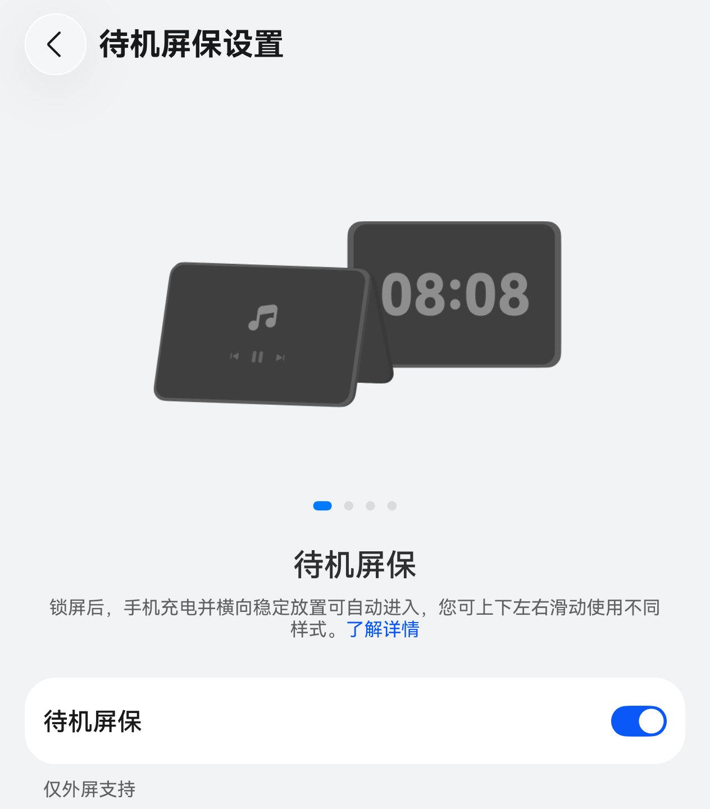

## 使用步骤

待机屏保支持卡片展示与卡片编辑功能（添加、移除），具体操作步骤如下： 进入待机屏保界面：插入充电器或开启“不充电可显示” 开关，设备横屏锁屏并与桌面夹角45°~90°稳定摆放（折叠机需切换为外屏；同时折叠机支持帐篷模式显示），即可进入待机屏保界面。
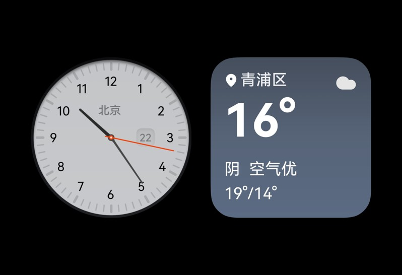
进入待机屏保编辑界面：在待机屏保界面长按或双指捏合即可进入编辑界面。
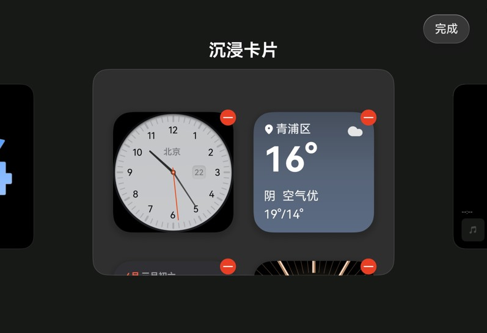
进入待机屏保卡片中心界面：在待机屏保编辑界面，上滑左侧或右侧列表至最后，点击“+”弹出卡片管理页面。
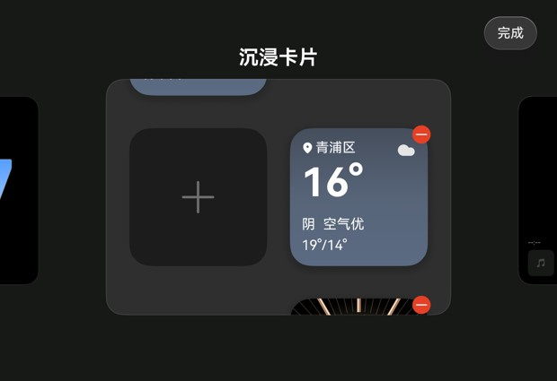
进入待机屏保卡片管理页面：在待机屏保卡片中心点击“建议”会显示推荐的卡片，或者点击应用列表中的应用，弹出对应的卡片。
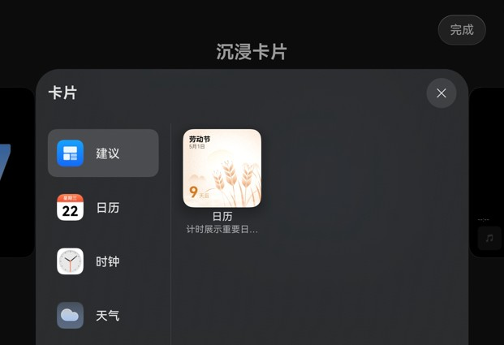
添加卡片：在待机屏保卡片管理页面，选择好卡片后，点击“添加”按钮即可添加到待机屏保界面。
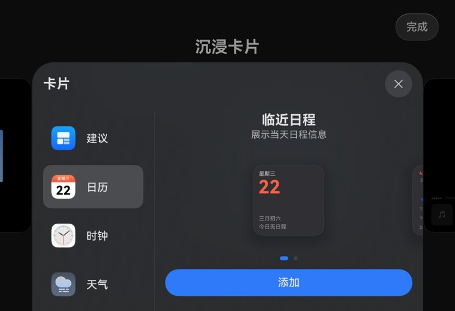
移除卡片：进入待机屏保编辑界面，点击卡片右上角的“-”即可移除卡片。
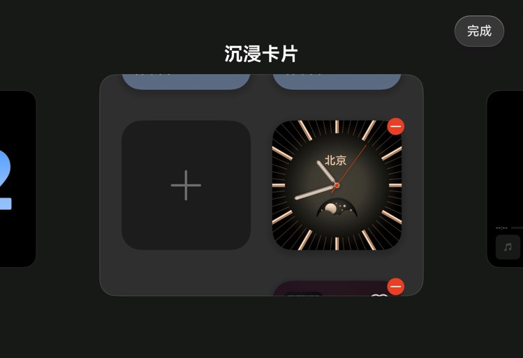

## 开发准备


## 待机屏保开放能力申请

待机屏保卡片会展示在设备的待机屏保界面，开发者需申请上架开放能力，用以保护数据隐私安全。 登录AppGallery Connect，选择“开发与服务”。
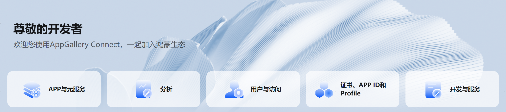
在项目列表中找到您的项目，并点击选择需开启开放能力的应用/元服务。
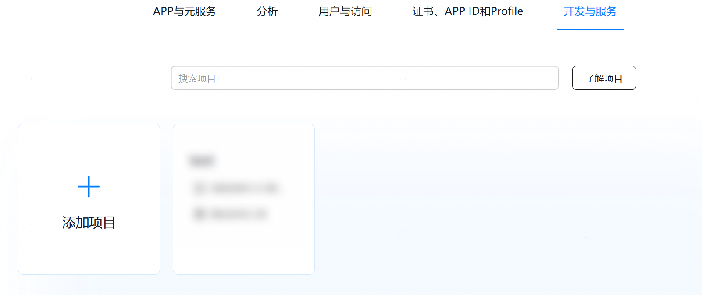
在“开放能力管理”页面，点击待机屏保卡片对应的申请按钮。

在“新建业务申请”窗口填写申请信息，然后点击“提交”。 申请原因：必填，包括应用介绍、使用场景、申请用途，不超过512个字符。 上传附件：选填，提供对应卡片UI设计释义材料，仅可上传1个附件，大小不超过500MB。支持文本、表格、图片、视频、压缩包格式。
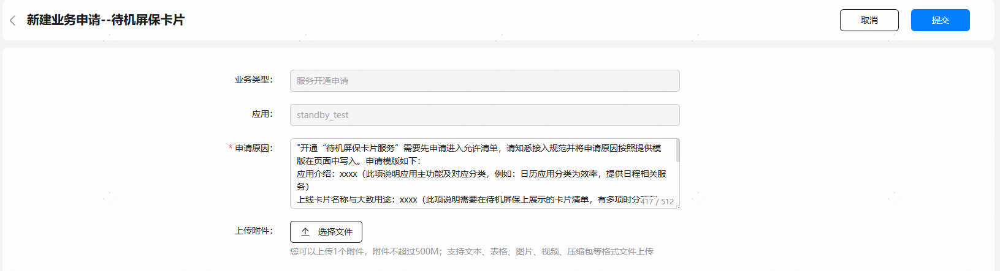
返回“开放能力管理”页面，原“申请”按钮变为置灰显示的“申请”，待机屏保卡片的能力开关已勾选。
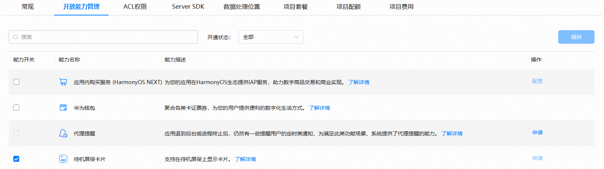
至此，您的应用已成功开通待机屏保开放能力。

## 开发步骤

下面给出示例，实现待机屏保卡片展示。 [创建卡片](https://developer.huawei.com/consumer/cn/doc/harmonyos-guides/arkts-ui-widget-creation)。 配置卡片在待机屏保界面展示。  如果卡片不需要展示在待机屏保界面，配置isSupported字段为false;如果卡片已适配待机屏保卡片UX规范，配置isAdapted字段为true，系统会把卡片布局组件中backgroundImage移除；如果卡片涉及隐私敏感信息，需要配置isPrivacySensitive字段为true，用户将卡片添加到待机屏保界面则会有蒙版覆盖。具体参考[配置文件字段说明](https://developer.huawei.com/consumer/cn/doc/harmonyos-guides/arkts-ui-widget-configuration#配置文件字段说明)。
```text
// entry/src/main/resources/base/profile/form_config.json
  {
    "forms": [
      {
        "name": "widget",
        "displayName": "$string:widget_display_name",
        "description": "$string:widget_desc",
        "src": "./ets/widget/pages/WidgetCard.ets",
        "uiSyntax": "arkts",
        "isDynamic": true,
        "isDefault": true,
        "updateEnabled": false,
        "scheduledUpdateTime": "10:30",
        "renderingMode": "autoColor",
        "updateDuration": 1,
        "defaultDimension": "1*2",
        "supportDimensions": [
          "1*2",
          "2*2"
        ],
        "standby": {
          "isSupported": true,
          "isAdapted": true,
          "isPrivacySensitive": false
        }
      }
    ]
  }
```
