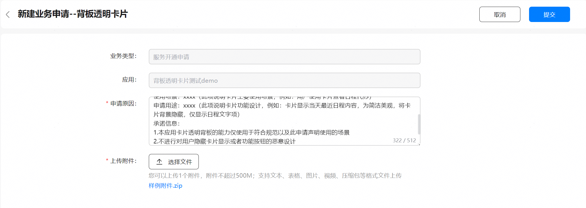
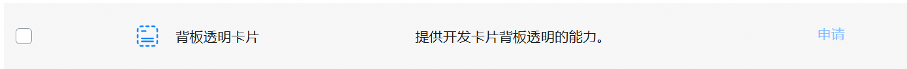
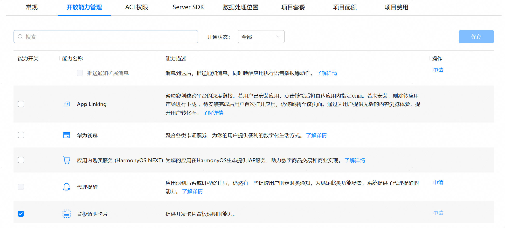
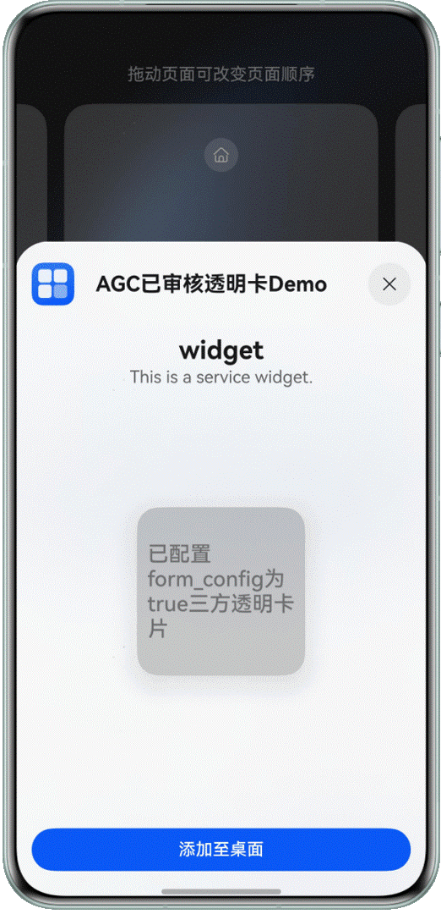

# 背板透明卡片开发指导

更新时间：2026-03-09 02:50:43

来源：https://developer.huawei.com/consumer/cn/doc/harmonyos-guides/arkts-ui-transparent-backplate-form-development

从API version 22开始，Form Kit提供卡片背板元素透明显示的能力，满足更丰富的UI设计以及美观诉求。
 
> [!NOTE]
> 示例效果请以真机运行为准，当前不支持DevEco Studio预览器。

  

#### 约束和限制
1. 非透明区域要求大于等于10%，不能有大面积全透明，让用户误以为此区域没有卡片的UI设计和实现。
2. 为保障卡片内容和文字清晰可见，建议根据加卡时系统告知的推荐颜色值来显示文字。
 
  

#### 开发准备

  

#### 透明卡片开放能力申请

因为背板透明卡片仅使用于符合UI规范以及声明使用的场景，不允许对用户隐藏卡片显示或者功能按钮的恶意设计，所以需要开发者申请上架开放能力。
 1. 登录AppGallery Connect，选择“开发与服务”。

  


2. 在项目列表中找到您的项目，并点击选择需开启开放能力的应用/元服务。

  


3. 在“开放能力管理”页面，点击背板透明卡片对应的申请按钮。

  


4. 在“新建业务申请”窗口填写申请信息，然后点击“提交”。申请原因：必填，包括应用介绍、使用场景、申请用途，不超过256个字符。上传附件：必填，提供对应卡片UI设计释义材料，仅可上传1个附件，大小不超过500MB。支持文本、表格、图片、视频、压缩包格式。

  


5. 返回“开放能力管理”页面，原“申请”按钮变为“申请中”，1-3个工作日反馈申请结果。

  


6. 申请审批通过后，互动中心会发送通知给您，同时“申请中”按钮会变为置灰显示的“申请”。

  


7. 能力申请通过后，勾选背板透明卡片的能力开关，点击右上角“保存”。至此，您的应用已成功接入开放能力。

  


 
  

#### 开发步骤

下面给出示例，实现背板透明卡片功能。
 1. [创建卡片](https://developer.huawei.com/consumer/cn/doc/harmonyos-guides/arkts-ui-widget-creation)。
2. 配置背板透明卡片。

  在form_config.json配置文件中，背板透明卡片必须配置transparencyEnabled字段为true。具体参考[配置文件字段说明](https://developer.huawei.com/consumer/cn/doc/harmonyos-guides/arkts-ui-widget-configuration#配置文件字段说明)。

  
```ArkTS
// entry/src/main/resources/base/profile/form_config.json

{
  "forms": [
    {
        "name": "widget",
        "displayName": "$string:widget_display_name",
        "description": "$string:widget_desc",
        "src": "./ets/widget/pages/WidgetCard.ets",
        "uiSyntax": "arkts",
        "window": {
            "designWidth": 720,
            "autoDesignWidth": true
        },
        "isDynamic": true,
        "isDefault": true,
        "updateEnabled": false,
        "scheduledUpdateTime": "10:30",
        "updateDuration": 1,
        "defaultDimension": "2*2",
        "transparencyEnabled": true,
        "supportDimensions": [
            "2*2"
        ]
    }
  ]
}
```

3. 设置背板透明卡片字体反色。

  在WidgetCard.ets卡片布局文件中，实现默认卡片反色字体颜色设置。

  
```ArkTS
// entry/src/main/ets/widget/pages/WidgetCard.ets
const TAG: string = 'WidgetCard';

@Entry
@Component
export struct WidgetCard {
  readonly title: string = '已配置form_config为true三方透明卡片';
  readonly actionType: string = 'router';
  readonly abilityName: string = 'EntryAbility';
  readonly message: string = 'add detail';
  readonly fullWidthPercent: string = '100%';
  readonly fullHeightPercent: string = '100%';

  // 获取反色信息
  @LocalStorageProp('textColor') @Watch('getTextColor') textColor: string = '#00ff00';

  build() {
    Row() {
      Column() {
        Text(this.title)
          .fontSize('20vp')
          .fontWeight(FontWeight.Medium)
          .fontColor(this.textColor)
      }
      .width(this.fullWidthPercent)
    }
    .height(this.fullHeightPercent)
    .backgroundColor(Color.Transparent)
    .onClick(() => {
      postCardAction(this, {
        action: this.actionType,
        abilityName: this.abilityName,
        params: {
          message: this.message
        }
      });
    })
  }

  private getTextColor(): void {
    console.info(TAG, `this.textColor = ${this.textColor}`);
  }
}
```
   在卡片Ability生命周期EntryFormAbility.ets文件中，实现反色字体颜色更新。

  
```ArkTS
// entry/src/main/ets/entryformability/EntryFormAbility.ets
import { formBindingData, FormExtensionAbility, formInfo, formProvider } from '@kit.FormKit';
import { Want } from '@kit.AbilityKit';

const TAG: string = 'ServiceEntryFormAbility';

export default class EntryFormAbility extends FormExtensionAbility {
  onAddForm(want: Want) {
    console.info(TAG, 'onAddForm', JSON.stringify(want));
    let textColor: string = '#707070';
    let formData: Record<string, string> = {};
    if (want && want.parameters) {
      // 获取反色信息
      let testColorJsonStr = want.parameters[formInfo.FormParam.HOST_BG_INVERSE_COLOR_KEY] as TextColor;
      if (!testColorJsonStr) {
        console.error(TAG, `no host_bg_inverse_color in want parameters`);
      } else {
        textColor = testColorJsonStr.mTextColor;
        formData['textColor'] = textColor;
      }
    }

    return formBindingData.createFormBindingData(formData);
  }

  onCastToNormalForm(formId: string) {}

  onUpdateForm(formId: string, wantParams?: Record<string, Object>) {
    console.info(TAG, 'onUpdateForm', JSON.stringify(wantParams));
    let textColor: string = '#707070';
    if (wantParams) {
      let testColorJsonStr = wantParams[formInfo.FormParam.HOST_BG_INVERSE_COLOR_KEY] as TextColor;
      console.info(TAG, `onUpdate typeof testColorJsonStr = ${JSON.stringify(testColorJsonStr)}`);
      // 获取反色信息
      if (!testColorJsonStr) {
        console.error(TAG, `no host_bg_inverse_color in wantParams parameters`);
        return;
      } else {
        textColor = testColorJsonStr.mTextColor;
      }
    }

    let formMsg: Record<string, string> = {
      'textColor': textColor
    };

    let formData: formBindingData.FormBindingData = formBindingData.createFormBindingData(formMsg);
    formProvider.updateForm(formId, formData).then((succ) => {
      console.info(TAG,`succ = ${JSON.stringify(succ)}`);
    }).catch((fail :Error) => {
      console.info(TAG,`err = ${JSON.stringify(fail)}`);
    })

  }

  onFormEvent(formId: string, message: string) {}

  onRemoveForm(formId: string) {}

  onAcquireFormState(want: Want) {
    return formInfo.FormState.READY;
  }
}

interface  TextColor {
  mTextColor: string;
  mWallpaperType: number;
}
```

4. 在应用调试或发布时，进行[手动签名](https://developer.huawei.com/consumer/cn/doc/harmonyos-guides/ide-signing#section297715173233)后运行。
5. 用户可在卡片中心-卡片管理页面，点击“添加至桌面”，此时在桌面即可看到新添加的背板透明卡片。结果示例如下。

  

