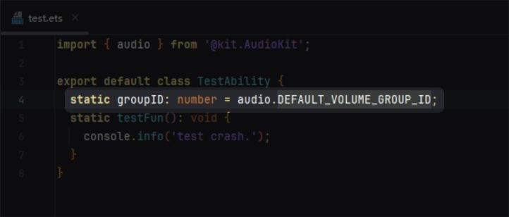

# ArkTS卡片适配常见问题

更新时间：2026-04-20 06:34:33

来源：https://developer.huawei.com/consumer/cn/doc/harmonyos-guides/arkts-ui-widget-adapt-faq

#### ArkTS卡片开发是否支持V2装饰器？如何从V1到V2迁移？

ArkTS卡片开发支持V2装饰器语法(如[@ObservedV2](https://developer.huawei.com/consumer/cn/doc/harmonyos-guides/arkts-new-observedv2-and-trace)、[@ComponentV2](https://developer.huawei.com/consumer/cn/doc/harmonyos-guides/arkts-create-custom-components#componentv2))，建议开发者使用V2装饰器替代V1语法进行状态管理，以获得更优的组件渲染性能和状态同步能力。

完整的语法差异对比、迁移步骤及示例代码，请参见官方文档: [V1->V2迁移指导概述](https://developer.huawei.com/consumer/cn/doc/harmonyos-guides/arkts-v1-v2-migration)。

#### 如何定位ArkTS卡片白屏问题？

ArkTS卡片白屏问题定位请参考[服务卡片显示问题定位指导](https://developer.huawei.com/consumer/cn/forum/topic/0202182083369423556)

#### ArkTS卡片如何适配深浅色模式？

当前系统存在深浅色两种显示模式，为了给用户更好的使用体验，保障卡片与页面视觉体验一致性，ArkTS卡片支持适配深浅色模式，具体请参考[应用深浅色适配](https://developer.huawei.com/consumer/cn/doc/harmonyos-guides/ui-dark-light-color-adaptation)。

#### 导入particleAbility、audio、camera、media、backgroundTaskManager模块导致应用崩溃问题。

#### 问题现象

导入particleAbility、audio、camera、media、backgroundTaskManager后应用崩溃，FaultLog指向相关调用行。

报错对应的代码行如下：

#### 原因

ArkTS卡片的FormExtensionAbility不支持加载上述模块，参考[@ohos.app.form.FormExtensionAbility](https://developer.huawei.com/consumer/cn/doc/harmonyos-references/js-apis-app-form-formextensionability)。强行加载得到的对象是undefined，使用时就会产生JS crash。

#### 解决措施

检查 FormExtensionAbility 的导入链，将涉及上述模块的文件与 ArkTS 卡片使用的文件拆分，避免被 FormExtensionAbility 加载。
