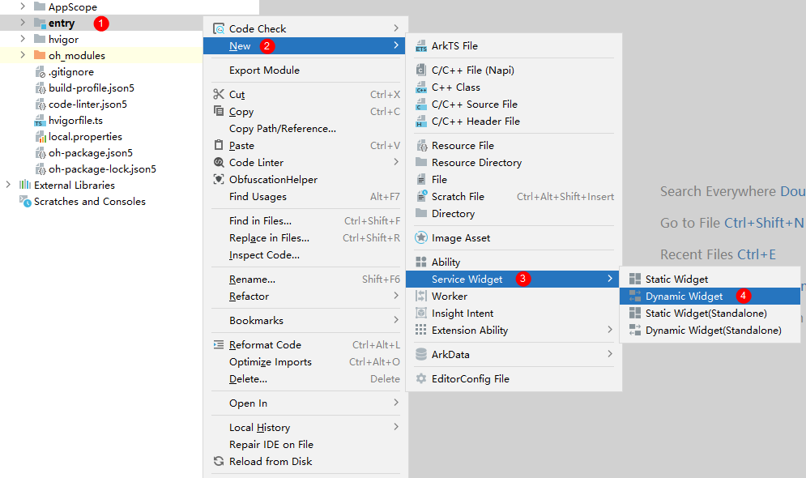
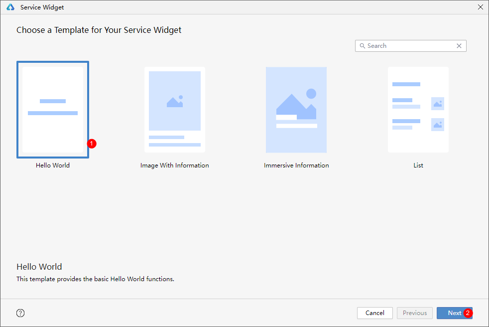
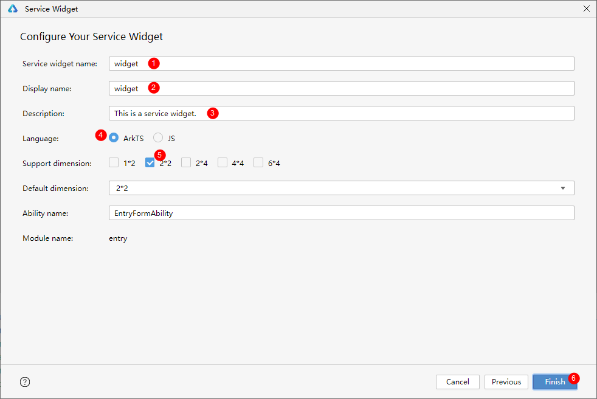
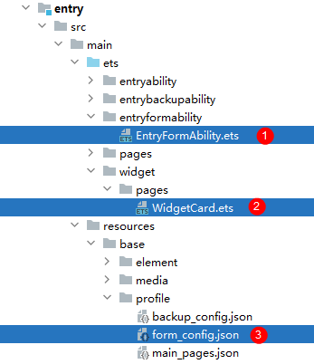
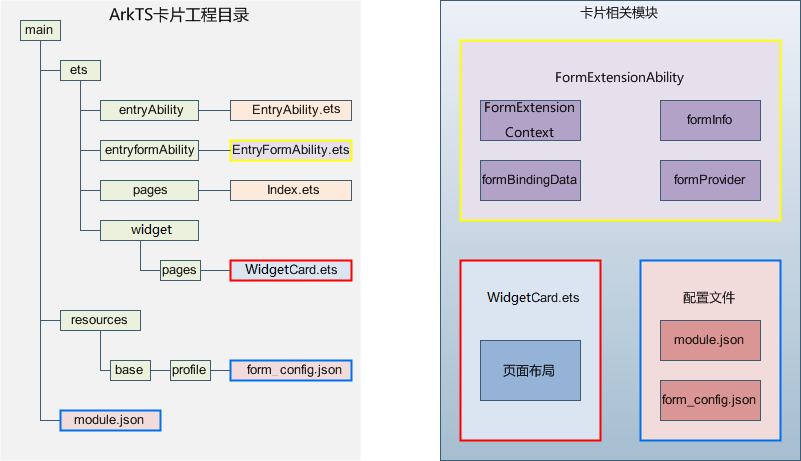
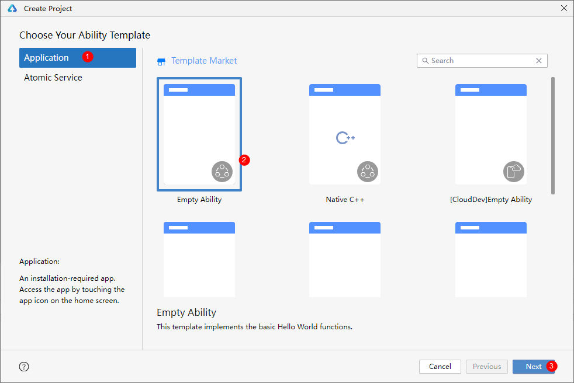
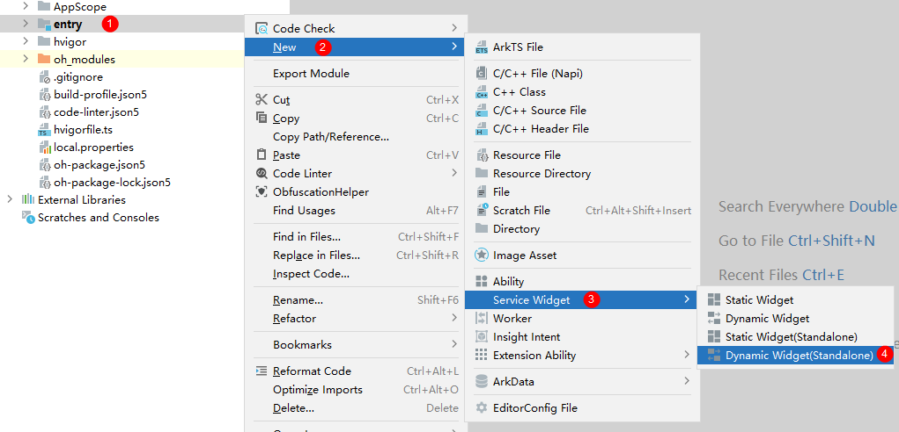
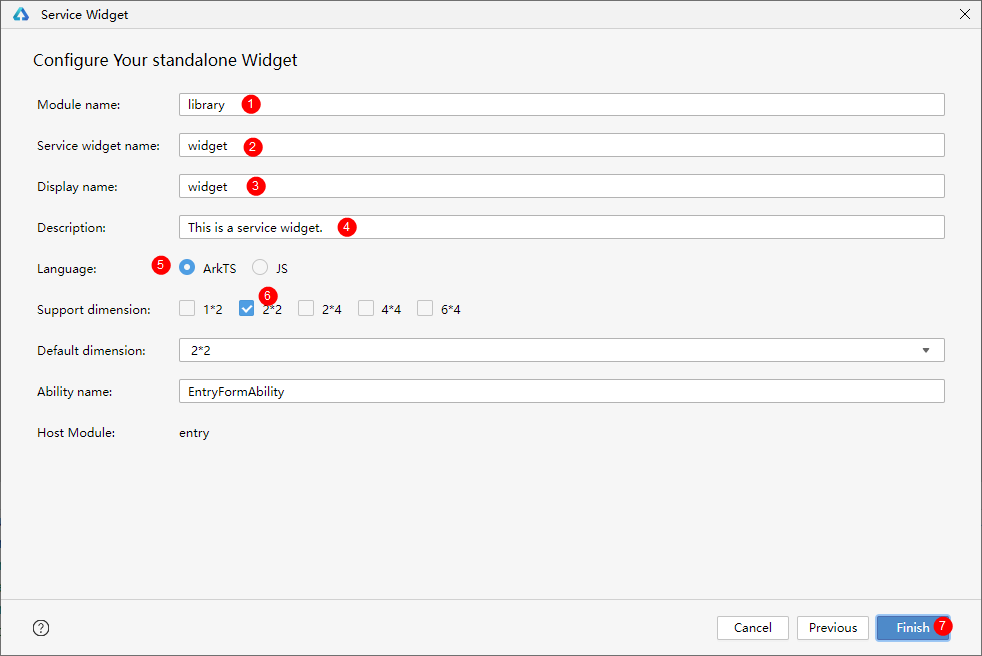
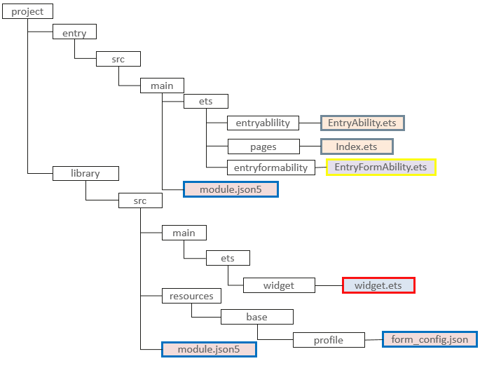

# 创建ArkTS卡片

更新时间：2026-03-09 02:50:43

来源：https://developer.huawei.com/consumer/cn/doc/harmonyos-guides/arkts-ui-widget-creation

ArkTS卡片有两种创建卡片包的方式。开发者在开发过程中任选其一即可。

方式一：卡片和应用共包方式，创建步骤请参考[共包方式创建卡片](https://developer.huawei.com/consumer/cn/doc/harmonyos-guides/arkts-ui-widget-creation#方式一共包方式创建卡片)，此时卡片UI和应用代码在一个module内，最终编译产物也在同一个HAP包内。

方式二：独立卡片包方式，创建步骤请参考[独立包方式创建卡片](https://developer.huawei.com/consumer/cn/doc/harmonyos-guides/arkts-ui-widget-creation#方式二独立包方式创建卡片)，此时卡片UI和应用代码在不同module内，最终编译产物分为卡片包和应用包。从API version 20开始支持。

ArkTS卡片创建完成，在开发卡片过程中，支持对卡片进行[实时预览](https://developer.huawei.com/consumer/cn/doc/harmonyos-guides/ide-service-widget#section18171652015)。

## 方式一：共包方式创建卡片

## 创建步骤

**1. 新建工程** 在DevEco Studio中，选择创建Application或Atomic Service工程，这两种都支持创建卡片。工程创建指导具体请参考[创建一个新的工程](https://developer.huawei.com/consumer/cn/doc/harmonyos-guides/ide-create-new-project)。

> [!NOTE]
> 基于不同版本的DevEco Studio，请以实际界面为准。

**2. 新建卡片** 在已有的应用工程中，右键新建ArkTS卡片，具体操作如下。 选中entry目录单击右键选择【New】->【Service Widget】->【Dynamic Widget】。在API 10及以上 Stage模型的工程中，开发者可通过Service Widget菜单直接选择创建动态卡片（Dynamic Widget）或静态卡片（Static Widget）。创建卡片后，也可在卡片的[form_config.json配置文件](https://developer.huawei.com/consumer/cn/doc/harmonyos-guides/arkts-ui-widget-configuration#配置文件字段说明)中，通过isDynamic参数修改卡片类型：isDynamic置空或赋值为“true”，则该卡片为[动态卡片](https://developer.huawei.com/consumer/cn/doc/harmonyos-guides/arkts-form-overview#动态卡片)；isDynamic赋值为"false"，则该卡片为[静态卡片](https://developer.huawei.com/consumer/cn/doc/harmonyos-guides/arkts-form-overview#静态卡片)。静态卡片和动态卡片切换之后用户交互实现也需要修改，具体参考ArkTS卡片概述中的[动态卡片](https://developer.huawei.com/consumer/cn/doc/harmonyos-guides/arkts-form-overview#动态卡片)和[静态卡片](https://developer.huawei.com/consumer/cn/doc/harmonyos-guides/arkts-form-overview#静态卡片)。

选择模板后，点击【Next】。

在选择卡片的开发语言类型（Language）时，选择ArkTS选项。选择卡片支持的外观规格（Support dimension）时，选择期望的卡片尺寸，然后选择默认的外观规格（Default dimension），最后点击“Finish”，即可完成ArkTS卡片创建。详细的卡片外观规格可参考[form_config.json](https://developer.huawei.com/consumer/cn/doc/harmonyos-guides/arkts-ui-widget-configuration#配置文件字段说明)配置文件，后续也可以在form_config.json配置文件中修改卡片规格。

建议根据实际使用场景命名卡片名称，ArkTS卡片创建完成后，工程中会新增如下卡片相关文件：卡片生命周期管理文件（EntryFormAbility.ets）、卡片页面文件（WidgetCard.ets）和卡片配置文件（form_config.json）。填写卡片配置之后点击【Finish】。

## 工程结构介绍

**图1** ArkTS卡片工程目录、相关模块

[FormExtensionAbility](https://developer.huawei.com/consumer/cn/doc/harmonyos-references/js-apis-app-form-formextensionability)：卡片扩展模块，提供卡片创建、销毁、刷新等生命周期回调。 [FormExtensionContext](https://developer.huawei.com/consumer/cn/doc/harmonyos-references/js-apis-inner-application-formextensioncontext)：FormExtensionAbility的上下文环境，提供FormExtensionAbility具有的接口和能力。 [formProvider](https://developer.huawei.com/consumer/cn/doc/harmonyos-references/js-apis-app-form-formprovider)：提供了获取卡片信息、更新卡片、设置卡片更新时间等能力。 [formInfo](https://developer.huawei.com/consumer/cn/doc/harmonyos-references/js-apis-app-form-forminfo)：提供了卡片信息和状态等相关类型和枚举。 [formBindingData](https://developer.huawei.com/consumer/cn/doc/harmonyos-references/js-apis-app-form-formbindingdata)：提供卡片数据绑定的能力，包括FormBindingData对象的创建、相关信息的描述。 [页面布局（WidgetCard.ets）](https://developer.huawei.com/consumer/cn/doc/harmonyos-guides/arkts-ui-widget-page-overview)：基于ArkUI提供卡片UI开发能力。 [ArkTS卡片通用能力](https://developer.huawei.com/consumer/cn/doc/harmonyos-guides/arkts-ui-widget-page-overview#arkts卡片支持的页面能力)：提供了能在ArkTS卡片中使用的组件、属性和API。 [ArkTS卡片特有能力](https://developer.huawei.com/consumer/cn/doc/harmonyos-guides/arkts-ui-widget-event-overview)：postCardAction用于卡片内部和提供方应用间的交互，仅在卡片中可以调用。 [卡片配置](https://developer.huawei.com/consumer/cn/doc/harmonyos-guides/arkts-ui-widget-configuration)：包含FormExtensionAbility的配置和卡片的配置。 在[module.json5配置文件](https://developer.huawei.com/consumer/cn/doc/harmonyos-guides/module-configuration-file)中的extensionAbilities标签下，配置FormExtensionAbility相关信息。 在resources/base/profile/目录下的[form_config.json](https://developer.huawei.com/consumer/cn/doc/harmonyos-guides/arkts-ui-widget-configuration#配置文件字段说明)配置文件中，配置卡片（WidgetCard.ets）相关信息。

## 方式二：独立包方式创建卡片

## 创建步骤

**1. 新建工程** 在DevEco Studio中，选择创建Application或Atomic Service工程，这两种都支持创建卡片。工程创建指导具体请参考[创建一个新的工程](https://developer.huawei.com/consumer/cn/doc/harmonyos-guides/ide-create-new-project)。

> [!NOTE]
> 基于不同版本的DevEco Studio，请以实际界面为准。

**2. 新建卡片** 选中entry目录单击右键选择【New】->【Service Widget】->【Dynamic Widget(Standalone)】。在Service Widget菜单可直接选择创建独立包的动态卡片（Dynamic Widget(standalone)）或静态卡片（Static Widget(standalone)）。创建服务卡片后，也可以在卡片的[form_config.json配置文件](https://developer.huawei.com/consumer/cn/doc/harmonyos-guides/arkts-ui-widget-configuration#配置文件字段说明)中，通过isDynamic参数修改卡片类型：isDynamic置空或赋值为“true”，则该卡片为[动态卡片](https://developer.huawei.com/consumer/cn/doc/harmonyos-guides/arkts-form-overview#动态卡片)；isDynamic赋值为"false"，则该卡片为[静态卡片](https://developer.huawei.com/consumer/cn/doc/harmonyos-guides/arkts-form-overview#静态卡片)。静态卡片和动态卡片切换之后用户交互实现也需要修改，具体参考ArkTS卡片概述中的[动态卡片](https://developer.huawei.com/consumer/cn/doc/harmonyos-guides/arkts-form-overview#动态卡片)和[静态卡片](https://developer.huawei.com/consumer/cn/doc/harmonyos-guides/arkts-form-overview#静态卡片)。

选择模板后，点击【Next】。

填写卡片配置之后点击【Finish】。卡片创建成功后，entry包中包含应用和卡片后端能力；library包中包含卡片UI侧能力。entry模块下的module.json5配置文件中的formWidgetModule字段需关联library模块，library模块下的module.json5配置文件中的formExtensionModule字段需关联entry模块，以实现卡片包和应用包相互关联。创建完成后，会自动生成配置文件并配置，后续也可以按照[卡片配置文件](https://developer.huawei.com/consumer/cn/doc/harmonyos-guides/arkts-ui-widget-configuration)修改配置。

## 工程结构介绍

独立卡片包与卡片共包方式创建卡片，仅工程结构存在差异，生成的文件是一致的，各文件具体内容请参考[共包方式工程结构介绍](https://developer.huawei.com/consumer/cn/doc/harmonyos-guides/arkts-ui-widget-creation#工程结构介绍)。 **图2** 独立卡片包工程目录。

> [!NOTE]
> 独立卡片包中应用包和卡片包为2个独立模块，因此需要关注同时安装的应用包和卡片包版本号一致。
