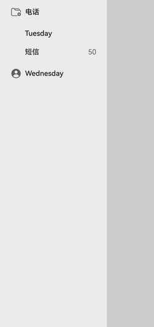

# 侧边栏菜单样式

更新时间：2026-05-07 09:37:20

来源：https://developer.huawei.com/consumer/cn/doc/harmonyos-guides/ui-design-side-menu

#### 场景介绍

从6.0.0(20)版本开始，新增支持设置侧边栏菜单样式。

[HdsSideMenu](https://developer.huawei.com/consumer/cn/doc/harmonyos-references/ui-design-hdssidemenu)提供一种菜单栏样式组件。设置侧边栏对应的一级菜单和二级菜单，并显示其新消息数量。





#### 开发步骤
1. 导入相关模块。

  
```text
import { HdsSideMenu, HdsSideMenuMainItem, HdsSideMenuSubItem, HdsSideMenuBadgeParam, HdsSideBar } from '@kit.UIDesignKit';
import { SymbolGlyphModifier } from '@kit.ArkUI';
```

2. 设置对应的一级菜单和二级菜单，并显示其新消息数量。

  
```text
@Entry
@ComponentV2
struct Index {
  @Local showControlButton: boolean = true;
  @Local sideBarMask: boolean = false;
  @Local autoHide: boolean = true;
  @Local barStateTypeText: string = 'Select BarState';
  @Local widthIndex: number = 0;
  @Local badgeNumber: HdsSideMenuBadgeParam = { count: 50 };
  @Local useTheme: boolean = false;
  @Local selectedIndex: number = 2;
  @Local selectedTransparency: number = 0.6;
  @Local str: string = '短信';
  @Local isShowSidebar: boolean = true;
  listOptionsDefault?: HdsSideMenuMainItem[] = [
    new HdsSideMenuMainItem(
      {
        symbol: new SymbolGlyphModifier($r('sys.symbol.ohos_folder_badge_plus')).fontSize(14),
        label: $r('sys.string.TextView_engr_phone')
      }),
    new HdsSideMenuMainItem({
      icon: $r('sys.symbol.person_wave_3'),
      label: 'Tuesday',
      hdsSideMenuSubItem: [
        new HdsSideMenuSubItem({ label: this.str, badge: this.badgeNumber })],
    }),
    new HdsSideMenuMainItem({
      symbol: new SymbolGlyphModifier($r('sys.symbol.person_crop_circle_fill_1')),
      label: 'Wednesday'
    }),
  ]
  @Builder
  SideBarPanelBuilder() {
    Column() {
      HdsSideMenu({
        items: this.listOptionsDefault,
        selectedIndex: this.selectedIndex,
        $selectedIndex: (selectedIndex: number) => {
          this.selectedIndex = selectedIndex
        }
      })
    }
    .height('100%')
  }
  // 右侧内容区
  @Builder
  ContentPanelBuilder() {
    Column() {
      Column() {
        Button() {
          SymbolGlyph(this.isShowSidebar ? $r('sys.symbol.open_sidebar') : $r('sys.symbol.close_sidebar'))
            .fontWeight(FontWeight.Normal)
            .fontSize($r('sys.float.ohos_id_text_size_headline7'))
            .fontColor([$r('sys.color.ohos_id_color_titlebar_icon')])
            .hitTestBehavior(HitTestMode.None)
        }
        .backgroundColor($r('sys.color.ohos_id_color_button_normal'))
        .height(24)
        .width(24)
        .animation({ curve: Curve.Sharp, duration: 100 })
        .onClick(() => {
          this.isShowSidebar = !this.isShowSidebar;
        })
      }
    }
    .height('100%')
    .width('100%')
  }
  @BuilderParam sideBarBuilder: () => void = this.SideBarPanelBuilder
  @BuilderParam contentBuilder: () => void = this.ContentPanelBuilder
  @Builder
  build() {
    Column() {
      HdsSideBar({
        sideBarPanelBuilder: (): void => {
          this.sideBarBuilder()
        },
        contentPanelBuilder: (): void => {
          this.contentBuilder()
        },
        isShowSideBar: this.isShowSidebar,
        $isShowSideBar: (isShowSidebar: boolean) => {
          this.isShowSidebar = !isShowSidebar
        }
      })
    }
  }
}
```
