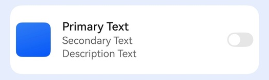

# 设置列表卡片样式

更新时间：2026-05-07 09:37:20

来源：https://developer.huawei.com/consumer/cn/doc/harmonyos-guides/ui-design-set-listitem-style

#### 场景介绍

从6.0.0(20)版本开始，新增支持设置列表卡片样式。

应用使用[HdsListItemCard](https://developer.huawei.com/consumer/cn/doc/harmonyos-references/ui-design-hdslistitemcard)组件实现多设备上的系统列表样式。





#### 开发步骤
1. 导入相关模块。

  
```text
import { HdsListItemCard, PrefixImage, SuffixSwitch} from '@kit.UIDesignKit';
import { promptAction } from '@kit.ArkUI';
```

2. 创建HdsListItemCard组件，设置左边为Image，中间为Text，右边为Switch的场景。

  
```text
@Entry
@Component
struct Test {
  private scroller: ListScroller = new ListScroller();

  build() {
    Column() {
      List({ space: 10, scroller: this.scroller }) {
        ListItem() {
          HdsListItemCard({
            // A区图片
            prefixItem: new PrefixImage({
              image: $r('app.media.background'),
              onClick: () => {
                promptAction.openToast({ message: 'left image' });
              }
            }),
            // B区文本
            textItem: {
              primaryText: {
                text: 'Primary Text'
              },
              secondaryText: {
                text: 'Secondary Text'
              },
              description: {
                text: 'Description Text'
              }
            },
            // C区Switch
            suffixItem: new SuffixSwitch({
              isCheck: false,
              onChange: (num: boolean) => {
                if (num) {
                  promptAction.openToast({ message: 'switch is true' });
                } else {
                  promptAction.openToast({ message: 'switch is false' });
                }
              }
            }),
            onClick: () => {
              promptAction.openToast({ message: 'hdslistitem' });
            }
          })
        }
      }
      .width('100%')
      .height('100%')
      .margin(10)
    }.backgroundColor(0x1a0a59f7).height('100%')
  }
}
```
