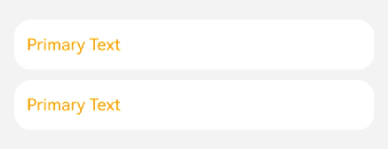

# 设置附带横滑的列表样式

更新时间：2026-05-07 09:37:20

来源：https://developer.huawei.com/consumer/cn/doc/harmonyos-guides/ui-design-set-hds-slide-horizon-listitem

##### 场景介绍

从6.0.0(20)版本开始，新增支持设置附带横滑的列表样式。

应用使用[HdsListItem](https://developer.huawei.com/consumer/cn/doc/harmonyos-references/ui-design-hdslistitem)组件实现多设备上的系统列表的横滑动效按钮的内容和样式。





##### 开发步骤
1. 导入相关模块。

  
```text
import { promptAction, SymbolGlyphModifier, TextModifier } from '@kit.ArkUI';
import { HdsListItem } from '@kit.UIDesignKit';
```

2. 简单配置页面的布局，调用HdsListItem的接口绘制列表的横滑动效按钮的内容和样式。

  
```text
@Entry
@Component
struct HdsListItemExample {
  @State dataSource: LazyDataSource<Item> = new LazyDataSource();
  @State dataArr: Array<Item> = [];
  @State EndOffset: number = 0;
  private scroller: Scroller = new Scroller();

  build() {
    Column() {
      List({ space: 10, scroller: this.scroller }) {
        LazyForEach(this.dataSource, (item: Item) => {
          HdsListItem({
            hdsListItemCard: {
              textItem: {
                primaryText: {
                  text: 'Primary Text',
                  modifier: new TextModifier().fontColor(Color.Orange).fontSize(16),
                }
              }
            },
            swipeActionOptions: {
              icons: [
                {
                  icon: new SymbolGlyphModifier($r('sys.symbol.share')).fontColor([Color.Red]).fontSize(16),
                  backgroundColor: Color.Green,
                  onAction: () => {
                    promptAction.openToast({ message: '点击share按钮', duration: 100 });
                  },
                },
                {
                  icon: new SymbolGlyphModifier($r('sys.symbol.plus_square_on_square')),
                  backgroundColor: Color.Orange,
                  onAction: () => {
                    promptAction.openToast({ message: '点击copy按钮', duration: 100 });
                  },
                },
                {
                  icon: new SymbolGlyphModifier($r('sys.symbol.plus_square_dashed_on_square'))
                          .symbolEffect(new BounceSymbolEffect(), true),
                  onAction: () => {
                    promptAction.openToast({ message: '点击paste按钮', duration: 100 });
                  },
                },
              ],
              deleteIconOptions: {
                backgroundColor: Color.Red, // 修改背景色
                iconColor: Color.Gray, // 修改垃圾桶的颜色
                onAction: () => {
                  promptAction.openToast({ message: '点击删除按钮', duration: 100 });
                } // 点击回调
              },
              fullDeleteOptions: {
                isFullDelete: true, // 划动距离超过划出组件大小后自动触发删除，默认是false
                onFullDeleteAction: () => {
                  promptAction.openToast({ message: '触发自动删除', duration: 100 });
                  this.getUIContext()?.animateTo({
                    duration: 350,
                  }, () => {
                    this.dataSource.deleteItem(item)
                  });
                }, // 触发删除时的回调
              },
            }
          })
        }, (item: Item) => item.data)
      }
      .scrollBar(BarState.Off)
      .onDidScroll((scrollOffset: number) => {
        this.EndOffset = scrollOffset
      })
      .margin(10)
      .width('100%')
      .height('100%')
    }
    .backgroundColor('#0D182431')
    .width('100%')
    .height('100%')
  }

  aboutToAppear() {
    for (let i = 0; i < 2; i++) {
      this.dataSource.pushItem(new Item(i + ''));
      this.dataArr.push(new Item(i + ''));
    }
  }
}

class Item {
  constructor(data: string) {
    this.data = data;
  }

  public data: string = '';
}

export class LazyDataSource<T> implements IDataSource {
  private elements: T[];
  private listeners: Set<DataChangeListener>;

  constructor(elements: T[] = []) {
    this.elements = elements;
    this.listeners = new Set();
  }

  public totalCount(): number {
    return this.elements.length;
  }

  public getData(index: number): T {
    return this.elements[index];
  }

  public indexOf(item: T): number {
    return this.elements.indexOf(item);
  }

  public pinItem(item: T, index: number): void {
    this.elements.splice(index, 1);
    this.elements.unshift(item);
    this.listeners.forEach(listener => listener.onDataReloaded());
  }

  public pushItem(item: T) {
    this.elements.push(item);
    this.listeners.forEach(listener => listener.onDataAdd(this.elements.length - 1));
  }

  public deleteItem(item: T): void {
    const index = this.elements.indexOf(item);
    if (index < 0) {
      return;
    }
    this.elements.splice(index, 1);
    this.listeners.forEach(listener => listener.onDataDelete(index));
  }

  public deleteItemByIndex(index: number): void {
    this.elements.splice(index, 1);
    this.listeners.forEach(listener => listener.onDataDelete(index));
  }

  public registerDataChangeListener(listener: DataChangeListener): void {
    this.listeners.add(listener);
  }

  public unregisterDataChangeListener(listener: DataChangeListener): void {
    this.listeners.delete(listener);
  }
}
```
