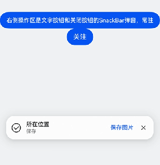

# 设置常驻通知弹窗

更新时间：2026-05-07 09:37:20

来源：https://developer.huawei.com/consumer/cn/doc/harmonyos-guides/ui-design-snackbar-resident-notification

#### 场景介绍

从6.0.0(20)版本开始，新增支持设置常驻通知弹窗。

[HdsSnackBar](https://developer.huawei.com/consumer/cn/doc/harmonyos-references/ui-design-hdssnackbar)支持常驻通知弹窗。当应用开发者需要常驻通知提醒弹窗时，可以通过HdsSnackBar的show方法显示HdsSnackBar弹窗，设置duration是-1表示常驻弹窗。





#### 开发步骤
1. 导入相关模块。

  
```text
import {
  HdsSnackBar,
  SnackBarIconOptions,
  SnackBarMessageOptions,
  SnackBarOperationOptions,
  SnackBarStyleOptions,
  SnackBarOperationType
} from '@kit.UIDesignKit';
```

2. 创建UIContext，创建HdsSnackBar对象hdsSnackBar，调用HdsSnackBar对象的show方法可以显示HdsSnackBar弹窗，入参是左侧图标icon、中间文本message、右侧操作区operation、样式style，其中右侧操作区设置类型是带有关闭按钮的文本按钮，其中style中设置duration是-1表示HdsSnackBar弹窗常驻。
3. 设置textButtonId和nextFocusId两个属性，支持开发者自定义Tab键走焦能力。

  
```text
@Entry
@ComponentV2
struct TestSnackBar {
  uiContext: UIContext = this.getUIContext();
  hdsSnackBar: HdsSnackBar = new HdsSnackBar(this.uiContext);
  icon: SnackBarIconOptions = {
    icon: $r('sys.symbol.checkmark_circle')
  }
  message: SnackBarMessageOptions = {
    title: $r('sys.string.ohos_id_text_location_button_description_current_position'),
    content: $r('sys.string.ohos_id_text_save_button_description_save')
  }
  operation: SnackBarOperationOptions = {
    operationType: SnackBarOperationType.TEXT_WITH_CLOSE,
    content: $r('sys.string.ohos_id_text_save_button_description_save_image'),
    textButtonId: 'snackBarTextButton'
  }
  style: SnackBarStyleOptions = {
    nextFocusId: 'button',
    duration: -1
  }

  build() {
    Column() {
      Blank()
        .height(400)
      Button('右侧操作区是文字按钮和关闭按钮的SnackBar弹窗，常驻')
        .onClick(() => {
          this.hdsSnackBar.show(this.icon, this.message, this.operation, this.style);
        })
        .id("button")

      Button('关注')
        .nextFocus({
          // 这里forward的id必须和SnackBarOperationOptions接口中传入的textButtonId相同
          forward: 'snackBarTextButton'
        })
    }
    .width('100%')
    .height('100%')
    .backgroundColor(0xF1F3F5)
  }
}
```
