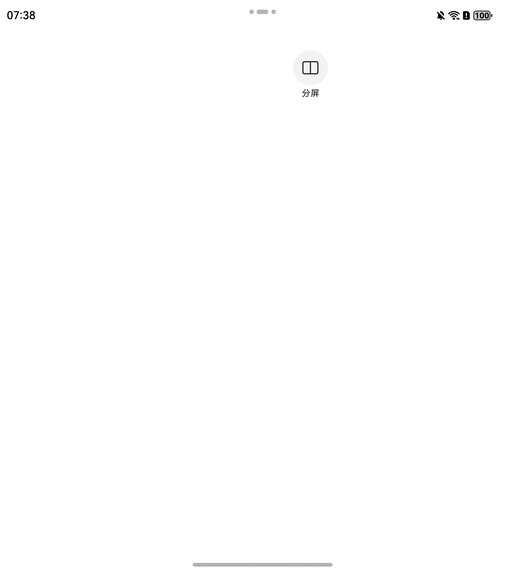

# 应用内多窗

更新时间：2026-05-08 09:27:50

来源：https://developer.huawei.com/consumer/cn/doc/harmonyos-guides/ui-design-multiwindowentryinapp

#### 场景介绍

从6.0.0(20)版本开始，新增支持应用内多窗。

通过应用内多窗组件[MultiWindowEntryInAPP](https://developer.huawei.com/consumer/cn/doc/harmonyos-references/ui-design-multiwindowentryinapp-api)提供的单应用多窗口接口，实现一个应用多个窗口并行运行的体验。并且可以设置图标大小颜色、背板大小颜色、文字大小颜色等。

如果开发者未集成HdsNavigation组件，可使用应用内多窗组件实现应用内多窗体验。


#### 约束条件

依赖全景多窗特性，只有当前设备及屏幕状态支持全景多窗，才支持设置此功能。目前支持全景多窗的设备形态有：

 - 双折叠：展开态。
 - 三折叠：双屏态，三屏态的横屏态。
 - 平板：横屏态。


对于不支持的设备形态，该组件不可交互，不响应点击事件。


#### 开发步骤
1. 导入模块。

  
```text
// 从6.0.2(22)版本开始，无需手动导入MultiWindowEntryInAPPAttribute。具体请参考MultiWindowEntryInAPP的导入模块说明。
import { MultiWindowEntryInAPP, MultiWindowEntryInAPPAttribute } from '@kit.UIDesignKit';
import { Want } from '@kit.AbilityKit';
import { TextModifier } from '@kit.ArkUI';
```

2. 使用MultiWindowEntryInAPP组件，并且设置组件参数。

  
```text
@Entry
@Component
struct MultiWindowEntryInAPPTest {
  @State textModifier: TextModifier = new TextModifier();
  private want: Want = {
    // 修改为当前应用的bundleName、moduleName、abilityName，启动应用内的UIAbility
    bundleName: 'com.example.myapplication',
    moduleName: 'entry',
    abilityName: 'FuncAbility'
  };

  build() {
    Row() {
      MultiWindowEntryInAPP({
        want: this.want, isShowSubtitle: true, multiWindowEntryInAPPStyle: {
          iconOptions: {
            iconSize: 24,
            iconColor: $r('sys.color.font_primary'),
            iconWeight: FontWeight.Normal,
            backgroundColor: $r('sys.color.comp_background_tertiary')
          },
          subtitleOptions: {
            modifier: this.textModifier.fontColor(Color.Black)
          }
        }
      })
        .size({ width: 48, height: 48 })
        .position({ x: 400, y: 30 })
    }
  }
}
```


