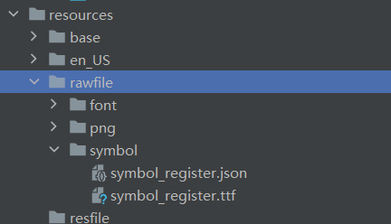
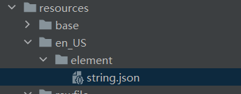

# 应用加载自定义Symbol

更新时间：2026-05-07 09:37:20

来源：https://developer.huawei.com/consumer/cn/doc/harmonyos-guides/ui-design-custom-symbol-res-register

## 场景介绍

从5.1.1 (19)版本开始，新增支持资源注册。 适用于需要快速定制应用内[Symbol图标](https://developer.huawei.com/consumer/cn/doc/harmonyos-references/ui-design-symbolregister)，不想强依赖于系统版本中预制的系统Symbol图标资源。

## 约束条件

资源注册支持Phone、Tablet、PC/2in1设备。

## 开发步骤

将UX设计师提供的Symbol图标资源（TTF文件）与动效参数资源（JSON文件）放入entry/src/main/resources/rawfile下，可新建目录。 说明：[Symbol资源制作流程参考](https://developer.huawei.com/consumer/cn/doc/design-guides/system-icons-0000001929854962)

多语言场景，在entry/src/main/resources目录中对应语言目录下的string.json文件中配置对应的Symbol图标Unicode值。

```text
{
  "string": [
    {
      "name": "symbol_custom_phone_fill_1",
      "value": "0x100016"
    }
  ]
}
```

导入相关模块。
```text
import { symbolRegister } from '@kit.UIDesignKit';
import { BusinessError } from '@kit.BasicServicesKit';
```

在通过SymbolGlyph/SymbolSpan组件展示自定义Symbol图标前，需要注册加载图标资源与动效参数资源。
```text
try {
  let result = symbolRegister.registerSymbol($rawfile("symbol/symbol_register.ttf"), $rawfile("symbol/symbol_register.json"));
} catch (error) {
  let err = error as BusinessError;
  console.error("errCode: " + err.code)
  console.error("error: " + err.message);
}
```

在需要展示自定义Symbol图标的页面通过SymbolGlyph/SymbolSpan组件展示该图标。
```text
struct test {
  build() {
    Column(){
      SymbolGlyph($r('app.string.symbol_custom_phone_fill_1'))
    }
  }
}
```


## 开发实例


```text
import { symbolRegister } from '@kit.UIDesignKit'
import { BusinessError } from '@kit.BasicServicesKit'

@Entry
@Component
struct test {
  aboutToAppear(): void {
    try {
      let result = symbolRegister.registerSymbol($rawfile("symbol/symbol_register.ttf"), $rawfile("symbol/symbol_register.json"));
    } catch (error) {
      let err = error as BusinessError;
      console.error("errCode: " + err.code)
      console.error("error: " + err.message);
    }
  }
  build() {
    Column(){
      SymbolGlyph($r('app.string.symbol_custom_phone_fill_1'))
    }
  }
}
```


