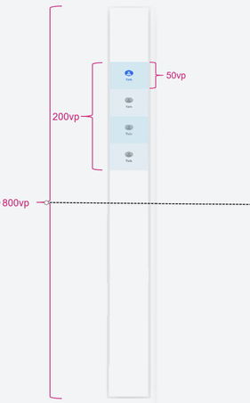
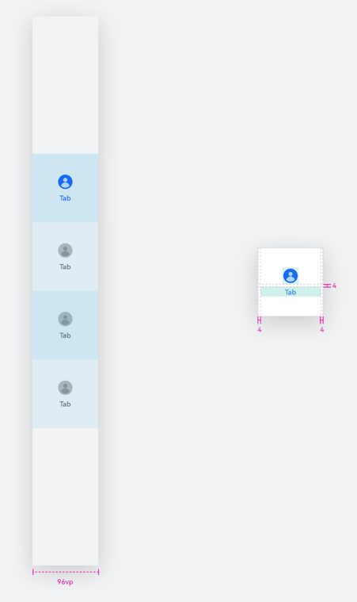
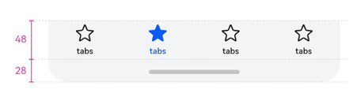

# 设置侧边栏半屏居中对齐样式

更新时间：2026-05-07 09:37:20

来源：https://developer.huawei.com/consumer/cn/doc/harmonyos-guides/ui-design-hds-tabs-sidebar-alignment-substyle

## 场景介绍

从6.0.0(20)版本开始，新增支持设置侧边栏半屏居中对齐样式。 [HdsTabs](https://developer.huawei.com/consumer/cn/doc/harmonyos-references/ui-design-hdstabs)容器组件侧边栏支持半屏居中对齐布局。横向Tabs时，若没有主动设置TabBar高度，则TabBar默认高度为48vp，纵向TabBar默认宽度为96vp，barHeight设成固定值后，TabBar无法扩展底部安全区。当safeAreaPadding不设置bottom或者bottom设置为0时，可以实现扩展安全区。 半屏居中对齐布局

默认横向和纵向宽度



## 约束条件

依赖页签位于侧边栏，vertical设置为true。 页签使用BottomTabBarStyle样式。

## 开发步骤

导入相关模块。
```text
// 从6.0.2(22)版本开始，无需手动导入HdsTabsAttribute。具体请参考HdsTabs的导入模块说明。
import { HdsTabs, ExtendBarMode, HdsTabsAttribute } from '@kit.UIDesignKit';
```

创建Hds一级容器组件，设置HdsTabs组件的barMode样式为ExtendBarMode.HALF_SCREEN_FIXED，所有页签总高度之和为HdsTabs组件高度的四分之一，且处在二分之一屏的居中位置。
```text
@Entry
@Component
struct Index {
  @State isVertical: boolean = false;

  build() {
    Column() {
      Column() {
        Row() {
          Button('verticalChange')
            .onClick(() => {
              this.isVertical = !this.isVertical;
            })
        }
      }
      .margin({ top: 20 })
      .width('100%')
      .height('10%')
      HdsTabs({ barPosition: BarPosition.End }) {
        TabContent() {
          Column().width('100%').height('100%').backgroundColor(Color.Yellow)
        }
        .tabBar(new BottomTabBarStyle($r('sys.media.ohos_app_icon'), 'Yellow'))
        TabContent() {
          Column().width('100%').height('100%').backgroundColor(Color.Blue)
        }
        .tabBar(new BottomTabBarStyle($r('sys.media.ohos_app_icon'), 'Blue'))
        TabContent() {
          Column().width('100%').height('100%').backgroundColor(Color.Pink)
        }
        .tabBar(new BottomTabBarStyle($r('sys.media.ohos_app_icon'), 'Pink'))
      }
      .vertical(this.isVertical)
      .barMode(ExtendBarMode.HALF_SCREEN_FIXED)
      .width('100%')
      .height('90%')
    }
  }
}
```
