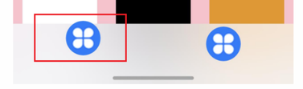

# 设置页签的图标出血样式

更新时间：2026-05-07 09:37:20

来源：https://developer.huawei.com/consumer/cn/doc/harmonyos-guides/ui-design-hds-tabs-icon-bleed-substyle

##### 场景介绍

从6.0.0(20)版本开始，新增支持设置页签的图标出血样式。

[HdsTabs](https://developer.huawei.com/consumer/cn/doc/harmonyos-references/ui-design-hdstabs)容器组件扩展支持出血图标样式。当应用开发者需要tabBar内的页签高度超出tabBar时，可以通过设置对应页签的属性，添加出血效果的自定义组件，图标超出容器部分最大高度为4vp。





##### 约束条件

依赖页签栏位于容器底部，barPosition设置为BarPosition.End，vertical设置为false。


##### 开发步骤
1. 导入相关模块。

  
```text
// 从6.0.2(22)版本开始，无需手动导入HdsTabsAttribute。具体请参考HdsTabs的导入模块说明。
import { HdsTabs, HdsTabsAttribute, bleedIconStyle } from '@kit.UIDesignKit';
```

2. 创建Hds一级容器组件，设置HdsTabs组件的子组件TabContent的tabBar样式。

  
```text
@Entry
@Component
struct Index {
  build() {
    Stack() {
      HdsTabs() {
        TabContent() {
          Column().width('100%').height('100%').backgroundColor(Color.Yellow)
        }
        .tabBar(bleedIconStyle(() => {
          this.tabBuilder()
        }))
        TabContent() {
          Column().width('100%').height('100%').backgroundColor(Color.Blue)
        }
        .tabBar(this.tabBuilder())
      }
      .vertical(false)
      .barPosition(BarPosition.End)
    }
  }

  @Builder
  tabBuilder() {
    Column() {
      Image($r('app.media.startIcon'))
        .width(48)
        .height(48)
        .borderRadius(24)
    }
  }
}
```
