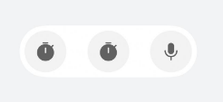

# 设置无主按钮的组件

更新时间：2026-05-07 09:37:20

来源：https://developer.huawei.com/consumer/cn/doc/harmonyos-guides/ui-design-actionbar-without-master-button

## 场景介绍

从6.0.0(20)版本开始，新增支持设置无主按钮的组件。 [HdsActionBar](https://developer.huawei.com/consumer/cn/doc/harmonyos-references/ui-design-hdsactionbar)组件支持多个按钮的样式。当应用开发者需要多个按钮并且没有主按钮，没有展开和收缩的动效时，可以通过设置左按钮和右按钮配置样式。


## 开发步骤

导入相关模块。
```text
import { HdsActionBar, ActionBarButton } from '@kit.UIDesignKit'
```

创建左边的按钮数组startButtons，创建右边的按钮数组endButtons，无主按钮，不支持切换展开和收缩状态。
```text
@Entry
@ComponentV2
struct TestNoPrimaryButton {

  build() {
    Column() {
      HdsActionBar({
        startButtons: [new ActionBarButton({
          baseIcon: $r('sys.symbol.stopwatch_fill')
        }), new ActionBarButton({
          baseIcon: $r('sys.symbol.stopwatch_fill')
        })],
        endButtons: [new ActionBarButton({
          baseIcon: $r('sys.symbol.mic_fill')
        })]
      })
    }
    .width('100%')
    .height('100%')
    .backgroundColor(0xF1F3F5)
    .justifyContent(FlexAlign.Center)
    .alignItems(HorizontalAlign.Center)
  }
}
```
