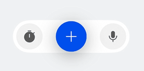

# 设置有主按钮的组件

更新时间：2026-05-07 09:37:20

来源：https://developer.huawei.com/consumer/cn/doc/harmonyos-guides/ui-design-actionbar-main-buttons

## 场景介绍

从6.0.0(20)版本开始，新增支持设置有主按钮的组件。 [HdsActionBar](https://developer.huawei.com/consumer/cn/doc/harmonyos-references/ui-design-hdsactionbar)组件支持多个按钮的样式。当应用开发者需要多个按钮并且有主按钮，支持展开和收缩的动效时，可以通过设置主按钮配置样式。


## 开发步骤

导入相关模块。
```text
import { HdsActionBar, ActionBarButton, ActionBarStyle } from '@kit.UIDesignKit';
```

创建左边的按钮数组startButtons，创建右边的按钮数组endButtons，创建主按钮primaryButton，设置isExpand初始值是true表示HdsActionBar的初始状态是展开状态，点击主按钮会收起，再次点击可以展开。
```text
@Entry
@ComponentV2
struct TestActionBar {
  @Local isExpand: boolean = true;

  @Local isPrimaryIconChanged: boolean = false;

  @Local primaryHoverTips: ResourceStr = '开始';

  build() {
    Column() {
      HdsActionBar({
        startButtons: [new ActionBarButton({
          baseIcon: $r('sys.symbol.stopwatch_fill')
        })],
        endButtons: [new ActionBarButton({
          baseIcon: $r('sys.symbol.mic_fill')
        })],
        primaryButton: new ActionBarButton({
          baseIcon: $r('sys.symbol.plus'),
          altIcon: $r('sys.symbol.play_fill'),
          onClick: () => {
            this.isExpand = !this.isExpand;
            this.isPrimaryIconChanged = !this.isPrimaryIconChanged;
            if (this.isPrimaryIconChanged) {
              this.primaryHoverTips = '暂停';
            } else {
              this.primaryHoverTips = '开始';
            }
          },
          hoverTips: this.primaryHoverTips
        }),
        actionBarStyle: new ActionBarStyle({
          isPrimaryIconChanged: this.isPrimaryIconChanged
        }),
        isExpand: this.isExpand!!
      })
    }
    .width('100%')
    .height('100%')
    .backgroundColor(0xF1F3F5)
    .justifyContent(FlexAlign.Center)
    .alignItems(HorizontalAlign.Center)
  }
}
```
