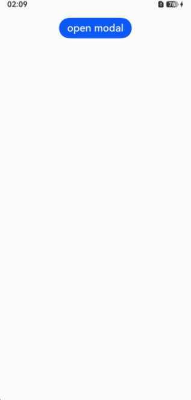

# 半模态样式

更新时间：2026-05-08 09:27:50

来源：https://developer.huawei.com/consumer/cn/doc/harmonyos-guides/ui-design-navigation-half-modal-style

#### 场景介绍

从6.0.0(20)版本开始，导航组件新增支持半模态中的标题栏样式，并在该样式下支持标题栏模糊效果。

用于半模态弹窗中使用导航组件场景。通过设置[HdsNavigationTitleMode](https://developer.huawei.com/consumer/cn/doc/harmonyos-references/ui-design-hdsnavigation#hdsnavigationtitlemode)为MODAL可以实现标题栏半模态样式及动态模糊。





#### 开发步骤
1. 导入相关模块。

  
```text
// 从6.0.2(22)版本开始，无需手动导入HdsNavigationAttribute。具体请参考HdsNavigation的导入模块说明。
import { IconStyleMode, HdsNavigationAttribute, HdsNavigation, HdsNavigationTitleMode } from '@kit.UIDesignKit';
```

2. 创建一级导航组件，通过设置titleMode属性为HdsNavigationTitleMode.MODAL实现标题栏半模态样式。

  
```text
@Entry
@Component
struct SheetTransitionExample {
  @State isShow: boolean = false;
  scroller: Scroller = new Scroller();

  @Builder
  HdsNavigationBuilder() {
    HdsNavigation() {
      Scroll(this.scroller) {
        Image($r('app.media.scenery2'))
          .height('100%')
      }
      .clip(false) // 设置不对子组件超出当前组件范围外的区域进行裁剪，使内容区可以穿透到标题栏下方
      .scrollBar(BarState.Off)
      .edgeEffect(EdgeEffect.Spring, { alwaysEnabled: true })
    }
    .titleBar({
      enableComponentSafeArea: true, // 将标题栏设置为组件级安全区，内容区可避让标题栏
      content: {
        title: {
          mainTitle: '壁纸'
        },
      // 设置HdsNavigation关闭按钮，与半模态按钮规格一致
      menu: {
        value: [{
          content: {
            icon: $r('sys.symbol.xmark'),
            type: IconStyleMode.SMALL,
            action: () => {
              this.isShow = false;
            },
          }
        }]
      },
    },
  })
  .titleMode(HdsNavigationTitleMode.MODAL) // 设置导航标题栏模式为半模态
  .bindToScrollable([this.scroller]) // 绑定导航组件和可滚动容器组件
  }

  build() {
    Column({ space: 8 }) {
      Button('open modal')
        .onClick(() => {
          this.isShow = true;
        })
        .fontSize(20)
        .margin(10)
        .bindSheet($$this.isShow, this.HdsNavigationBuilder(), {
          detents: [SheetSize.MEDIUM, SheetSize.LARGE, 200],
          showClose: false, // 取消半模态的关闭按钮，推荐使用HdsNavigation的menu配置关闭按钮
          enableFloatingDragBar: true,
        })
    }
    .width('100%')
    .height('100%')
  }
}
```
