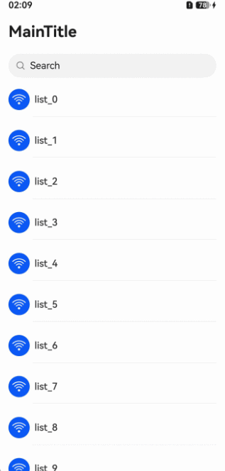

# 标题栏动态显隐

更新时间：2026-05-08 09:27:50

来源：https://developer.huawei.com/consumer/cn/doc/harmonyos-guides/ui-design-navigation-dynamic-display-and-hiding

#### 场景介绍

从6.0.0(20)版本开始，导航组件新增支持设置标题栏动态显隐功能。

用于实现标题栏在特定条件下自动显示或隐藏的效果，适用于需要节省屏幕空间的应用界面。当应用开发者需要动态隐藏标题栏时，可通过使用[dynamicHideTitleBar](https://developer.huawei.com/consumer/cn/doc/harmonyos-references/ui-design-hdsnavigation#dynamichidetitlebar)属性实现该功能。在设置动态隐藏标题栏的前提下，才可进一步设置隐藏状态栏。隐藏状态栏表现为状态栏内容区颜色为透明，状态栏区域无模糊。仅在隐藏标题栏区域后，执行隐藏状态栏。





#### 开发步骤
1. 导入相关模块。

  
```text
// 从6.0.2(22)版本开始，无需手动导入HdsNavigationAttribute。具体请参考HdsNavigation的导入模块说明。
import { HdsNavigation, BottomBuilderShowType, HideMode, HdsNavigationAttribute, HdsNavigationTitleMode } from '@kit.UIDesignKit';
```

2. 创建一级导航组件，通过设置dynamicHideTitleBar属性，可隐藏状态栏、标题区域、bottomBuilder区域。

  
```text
@Entry
@Component
struct Index {
  scroller: Scroller = new Scroller();
  private arr: number[] = [0, 1, 2, 3, 4, 5, 6, 7, 8, 9, 10, 11, 12, 13, 14, 15, 16, 17, 18, 19, 20];

  @Builder
  bottomBuilder() {
    Column() {
      Search({ placeholder: 'Search' })
        .height(40)
        .placeholderColor($r('sys.color.font_primary'))
        .margin({ left: 16, right: 16 })
    }
    .width('100%')
  }

  build() {
    HdsNavigation() { // 创建HdsNavigation组件
      List({ space: 12, initialIndex: 0, scroller: this.scroller }) {
        ForEach(this.arr, (item: number) => {
          ListItem() {
            Column() {
              Row({ space: 8 }) {
                Button() {
                  SymbolGlyph($r('sys.symbol.wifi'))
                    .fontColor([$r('sys.color.icon_on_primary')])
                    .fontSize(24)
                }
                .width(35)
                .height(35)

                Text('list_' + item)
                  .width('100%')
                  .height(72)
                  .fontSize(16)
                  .fontWeight(500)
              }

              Divider().margin({ left: 40 })
            }
          }
          .height(56)
        }, (item: number) => item.toString())
      }
      .margin({ left: 16, right: 16 })
      .clip(false) // 设置不对子组件超出当前组件范围外的区域进行裁剪，使内容区可以穿透到标题栏下方
      .cachedCount(3, true) // 设置列表中ListItem/ListItemGroup的预加载数量，列表穿透到标题栏下方不会消失
      .scrollBar(BarState.Off)
      .edgeEffect(EdgeEffect.Spring, { alwaysEnabled: true })
    }
    .titleBar({
      content: {
        title: { mainTitle: 'MainTitle' },
        // 设置标题下方bottomBuilder区域，包括设置高度，显示类型
        bottomBuilder: {
          builder: (): void => this.bottomBuilder(),
          height: 56,
          showType: BottomBuilderShowType.DIRECTLY_SHOW
        }
      },
      enableComponentSafeArea: true, // 将标题栏设置为组件级安全区，内容区可避让标题栏
    })
    .bindToScrollable([this.scroller]) // 绑定导航组件和可滚动容器组件
    .titleMode(HdsNavigationTitleMode.MINI)
    .hideBackButton(true)
    // 设置标题栏动态显隐，包括设置标题区域，bottomBuilder区域，状态栏区域是否动态隐藏，隐藏模式以及开始隐藏时内容区的滚动距离。
    .dynamicHideTitleBar({
      hideTitleArea: true,
      hideBottomBuilder: true,
      hideStatusBar: false,
      mode: HideMode.SCROLL_UP_TO,
      hideOffset: 10
    })
  }
}
```
