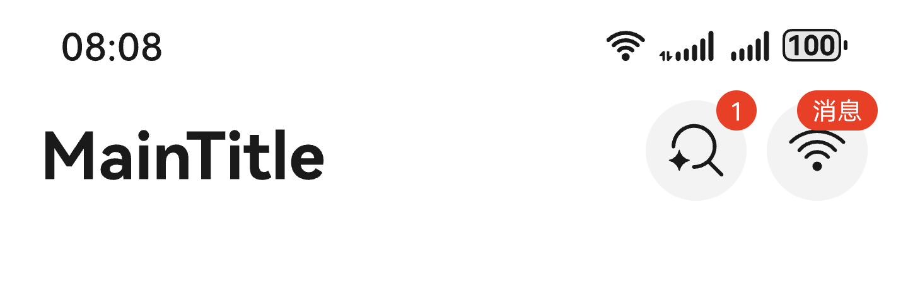

# 设置信息提醒

更新时间：2026-05-08 09:27:50

来源：https://developer.huawei.com/consumer/cn/doc/harmonyos-guides/ui-design-navigation-message-reminder

#### 场景介绍

从5.1.0(18)版本开始，导航组件新增支持菜单栏设置信息提醒能力。

当应用开发者需要在导航组件菜单项右上角附加消息提醒时，可以通过设置标题栏菜单中的[badge](https://developer.huawei.com/consumer/cn/doc/harmonyos-references/ui-design-hdsnavigation#hdsnavigationbadgeiconoptions)属性，实现信息提醒能力。





#### 开发步骤
1. 导入相关模块。

  
```text
// 从6.0.2(22)版本开始，无需手动导入HdsNavigationAttribute。具体请参考HdsNavigation的导入模块说明。
import { HdsNavigation, HdsNavigationAttribute, HdsNavigationTitleMode } from '@kit.UIDesignKit';
```

2. 创建一级导航组件，通过配置titleBar中menu的badge属性，设置信息提醒样式。

  
```text
@Entry
@Component
struct Index {
  build() {
    HdsNavigation() { // 创建HdsNavigation组件
    }
    .titleBar({
      content: {
        // 标题栏内容设置
        menu: {
          // 标题栏菜单区域内容设置
          value: [{
            content: {
              // 第一个菜单项内容设置
              label: 'menu1',
              icon: $r('sys.symbol.AI_search'),
              isEnabled: true,
            },
            badge: {
              // 第一个菜单项信息提醒设置
              count: 1
            }
          }, {
            content: {
              // 设置第一个菜单项内容，设置为普通文本按钮
              label: 'menu2',
              icon: $r('sys.symbol.wifi'),
              isEnabled: true,
              componentId: 'menu_1',
              action: () => {
              },
            },
            badge: {
              // 第二个菜单项信息提醒设置
              value: '消息'
            }
          }]
        },
        title: { mainTitle: 'MainTitle' },
      }
    })
    .titleMode(HdsNavigationTitleMode.MINI)
    .hideBackButton(true)
  }
}
```
