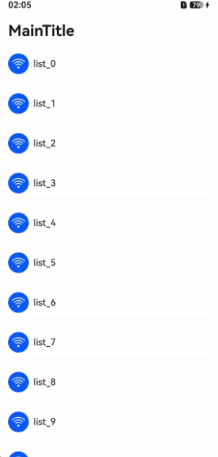
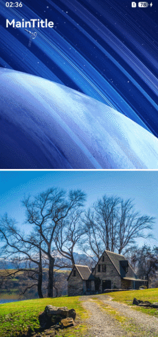
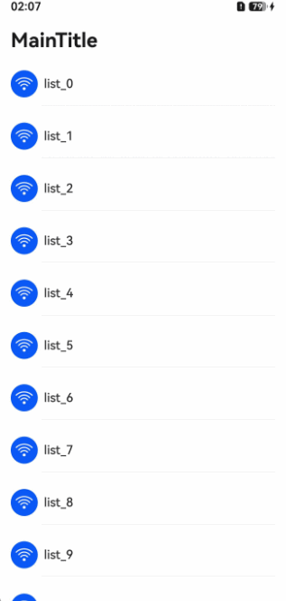

# 设置动态模糊样式

更新时间：2026-05-08 09:27:50

来源：https://developer.huawei.com/consumer/cn/doc/harmonyos-guides/ui-design-navigation-dynamic-blur

## 场景介绍

从5.1.0(18)版本开始， 导航组件新增支持标题栏[通用模糊](https://developer.huawei.com/consumer/cn/doc/harmonyos-references/ui-design-hdsnavigation#scrolleffecttype)（适用于列表型非沉浸式场景）样式。 从6.0.0(20)版本开始，新增支持[过渡模糊](https://developer.huawei.com/consumer/cn/doc/harmonyos-references/ui-design-hdsnavigation#scrolleffecttype)（适用于沉浸式图文类）与[渐变模糊](https://developer.huawei.com/consumer/cn/doc/harmonyos-references/ui-design-hdsnavigation#scrolleffecttype)（适用于增强页面沉浸感的场景）样式。 当应用开发者需要使用标题栏样式随内容区滚动而动态改变样式的导航组件时，可以通过设置titleBar属性中的[style](https://developer.huawei.com/consumer/cn/doc/harmonyos-references/ui-design-hdsnavigation#hdsnavigationtitlebaroptions)配置，自定义标题栏样式随滚动距离线性变化。通常需配合滚动容器组件使用，推荐使用bindToScrollable、bindToNestedScrollable属性绑定导航组件和可滚动容器组件。

## 通用模糊样式

对组件背景进行均匀的模糊处理，模糊强度一致，边界清晰，用于强调控件与内容的层级分隔。滑动内容进入/离开标题栏区域过程中，模糊背板和分割线透明渐变出现/消失。此方式适用于非沉浸式场景。


## 过渡模糊样式

对组件背景进行均匀的模糊处理，模糊强度一致，边界清晰，用于强调控件与内容的层级分隔。滑动时标题栏内容发生颜色/状态变化，滑动过程中，随滑动距离，标题栏样式线性变化。此方式仅适用于沉浸式页面，随内容区滚动修改标题栏样式的场景。


## 渐变模糊样式

模糊效果在空间维度上呈现逐渐增强/减弱的变化，模糊边界柔和，用于增强页面沉浸感。


## 开发步骤

导入相关模块。
```text
// 从6.0.2(22)版本开始，无需手动导入HdsNavigationAttribute。具体请参考HdsNavigation的导入模块说明。
import { HdsNavigation, HdsNavigationTitleMode, ScrollEffectType, HdsNavigationAttribute } from '@kit.UIDesignKit';
import { LengthMetrics } from '@kit.ArkUI';
```

创建一级导航组件，通过配置titleBar中的scrollEffectType属性，可实现通用模糊、过渡模糊、渐变模糊样式。
```text
@Entry
@Component
struct Index {
  scroller: Scroller = new Scroller();
  private arr: number[] = [0, 1, 2, 3, 4, 5, 6, 7, 8, 9, 10, 11, 12, 13, 14, 15, 16, 17, 18, 19, 20];

  build() {
    HdsNavigation() { // 创建HdsNavigation组件
      List({ space: 12, initialIndex: 0, scroller: this.scroller }) {
        ForEach(this.arr, (item: number) => {
          ListItem() {
            Column() {
              Row({ space: 8 }) {
                Button() {
                  SymbolGlyph($r('sys.symbol.wifi'))
                    .fontColor([$r('sys.color.icon_on_primary')])
                    .fontSize(24)
                }
                .width(35)
                .height(35)

                Text('list_' + item)
                .width('100%')
                .height(72)
                .fontSize(16)
                .fontWeight(500)
              }

              Divider().margin({ left: 40 })
            }
          }
          .height(56)
        }, (item: number) => item.toString())
      }
      .margin({ left: 16, right: 16 })
      .clip(false) // 设置不对子组件超出当前组件范围外的区域进行裁剪，使内容区可以穿透到标题栏下方
      .cachedCount(3, true) // 设置列表中ListItem/ListItemGroup的预加载数量，列表穿透到标题栏下方不会消失
      .scrollBar(BarState.Off)
      .edgeEffect(EdgeEffect.Spring, { alwaysEnabled: true })
    }
    .titleBar({
      enableComponentSafeArea: true, // 将标题栏设置为组件级安全区，内容区可避让标题栏
      style: { // 设置导航组件标题栏样式，推荐使用默认样式
        // 标题栏动态模糊样式，包括是否使能滚动动态模糊，动态模糊类型，动态模糊生效的滚动距离等
        scrollEffectOpts: {
          enableScrollEffect: true,
          scrollEffectType: ScrollEffectType.COMMON_BLUR,
          blurEffectiveStartOffset: LengthMetrics.vp(0),
          blurEffectiveEndOffset: LengthMetrics.vp(20)
        },
        originalStyle: { // 内容区滚动前初始样式设置
          backgroundStyle: { // 标题栏背板样式设置
            backgroundColor: $r('sys.color.ohos_id_color_background'),
          },
          contentStyle: { // 标题栏内容区样式设置，包括标题区域，菜单区域，返回按钮区域
            titleStyle: {
              mainTitleColor: $r('sys.color.font_primary'),
              subTitleColor: $r('sys.color.font_secondary')
            },
            menuStyle: {
              backgroundColor: $r('sys.color.comp_background_tertiary'),
              iconColor: $r('sys.color.icon_primary')
            },
            backIconStyle: {
              backgroundColor: $r('sys.color.comp_background_tertiary'),
              iconColor: $r('sys.color.icon_primary')
            }
          }
        },
        scrollEffectStyle: { // 内容区滚动超过blurEffectiveEndOffset后样式设置
          backgroundStyle: {
            backgroundColor: $r('sys.color.ohos_id_color_background_transparent')
          },
          contentStyle: {
            titleStyle: {
              mainTitleColor: $r('sys.color.font_primary'),
              subTitleColor: $r('sys.color.font_secondary')
            },
            menuStyle: {
              backgroundColor: $r('sys.color.comp_background_tertiary'),
              iconColor: $r('sys.color.icon_primary')
            },
            backIconStyle: {
              backgroundColor: $r('sys.color.comp_background_tertiary'),
              iconColor: $r('sys.color.icon_primary')
            }
          }
        }
      },
      content: { // 标题栏内容设置
        title: { mainTitle: 'MainTitle' },
      }
    })
    .hideBackButton(true)
    .bindToScrollable([this.scroller]) // 绑定导航组件和可滚动容器组件
    .titleMode(HdsNavigationTitleMode.MINI)
  }
}
```
