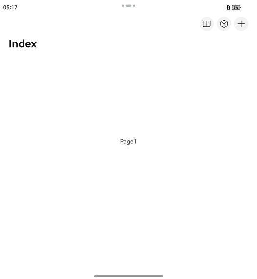

# 设置应用内多窗

更新时间：2026-04-29 07:35:50

来源：https://developer.huawei.com/consumer/cn/doc/harmonyos-guides/ui-design-navigation-set-multi-window

## 场景介绍

从6.0.0(20)版本开始，新增支持应用内多窗。 当应用开发者需要使用应用内多窗图标（分屏按钮）时，可通过配置titleBar中的menu的[multiWindowEntryInAPPMenu](https://developer.huawei.com/consumer/cn/doc/harmonyos-references/ui-design-hdsnavigation#hdsnavigationmenucontentoptions)属性实现该功能。

## 约束条件

依赖全景多窗特性，只有当前设备及屏幕状态支持全景多窗，才支持设置此功能。目前支持全景多窗的设备形态有： 双折叠：展开态。 三折叠：双屏态，三屏态的横屏态。 平板：横屏态。 对于不支持的设备形态，该组件不可交互，不响应点击事件。

## 开发步骤

导入模块。
```text
// 从6.0.2(22)版本开始，无需手动导入HdsNavigationAttribute。具体请参考HdsNavigation的导入模块说明。
import { HdsNavigation, HdsNavigationMenuContentOptions, HdsNavigationAttribute } from '@kit.UIDesignKit';
import { Want } from '@kit.AbilityKit';
```

创建一级导航组件，通过配置titleBar中的menu上的multiWindowEntryInAPPMenu属性，实现应用内多窗图标设置。
```text
@Entry
@Component
struct MultiWindowEntryInAPPTest {
  private want: Want = {
    // 修改为当前应用的bundleName、moduleName、abilityName，启动应用内的UIAbility
    bundleName: 'com.example.myapplication',
    moduleName: 'entry',
    abilityName: 'FuncAbility',
  }
  @State menuContent: HdsNavigationMenuContentOptions = {
    multiWindowEntryInAPPMenu: {
      want: this.want
    },
    maxCount: 3,
    value: [
      { content: { label: 'menu1', icon: $r('sys.symbol.search_things'), } },
      { content: { label: 'menu2', icon: $r('sys.symbol.plus'), } }
    ]
  }

  build() {
    HdsNavigation() {
      Stack() {
        Text('Page1')
      }.alignContent(Alignment.Center)
      .width('100%')
      .height('100%')
    }
    .hideToolBar(false)
    .navBarWidth('100%')
    .titleBar({
      content: {
        title: {
          mainTitle: "Index"
        },
        menu: this.menuContent
      }
    })
  }
}
```


