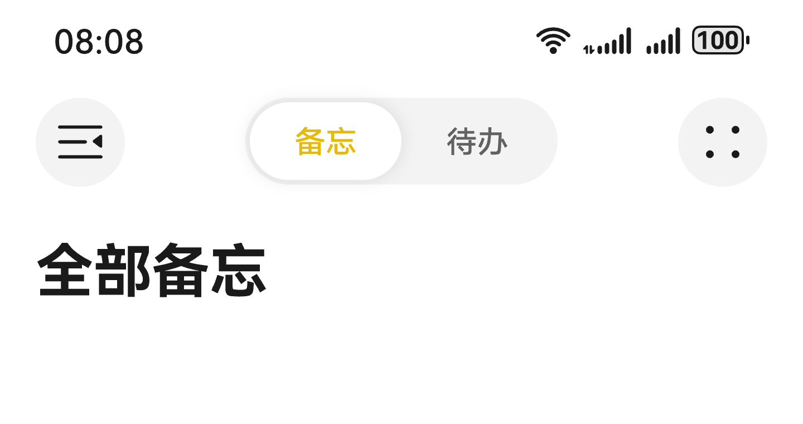

# 设置自定义区域

更新时间：2026-05-08 09:27:50

来源：https://developer.huawei.com/consumer/cn/doc/harmonyos-guides/ui-design-navigation-customized-area

## 场景介绍

从6.0.0(20)版本开始，导航组件支持设置标题栏的[stackBuilder](https://developer.huawei.com/consumer/cn/doc/harmonyos-references/ui-design-hdsnavigation#titlebarcontentoptions)和[bottomBuilder](https://developer.huawei.com/consumer/cn/doc/harmonyos-references/ui-design-hdsnavigation#titlebarcontentoptions)，允许开发者自定义标题栏样式，以匹配应用的视觉风格。 当应用开发者需要在标题栏区域增加自定义节点时，例如在标题栏上方区域增加分段按钮，标题下方区域增加搜索框、页签时，可以使用标题栏自定义区域设置能力。由于标题栏高度通常由系统或框架统一控制，开发者在添加自定义节点时需注意不要超出标题栏的可用空间，否则可能导致布局溢出或视觉混乱。自定义区域可能会覆盖或影响默认标题栏组件（如返回按钮、标题文字），需谨慎布局，避免交互冲突或遮挡关键元素。如果在标题栏中添加大量交互复杂、渲染频率高的组件，可能会对性能产生影响。



## 开发步骤

导入相关模块。
```text
// 从6.0.2(22)版本开始，无需手动导入HdsNavigationAttribute。具体请参考HdsNavigation的导入模块说明。
import { HdsNavigation, HdsNavigationTitleMode, HdsNavigationAttribute } from '@kit.UIDesignKit';
import { ItemRestriction, SegmentButton, SegmentButtonOptions, SegmentButtonTextItem } from '@kit.ArkUI';
```

创建一级导航组件，通过配置titleBar中content属性的stackBuilder以及bottomBuilder属性，即可实现导航组件的自定义区域设置。
```text
@Entry
@Component
struct Index {
  @Provide('pageInfos') pageInfos: NavPathStack = new NavPathStack();
  scroller: Scroller = new Scroller();
  @State tabOptions: SegmentButtonOptions = SegmentButtonOptions.tab({
    buttons: [{ text: '备忘' }, { text: '待办' }] as ItemRestriction,
    selectedFontColor: '#ffe6ba0b',
    selectedBackgroundColor: Color.White,
    textPadding: {
      top: 5,
      right: 5,
      bottom: 5,
      left: 5
    }
  });
  @State tabSelectedIndexes: number[] = [0];

  @Builder
  stackBuilder() {
    Row() {
      Flex({ justifyContent: FlexAlign.SpaceBetween }) {
        Button() {
          SymbolGlyph($r('sys.symbol.open_sidebar'))
            .fontColor([$r('sys.color.icon_primary')])
            .fontSize(24)
            .width(24)
            .height(24)
        }
        .width(40)
        .height(40)
        .backgroundColor($r('sys.color.ohos_id_color_button_normal'))

        SegmentButton({
          options: this.tabOptions,
          selectedIndexes: $tabSelectedIndexes
        })
          .width(150)

        Button() {
          SymbolGlyph($r('sys.symbol.dot_grid_2x2'))
            .fontColor([$r('sys.color.icon_primary')])
            .fontSize(24)
            .width(24)
            .height(24)
        }
        .backgroundColor($r('sys.color.ohos_id_color_button_normal'))
        .width(40)
        .height(40)
      }
      .margin({ left: 16, right: 16 })
    }
    .width('100%')
  }

  build() {
    HdsNavigation(this.pageInfos) { // 创建HdsNavigation组件
      Row() {
        Text('全部备忘')
          .fontSize(26)
          .fontWeight(FontWeight.Bold)
          .layoutWeight(1)
          .onClick(() => {
            this.pageInfos.pushPath({ name: 'pageOne' });
          })
      }
      .margin({ left: 16, top: 16 })
      .justifyContent(FlexAlign.Start)
    }
    .titleBar({
      enableComponentSafeArea: true, // 将标题栏设置为组件级安全区，内容区可避让标题栏
      content: {
        title: { mainTitle: '' },
        // 设置HdsNavigation 自定义标题区
        stackBuilder: (): void => this.stackBuilder(),
      }
    })
    .hideBackButton(true)
    .bindToScrollable([this.scroller]) // 绑定导航组件和可滚动容器组件
    .titleMode(HdsNavigationTitleMode.MINI)
  }
}
```

在PageOne页面创建二级导航组件。通过titleBar接口设置HdsNavDestination标题栏HarmonyOS风格化样式及内容设置。展示NavPathStack路由使用示例。
```text
// PageOne.ets
// 模块导入
// 从6.0.2(22)版本开始，无需手动导入HdsNavDestinationAttribute。具体请参考HdsNavDestination的导入模块说明。
import { BottomBuilderShowType, HdsNavDestination, HdsNavDestinationAttribute } from '@kit.UIDesignKit';

@Builder
export function PageOneBuilder() {
   PageOne()
}

@Component
export struct PageOne {
   @Consume('pageInfos') pageInfos: NavPathStack;
   scroller: Scroller = new Scroller();

   @Builder
   bottomBuilder() {
      Column() {
         Search({ placeholder: 'Search' })
            .height(40)
            .placeholderColor($r('sys.color.font_primary'))
            .margin({ left: 16, right: 16 })
      }
      .width('100%')
   }

   build() {
      HdsNavDestination() { // 创建HdsNavDestination组件
         Scroll(this.scroller) { // HdsNavDestination内容区设置可滚动容器组件，用于实现内容区滚动联动标题栏动态模糊样式
            Image($r('app.media.scenery2')) // scenery2为自定义资源，开发者需替换本地资源
               .height('100%')
         }
         .edgeEffect(EdgeEffect.Spring)
         .scrollBar(BarState.Off)
         .margin({ left: 16, right: 16 })
         .clip(false) // 设置不对子组件超出当前组件范围外的区域进行裁剪，使内容区可以穿透到标题栏下方
      }
      .titleBar({
         enableComponentSafeArea: true, // 将标题栏设置为组件级安全区，内容区可避让标题栏
         content: {
            // HdsNavigation标题栏内容区设置
            title: {
               // HdsNavigation标题栏标题设置
               mainTitle: 'PageOne',
            },
            // HdsNavigation标题栏返回按钮设置
            backIcon: {
               label: 'backIcon', // 无障碍播报内容
               componentId: 'backIconId', // 返回按钮id
            },
            // 设置标题栏下方自定义区域，包括设置高度，显示类型
            bottomBuilder: {
               builder: (): void => this.bottomBuilder(),
               height: 56,
               showType: BottomBuilderShowType.DIRECTLY_SHOW
            },
            menu: {
               // HdsNavigation标题栏菜单设置
               value: [{
                  // 菜单项内容设置
                  content: {
                     label: 'menu',
                     icon: $r('sys.symbol.ohos_circle'),
                  },
               }]
            },
         }
      })
      .bindToScrollable([this.scroller]) // 绑定导航组件和可滚动容器组件
   }
}
```

工程entry/src/main/module.json5文件中的“module”下新增如下配置，用于页面跳转。
```text
"routerMap": "$profile:route_map"
```

工程entry/src/main/resources/base/profile目录下增加route_map.json文件。
```text
{
  "routerMap": [
    {
      "name": "pageOne",
      "pageSourceFile": "src/main/ets/pages/PageOne.ets",
      "buildFunction": "PageOneBuilder",
      "data": {
        "description": "this is pageOne"
      }
    }
  ]
}
```
