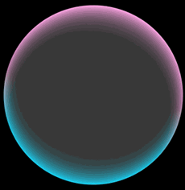

# 双边边缘流光

更新时间：2026-05-07 09:37:20

来源：https://developer.huawei.com/consumer/cn/doc/harmonyos-guides/ui-design-visual-effect-double-edge-streamer

##### 场景介绍

从6.0.0(20)版本开始，新增支持[双边边缘流光](https://developer.huawei.com/consumer/cn/doc/harmonyos-references/ui-design-hdseffect#effecttype)。

通过双边边缘流光接口可以设置组件的边缘发光效果，并且可以设置两条边的起始、终止位置和边缘颜色效果，常用于胶囊组件、屏幕边缘发光等。


##### 开发步骤
1. 导入模块。

  
```text
import { hdsEffect } from '@kit.UIDesignKit';
```

2. 设置双边边缘流光效果。

  
```text
@Entry
@Component
struct Index {
  @State controller: hdsEffect.ShaderEffectController = new hdsEffect.ShaderEffectController();

  build() {
    Column() {
      Stack() {
      }
      .visualEffect(new hdsEffect.HdsEffectBuilder()
        .shaderEffect({
          effectType: hdsEffect.EffectType.DUAL_EDGE_FLOW_LIGHT,
          animation: {
            duration: 4000,
            iterations: -1,
            autoPlay: true,
            onFinish: () => {
              console.info('Succeeded in finishing');
            }
          },
          controller: this.controller,
          params: {
            firstEdgeFlowLight: {
              startPos: 0,
              endPos: 1.0,
              color: '#1AD0F1',
            },
            secondEdgeFlowLight: {
              startPos: 0.5,
              endPos: 1.5,
              color: '#FFA4E5',
            }
          }
        })
        .buildEffect())
      .width(200)
      .borderRadius('50%')
      .clip(true)
      .height(200)
      .backgroundColor('#383838')
    }
    .justifyContent(FlexAlign.Center)
    .backgroundColor(Color.Black)
    .width('100%')
    .height('100%')
  }
}
```


