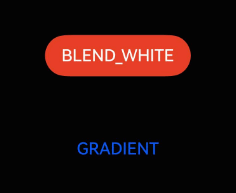

# 按压阴影

更新时间：2026-05-07 09:37:20

来源：https://developer.huawei.com/consumer/cn/doc/harmonyos-guides/ui-design-visual-effect-background-color

## 场景介绍

从6.0.0(20)版本开始，新增支持[按压阴影](https://developer.huawei.com/consumer/cn/doc/harmonyos-references/ui-design-hdseffect#pressshadow)。 通过按压阴影接口可以设置组件的背景色变化效果，一般常用于组件按压交互时的背景色变化场景。

## 开发步骤

导入模块。
```text
import { hdsEffect } from '@kit.UIDesignKit';
```

创建按压阴影效果。
```text
@Entry
@Component
struct PressShadowExample {
  @State button_blend_state: hdsEffect.PressShadowType = hdsEffect.PressShadowType.NONE;
  @State button_gradient_state: hdsEffect.PressShadowType = hdsEffect.PressShadowType.NONE;

  build() {
    NavDestination() {
      Column({ space: 50 }) {
        Button("BLEND_WHITE", { buttonStyle: ButtonStyleMode.EMPHASIZED, role: ButtonRole.ERROR, stateEffect: false })
          .visualEffect(new hdsEffect.HdsEffectBuilder()
            .pressShadow(this.button_blend_state)
            .buildEffect())
          .onTouch((event: TouchEvent) => {
            if (event.type === TouchType.Down) {
              this.button_blend_state = hdsEffect.PressShadowType.BLEND_WHITE;
            } else if (event.type === TouchType.Up || event.type === TouchType.Cancel) {
              this.button_blend_state = hdsEffect.PressShadowType.NONE;
            }
          })

        Button("GRADIENT", { buttonStyle: ButtonStyleMode.NORMAL, stateEffect: false })
          .visualEffect(new hdsEffect.HdsEffectBuilder()
            .pressShadow(this.button_gradient_state)
            .buildEffect())
          .onTouch((event: TouchEvent) => {
            if (event.type === TouchType.Down) {
              this.button_gradient_state = hdsEffect.PressShadowType.BLEND_GRADIENT;
            } else if (event.type === TouchType.Up || event.type === TouchType.Cancel) {
              this.button_gradient_state = hdsEffect.PressShadowType.NONE;
            }
          })
      }
      .height('70%')
      .justifyContent(FlexAlign.Center)
    }
    .width('100%')
    .height('100%')
    .title('Button example')
    .backgroundColor('#040404')
  }
}
```


