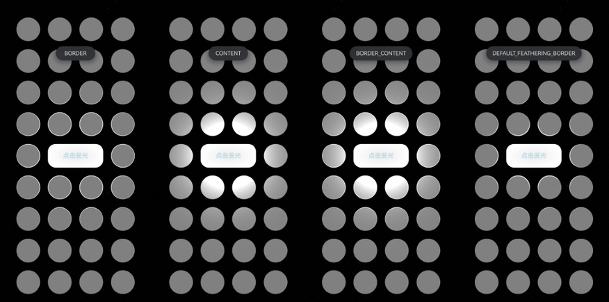

# 点光源效果

更新时间：2026-05-07 09:37:20

来源：https://developer.huawei.com/consumer/cn/doc/harmonyos-guides/ui-design-visual-effect-point-light

## 场景介绍

从6.0.0(20)版本开始，新增支持[点光源效果](https://developer.huawei.com/consumer/cn/doc/harmonyos-references/ui-design-hdseffect#pointlight)。 通过点光源接口可以设置组件的发光效果以及被照亮的受光效果，使得组件交互体验更显沉浸。

## 约束与限制

单个组件最多同时受12个光源照亮。

## 开发步骤

导入模块。
```text
import { hdsEffect } from '@kit.UIDesignKit';
```

创建点光源发光效果。如果需要发光，配置sourceType属性；如果需要被照亮，配置illuminatedType属性。 以下代码表示：当中间的Button点击时，产生点光源效果，重复点击触发不同点光源效果。
```text
@Entry
@Component
struct Index {
  @State bloomValue: number = 0;
  @State index: number = 0;
  @State illuminatedType: hdsEffect.PointLightIlluminatedType = hdsEffect.PointLightIlluminatedType.NONE;
  @State button_gradient_state: hdsEffect.PressShadowType = hdsEffect.PressShadowType.NONE;
  @State lightIntensity: number = 10;
  @State types: hdsEffect.PointLightIlluminatedType[] =
    [hdsEffect.PointLightIlluminatedType.NONE, hdsEffect.PointLightIlluminatedType.BORDER,
      hdsEffect.PointLightIlluminatedType.CONTENT, hdsEffect.PointLightIlluminatedType.BORDER_CONTENT,
      hdsEffect.PointLightIlluminatedType.DEFAULT_FEATHERING_BORDER];

  build() {
    Flex({
      direction: FlexDirection.Column,
      justifyContent: FlexAlign.Center,
      alignItems: ItemAlign.Center,
    }) {
      // 纵向循环
      ForEach(Array(4).fill(0), (row: number) => {
        Flex({
          direction: FlexDirection.Row,
          justifyContent: FlexAlign.Center,
          alignItems: ItemAlign.Center,
        }) {
          // 横向循环
          ForEach(Array(4).fill(0), (col: number) => {
            Flex()
              .visualEffect(new hdsEffect.HdsEffectBuilder().pointLight({
                illuminatedType: this.illuminatedType,
              }).buildEffect())
              .backgroundColor(0x808080)
              .size({ width: 60, height: 60 })
              .borderRadius(50)
              .margin({ top: 20, right: 10, left: 10 }) // 添加间距
          })
        }
        .width('100%') // 设置 Row 组件的宽度为 100%
      })

      Flex({
        direction: FlexDirection.Row,
        justifyContent: FlexAlign.Center, // 使用 SpaceBetween 来均匀分布间距
        alignItems: ItemAlign.Center,
      }) {
        Flex()
          .visualEffect(new hdsEffect.HdsEffectBuilder().pointLight({
            illuminatedType: this.illuminatedType,
          }).buildEffect())
          .backgroundColor(0x808080)
          .size({ width: 60, height: 60 })
          .borderRadius(50)
          .margin({ top: 20, right: 10, left: 10 })

        Button('点击发光')
          .size({ width: 140, height: 60 })
          .backgroundColor(0x808080)
          .fontColor(0xADD8E6)
          .visualEffect(new hdsEffect.HdsEffectBuilder()
            .pressShadow(this.button_gradient_state)
            .pointLight({
              options: {
                color: Color.White,
                intensity: this.lightIntensity,
                height: 150
              }
            })
            .pressShadow(this.button_gradient_state)
            .buildEffect())
          .onClick(() => {
            if (this.index (4).fill(0), (row: number) => {
        Flex({
          direction: FlexDirection.Row,
          justifyContent: FlexAlign.Center,
          alignItems: ItemAlign.Center,
        }) {
          // 横向循环
          ForEach(Array(4).fill(0), (col: number) => {
            Flex()
              .visualEffect(new hdsEffect.HdsEffectBuilder().pointLight({
                illuminatedType: this.illuminatedType,
              }).buildEffect())
              .backgroundColor(0x808080)
              .size({ width: 60, height: 60 })
              .borderRadius(50)
              .margin({ top: 20, right: 10, left: 10 })
          })
        }
        .width('100%') // 设置 Row 组件的宽度为 100%
      })
    }
    .backgroundColor(Color.Black)
  }
}
```


