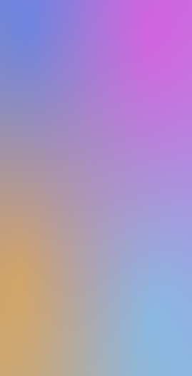

# 背景流光

更新时间：2026-05-07 09:37:20

来源：https://developer.huawei.com/consumer/cn/doc/harmonyos-guides/ui-design-visual-effect-background-streamer

## 场景介绍

从6.0.0(20)版本开始，新增支持[背景流光](https://developer.huawei.com/consumer/cn/doc/harmonyos-references/ui-design-hdseffect#effecttype)。 通过背景流光接口可以设置组件的背景流动发光效果，并且可以设置背景色及渐变背景色，常用于全屏幕背景流光等。

## 开发步骤

导入模块。
```text
import { hdsEffect } from '@kit.UIDesignKit';
```

设置背景流光效果。
```text
@Entry
@Component
struct UVFlowLight {
  @State controller: hdsEffect.ShaderEffectController = new hdsEffect.ShaderEffectController();

  build() {
    Stack() {
    }
    .visualEffect(new hdsEffect.HdsEffectBuilder()
      .shaderEffect({
        effectType: hdsEffect.EffectType.UV_BACKGROUND_FLOW_LIGHT,
        animation: {
          duration: 10000,
          iterations: -1,
          autoPlay: true,
          onFinish: ()=> {
            console.info('Succeeded in finishing');
          }
        },
        controller: this.controller
      })
      .buildEffect())
    .width('100%')
    .height('100%')
  }
}
```


