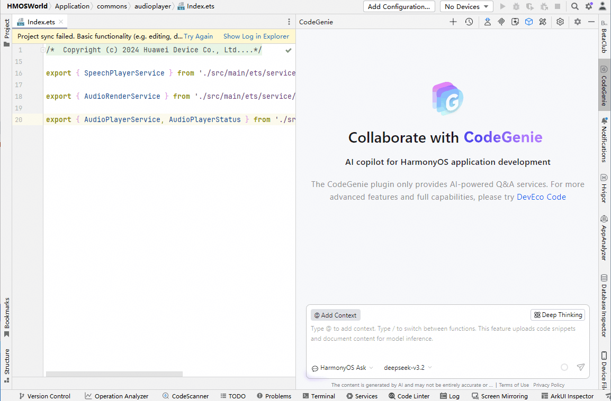

# 特性问答

更新时间：2026-06-15 08:14:01

来源：https://developer.huawei.com/consumer/cn/doc/harmonyos-guides/ide-feature-ask

从DevEco Studio 6.1.1 Beta1版本开始，CodeGenie新增特性问答的功能。该功能通过深度分析用户代码库，广泛探索相关功能或模块，并进行深入解读，提供系统性建议。针对开发者提出的本地工程的功能特性等问题，它能提供精确和智能的解答。
 

 
选择**HarmonyOS Ask**智能体，在对话区域输入“/”后，在弹出的菜单中选择“**Feature**”，在对话框中输入本地工程的功能特性问题（如释放音频资源的方法如何实现的），点击发送后等待回复。
 

