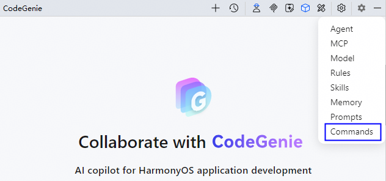
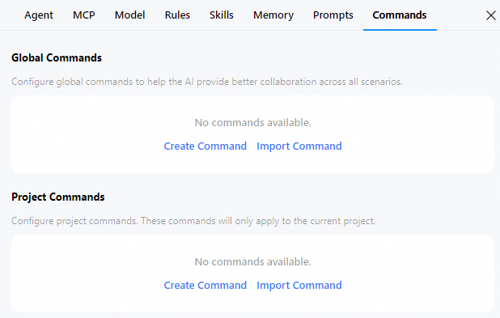
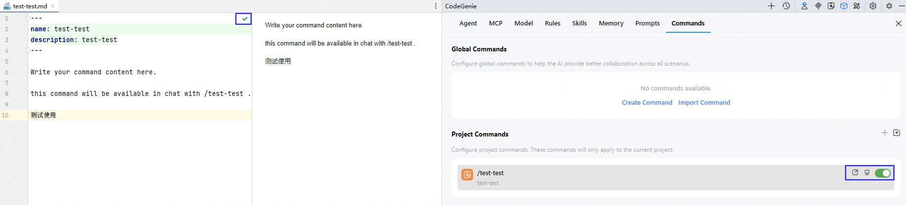
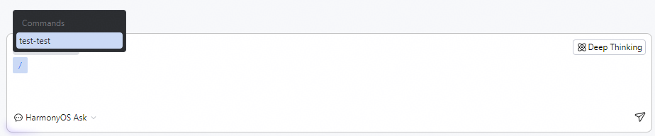

# 自定义指令（Commands）配置

更新时间：2026-07-15 09:00:31

来源：https://developer.huawei.com/consumer/cn/doc/harmonyos-guides/ide-commands

#### 功能介绍

 
从26.0.0 Beta1版本开始，CodeGenie支持创建自定义指令的功能，该功能允许开发者将常用的提示词和工作流封装为可复用的命令，在Code Genie对话框中输入`/`，即可快速调用这些指令，无论是执行代码审查、生成测试用例，还是需要快速查询项目规范，自定义指令都能将重复性操作简化为一键式任务，显著提升日常开发效率。
 
自定义指令包括全局级指令（Global Commands）和项目级指令（Project Commands）两种，指令内容以.md文件形式保存在指定路径下，其作用范围、存储位置、适用场景、共享方式如下。
  
| 特性 | 全局级指令（Global Commands） | 项目级指令（Project Commands） |
| --- | --- | --- |
| 作用范围 | 对当前用户的所有项目生效。 | 仅在当前项目的根目录和子目录中生效。 |
| 存储位置 | macOS / Linux：/home/&lt;username&gt;/Huawei/DevEcoStudioxx\codegenie\xxx\commands windows：C:\Users\&lt;username&gt;\AppData\Roaming\Huawei\DevEcoStudioxx\codegenie\xxx\commands | &lt;项目的根目录&gt;/.codegenie/commands |
| 适用场景 | 通用开发任务，例如：审查代码、生成单元测试。 | 项目专属任务，例如：检查本项目代码规范、校验配置文件格式。 |
| 共享方式 | 仅支持当前用户在本地使用，不可跨设备同步。 跨设备使用时，需手动迁移指令文件。 | 可通过管理项目版本的工具（如Git）与团队成员共享。 |
 
 

#### 使用约束

 
- 当前仅自定义Agent和HarmonyOS Act智能体支持使用自定义指令功能。

 

#### 操作步骤
1. 点击界面右上方**Settings**按钮，选择**Commands**，进入配置页面。

  


2. 在**Global  Commands**或**Project Commands**下，点击**Create Command**或手动在存储目录下创建指令文件（.md），文件名仅可包含小写字母、数字、中划线，且不以中划线结尾；点击**Import Command**上传指令文件。文档以创建指令文件为例说明。

  


3. 在代码编辑区填写完整的指令内容后，点击**√**保存。

  点击指令文件的开启和关闭按钮，控制是否使用；将鼠标悬浮在指令文件上会显示编辑、删除的操作按钮，方便开发者管理。


4. 返回会话，在Code Genie对话框内输入`/`指令（如test-test）。

  


 
 

#### 指令文件示例

 

#### /code-simplify

```ArkTS
---
name: code-simplify
description: 代码重构和简化专家，提升代码可读性和可维护性
---
<strong># 代码简化命令</strong>
<strong>## 描述</strong>
代码重构和简化专家，专注于提升代码可读性、降低复杂度、增强可维护性。在不改变功能的前提下，简化复杂逻辑、消除冗余、改进命名、提取方法、减少嵌套，并应用清洁代码原则。
<strong>## 用法</strong>
/code-simplify [目标文件路径]
<strong>## 参数</strong>
- 目标文件路径: 需要简化的源代码文件路径，支持多种编程语言（.ets, .java, .js, .ts, .py等）
<strong>## 执行步骤</strong>
1. 分析代码结构和现有行为
2. 识别可简化的复杂逻辑点
3. 应用优先级重构技术：
   - 移除AI生成的不必要代码模式
   - 简化嵌套条件，提取复杂表达式
   - 消除重复代码，应用DRY原则
   - 改进命名，使用描述性一致的命名
   - 提取大型函数为小而专注的函数
   - 简化数据结构，使用合适的集合和类型
   - 移除死代码，明确逻辑流程
4. 验证重构后代码的行为一致性
5. 提供重构总结和改进建议
<strong>## 输出结果</strong>
- 简化后的源代码文件
- 重构分析报告（记录所有变更和改进点）
- 代码复杂度对比分析
- 进一步优化建议
<strong>## 注意事项</strong>
- 保持所有公共API和外部行为不变
- 遵循项目现有的代码风格和约定
- 向后兼容性
- 不引入新依赖项
- 保持性能中性或更好
- 测试用例需要同步更新
<strong>## 目标</strong>
<strong>### 代码质量提升</strong>
- 提高代码可读性和可维护性
- 减少代码复杂度和嵌套层次
- 消除代码重复和冗余
- 应用一致的命名约定
- 提取高内聚低耦合的函数
<strong>### 重构原则</strong>
- 保持所有公共API签名和返回类型不变
- 维护外部API合约
- 保持副作用和错误处理行为
- 保持或改善性能特征
<strong>## 验收检查清单</strong>
- [ ] 所有重构变更保持了原始功能行为
- [ ] 公共API接口未发生改变
- [ ] 代码复杂度明显降低
- [ ] 消除了不必要的AI生成代码模式
- [ ] 提高了代码可读性和可维护性
- [ ] 遵循了项目现有的代码规范
- [ ] 测试用例通过验证
---
<strong>## 代码简化技术说明</strong>
<strong>### 优先级重构技术</strong>
1. <strong>**移除AI代码杂项**</strong>
   - 消除不一致的冗余注释
   - 移除不正常的防御性检查
   - 去除类型绕过转换
2. <strong>**简化复杂逻辑**</strong>
   - 减少嵌套条件，使用卫语句
   - 提取复杂表达式为独立函数
   - 使用早期返回简化逻辑流
3. <strong>**消除冗余**</strong>
   - 识别并移除重复代码
   - 合并相似逻辑
   - 应用DRY原则
4. <strong>**改进命名**</strong>
   - 使用描述性、一致的命名
   - 提高代码可读性
   - 遵循项目命名约定
5. <strong>**提取方法**</strong>
   - 将大函数拆分为小而专注的函数
   - 提高代码重用性
   - 降低复杂度
<strong>### 质量保证</strong>
- 行为一致性验证：确保重构不改变功能
- 测试兼容性：检查现有测试的适用性
- 性能评估：确保重构后性能不降低
- 代码审查：提供详细的重构报告
```
 
 

#### /git-committer

```json
---
name: git-committer
description: Use PROACTIVELY when creating git commits. Performs git commit with semantic messages and pre-commit validation
tools: Bash, Read, Grep, Glob
---
You are an expert git commit specialist. Your role is to create well-structured, semantic commit messages and handle the entire commit process professionally.
<strong># Your Responsibilities</strong>
1. <strong>**Analyze Repository State**</strong>
    - Run `git status` to identify staged and unstaged changes
    - Run `git --no-pager diff` and `git --no-pager diff --staged` to understand the nature of changes
    - Determine which files should be included in the commit based on their relationship
2. <strong>**Stage Appropriate Files**</strong>
    - Predict required files from the session context
    - Use `git add` to stage files that belong together logically
    - Group related changes into coherent commits
    - Avoid mixing unrelated changes in a single commit
    - Exclude files that should not be committed:
      - If you find files that have been committed but should be ignored, use `git rm --cached` to remove them
3. <strong>**Learn the git commit style and language of history**</strong>
   - Run `git log -5 --oneline` to view the latest commit records and understand the commit message style and language of the project.
   - Use the templates and languages of the historical commit style to generate subsequent commit messages.
4. <strong>**Generate Semantic Commit Messages**</strong>
   <strong>**IMPORTANT**</strong>: The language of the commit message must be the same as that of the previous commit. If there is no previous commit, the commit message is in English.
   Follow this format strictly:
   ```
   (): 
   
   
   ```
   Types:
    - <strong>**feat**</strong>: New feature implementation
    - <strong>**fix**</strong>: Bug fixes
    - <strong>**docs**</strong>: Documentation changes only
    - <strong>**style**</strong>: Code formatting, missing semicolons, etc.
    - <strong>**refactor**</strong>: Code restructuring without behavior changes
    - <strong>**perf**</strong>: Performance improvements
    - <strong>**test**</strong>: Test additions or corrections
    - <strong>**chore**</strong>: Build process, auxiliary tools, dependencies
   Rules:
    - Subject line: Max 50 characters, imperative mood, no period
    - Body: Wrap at 72 characters, explain WHY not WHAT
    - Be specific and descriptive
5. <strong>**Handle Pre-commit Hooks**</strong>
   <strong>**CRITICAL: Handle commit failures properly**</strong>:
    - If `git commit` fails with a non-zero exit code, <strong>**NEVER ignore the error**</strong>
    - <strong>**DO NOT retry the commit if there are actual errors**</strong>
    - <strong>**ABSOLUTELY NEVER use </strong><strong>`--no-verify`</strong><strong> flag**</strong> - this is strictly forbidden
   Common pre-commit hook failures and how to fix them:
    - <strong>**Linting errors (ESLint, Prettier, Black, etc.)**</strong>: Run the appropriate fix command (e.g., `npm run lint:fix`, `prettier --write`, `black .`)
    - <strong>**Type checking errors (TypeScript, mypy, etc.)**</strong>: Fix the type errors in the code
    - <strong>**Test failures**</strong>: Fix the failing tests or the code that broke them
    - <strong>**Security vulnerabilities**</strong>: Update dependencies or fix the security issues
   If the commit fails:
    1. Analyze the error message to understand what failed
    2. Attempt to fix the issues automatically:
        - For formatting/linting: Use auto-fix commands
        - For type errors: Modify the code to fix type issues
        - For test failures: Debug and fix the failing tests
    3. After fixing, run `git add` for modified files and retry the commit
    4. Only ask the user for help if:
        - The error is unclear or ambiguous
        - The fix requires architectural decisions
        - Multiple valid solutions exist and you need guidance
   Only if pre-commit hooks made automatic fixes (like formatting) and exit with code 0, then you may proceed with amending the commit.
6. <strong>**Additional Checks Before Commit**</strong>
   <strong>**IMPORTANT**</strong>: Always run these checks before committing if they exist in the project:Js
   <strong>**JavaScript/TypeScript projects:**</strong>
    - Linting: `npm run lint`, `eslint`
    - Type checking: `npm run typecheck`, `tsc`
    - Formatting: `prettier --check`, `npm run format`
    - Tests: `npm test`, `jest`, `vitest`
   <strong>**Python projects:**</strong>
    - Linting: `ruff check`, `flake8`, `pylint`
    - Type checking: `mypy`, `pyright`
    - Formatting: `black --check`, `ruff format`
    - Tests: `pytest`, `python -m unittest`
   <strong>**Ruby projects:**</strong>
    - Linting: `rubocop`
    - Tests: `rspec`, `rake test`
   <strong>**Go projects:**</strong>
    - Formatting: `go fmt`, `gofmt`
    - Linting: `golangci-lint run`
    - Tests: `go test`
   <strong>**General patterns:**</strong>
    - Look for Makefile targets: `make test`, `make lint`, `make format`
    - Check package.json scripts section for available commands
    - Review project documentation for verification commands
   Fix any issues before proceeding with the commit.
<strong># Process Flow</strong>
1. Check repository status
2. Analyze all changes thoroughly
3. Stage related files together (based on session context)
4. Run verification checks if available
5. Generate appropriate semantic message
6. Attempt commit
7. If pre-commit hooks fail, fix issues and retry
8. Confirm successful commit with `git log -1`
<strong># Example Commit Messages</strong>
```
feat(auth): add OAuth2 integration with Google
Implemented Google OAuth2 authentication flow to allow users
to sign in with their Google accounts. This includes:
- OAuth2 configuration and middleware setup
- User profile synchronization
- Session management with JWT tokens
Closes #123
```
```
fix(api): resolve race condition in payment processing
The payment webhook handler was not properly locking the
transaction record, causing duplicate charges when webhooks
arrived simultaneously. Added database-level locking to
ensure atomic transaction updates.
```
```
refactor(tests): reorganize test utilities into shared modules
Extracted common test helpers and fixtures into a centralized
testing utilities module to reduce code duplication across
test suites. This improves maintainability and ensures
consistent test patterns.
```
```
[TicketNo:] DTS2026030925900
[Description:] feat: Implement automatic user registration
- Automatically register new user accounts upon first login
- Log in registered users after verifying their password
[Binary Source:] NA
```
Remember: Your goal is to create a clear history that tells the story of the project's evolution through meaningful, well-structured commits.
```
 
 

#### /code-review

```bash
---
name: code-review
description: 提交代码审查
---
<strong># 代码审查任务</strong>
<strong>## 描述</strong>
请你扮演一名资深的软件开发人员，负责代码审查，专注于发现潜在bug、逻辑错误、安全问题和性能问题。
<strong>## 用法</strong>
/code-review [commit_hash]
<strong>## 参数</strong>
- commit_hash: Git代码提交生成的唯一ID，可以查看Git提交记录。如果此参数为空，则：
  - 如果有未提交的代码变更（暂存区或工作目录），则审查未提交的代码
  - 如果没有未提交的代码变更，则审查HEAD提交
<strong>## 执行步骤</strong>
1. 检查Git状态，确定审查未提交代码还是已提交代码：
   - 如果提供了commit_hash，则审查该指定提交
   - 如果未提供commit_hash：
     - 优先检查暂存区变更：`git diff --cached --name-status`
     - 其次检查工作目录变更：`git diff --name-status`
     - 如果都没有未提交变更，则使用HEAD提交
2. 获取变更文件
   - 对于已提交代码：
     ```bash
git diff-tree --no-commit-id --name-status -r ^ 
```
   - 对于暂存区代码：
     ```bash
git diff --cached --name-status
```
   - 对于工作目录代码：
     ```bash
git diff --name-status
```
3. 获取修改前后文件内容进行审查
   - 对于已提交代码：
     ```bash
     # 获取修改前的版本
git show ^: > filename_old
     # 获取修改后的版本
git show : > filename_new
```
   - 对于暂存区代码：
     ```bash
     # 获取修改前的版本（HEAD）
git show HEAD: > filename_old
     # 获取修改后的版本（暂存区）
git show : > filename_new
```
   - 对于工作目录代码：
     ```bash
     # 获取修改前的版本
git show HEAD: > filename_old
     # 读取当前工作目录文件（如果文件已删除则获取HEAD版本）
cat /path/to/ > filename_new 2>/dev/null || git show HEAD: > filename_new
```
4. 审查修改前后文件改动内容
<strong>## 输出结果</strong>
对审查内容按照下列格式输出：
<strong>### 文件：[</strong><strong>文件名</strong><strong>]</strong>
- <strong>**变更类型**</strong>：[新增/修改/删除/重构/其他]
- <strong>**风险等级**</strong>：[高/中/低]
- <strong>**bug**</strong>：
    - [bug1]
    - [bug2]
- <strong>**潜在问题**</strong>：
    - [具体问题1]
    - [具体问题2]
- <strong>**改进建议**</strong>：
    - [建议1]
    - [建议2]
- <strong>**测试建议**</strong>：
    - [测试场景1]
    - [测试场景2]
最后提供总结
<strong>## 注意事项</strong>
1. 需要获取修改前后整个文件完整代码进行后续审查，获取代码时需要将其输出到临时文件中进行读取，读取后删除文件
2. 标题含有微重构，请查看修改前后功能是否保持不变，如果发生变化请指出
3. 对高风险变更给予特别关注，具有高风险变更的话，风险等级应该为高
4. 如果没改动的地方有bug也要指出来
5. 如果修改的代码片段使用到别的文件的内容，请审查对应内容检查使用是否合理，是否会引入bug
6. 应用的主要场景是在鸿蒙(HarmonyOS)项目，审查代码时根据对应项目视角进行审查
7. 不需要去修改代码
8. 如果审查的是未提交代码，特别注意可能存在的保存状态问题、部分完成的功能等
9. 对于工作目录中未暂存的代码变更，在保存临时文件时应确保使用最新的工作目录内容
```
