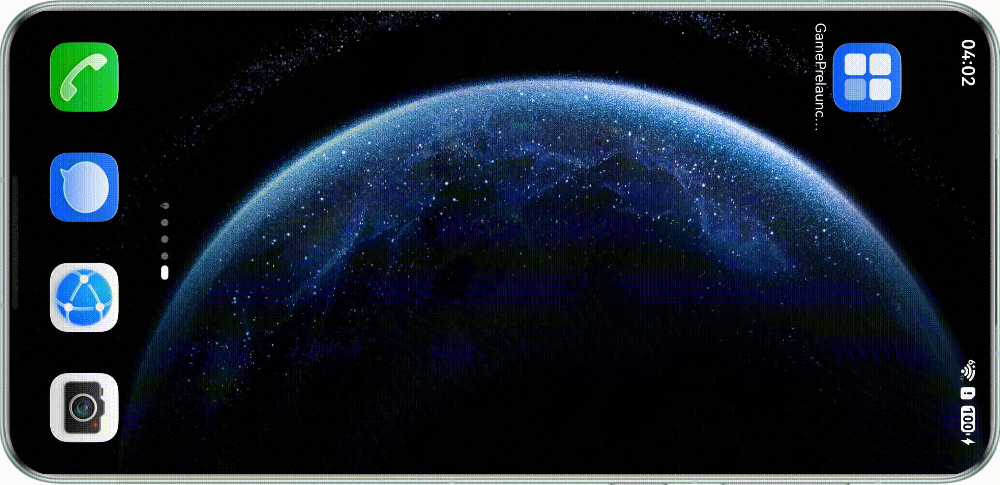
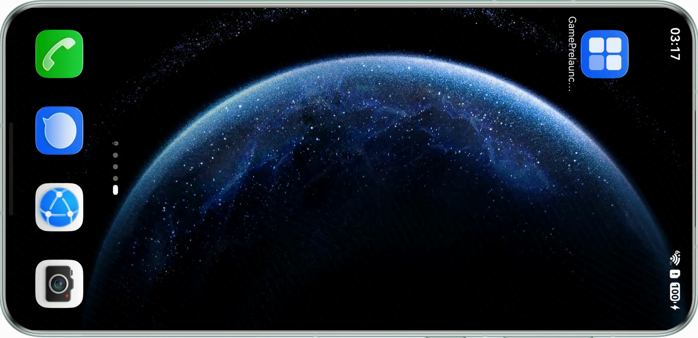

# 业务概述

更新时间：2026-06-12 06:54:11

来源：https://developer.huawei.com/consumer/cn/doc/harmonyos-guides/graphics-accelerate-preload-introduction

从API版本26.0.0开始，支持游戏预启动能力。
 
预启动是一种系统级启动优化机制，根据用户的使用习惯，在系统资源充足时提前加载游戏进行部分初始化和资源加载，从而在用户触发启动时显著缩短游戏启动时间，提升用户体验。
  

#### 约束与限制

游戏预启动能力支持Phone（运行内存大于8G）、Tablet、PC/2in1设备。
 
  

#### 用户体验

打开游戏时，自动跳过游戏资源加载、编译阶段，直达游戏界面。
 
- 游戏预启动

  

- 游戏未预启动

  

